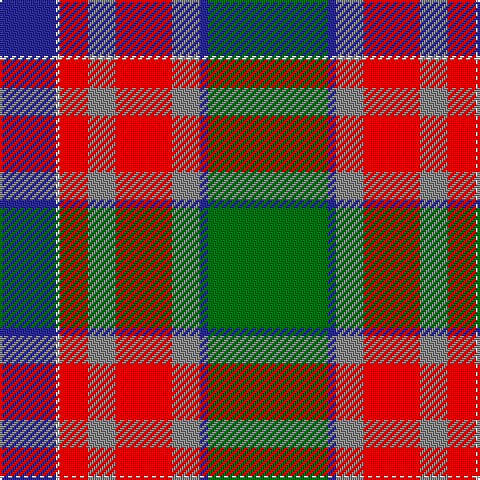

In pattern [BWRRRRBG](/patterns/bwrrrrbg/).

This was sourced from house-of-tartan.  It is a [8 stripes tartan](/stripes/stripes8/).

Original link http://www.house-of-tartan.scotland.net/house/TartanViewjs.asp?colr=Def&tnam=6796

## Thread count
DB/28 LN2 R14 N14 R28 N14 DB4 G/60

## Palette
Each colour and its ΔE from the base-6 reference it is a variant of.

| Colour | Shade | Base | ΔE (OKLab) |
|---|---|---|---|
| DB | <code style="background-color:#2C2C80;">#2C2C80</code> `#2C2C80` | B <code style="background-color:#2A418A;">#2A418A</code> | 0.06 |
| G | <code style="background-color:#006818;">#006818</code> `#006818` | G <code style="background-color:#006100;">#006100</code> | 0.02 |
| LN | <code style="background-color:#E0E0E0;">#E0E0E0</code> `#E0E0E0` | W <code style="background-color:#F7F7F7;">#F7F7F7</code> | 0.07 |
| N | <code style="background-color:#888888;">#888888</code> `#888888` | R <code style="background-color:#CC0000;">#CC0000</code> | 0.24 |
| R | <code style="background-color:#C80000;">#C80000</code> `#C80000` | R <code style="background-color:#CC0000;">#CC0000</code> | 0.01 |

# Sample pattern

## Nearest tartans

The nearest existing variants by ΔTartan distance.

1. [Ford & Etal](/setts/s8/k12w4r64k4g84b36k24w4-b1474b4-g408060-k101010-rc80000-wfcfcfc/) — ΔT 1.01
1. [Windsor](/setts/s10/r16b48k72b16g88w4g8w8g12w8-b0c585c-g8c7038-k101010-r880000-wc0c0c0/) — ΔT 1.04
1. [Harding (Name)](/setts/s8/g60b4ba14r28ba14r14w2b28-b14283c-ba5c5c5c-g005448-rc80000-wf8f8f8/) — ΔT 1.12
1. [Forrester / Foster](/setts/s9/w8b12w2b30r46g30y2g12y8-b304080-g008000-rc00000-we0e0e0-yf0c000/) — ΔT 1.14
1. [St Lawrence Trade](/setts/s8/g4b26g22y10b2r42g4ra2-b401000-g004010-ra08060-ra806050-yf0c000/) — ΔT 1.15
1. [Golden Wedding (Fashion)](/setts/s8/r8y44k32w2ra52k7ra7w3-k101010-rc80000-ra888888-we0e0e0-ybc8c00/) — ΔT 1.17
1. [Forrester (Clan)](/setts/s9/w12b16w4b60r96g60y4g16y12-b283854-g285800-rc80000-we0e0e0-ye8c000/) — ΔT 1.17
1. [Dinwoodie (Name)](/setts/s10/g24r4k4r84k26ga50r12k4ra8k20-g604000-ga006818-k101010-r888888-rac80000/) — ΔT 1.21
1. [Silver Wedding (Fashion)](/setts/s8/b8ba44k32w2r53wa8ba8wa4-b440044-ba5c5c5c-k101010-r888888-wc49cd8-wac0c0c0/) — ΔT 1.22
1. [Forrester Tartan Tartan Number: 2384. Earliest known date: 1987 A society that has been in existence since the 1980's. This is a general tartan fully adopted in 1987. Can be worn by all with the name. See products available Copyright © Blair Urquhart, Comrie, 2015](/setts/s9/w8b12w2b30r46g30y2g12y8-b2c2c80-g006818-rc80000-we0e0e0-ye8c000/) — ΔT 1.25

## Neighbour map

Every grey dot is one of 15726 variants placed by the first two principal components of the ΔTartan feature space (44% of its variance). Red is this tartan; blue dots are its nearest — click one to open its page.

<svg viewBox="0 0 640 380" role="img" style="max-width:100%;height:auto;border:1px solid #e0e0e0;border-radius:4px;display:block" xmlns="http://www.w3.org/2000/svg"><image href="/nn/cloud.v1.png" width="640" height="380"/><a href="/setts/s8/k12w4r64k4g84b36k24w4-b1474b4-g408060-k101010-rc80000-wfcfcfc/"><circle cx="187.2" cy="134.1" r="4" fill="#3465a4"><title>Ford &amp; Etal</title></circle></a><a href="/setts/s10/r16b48k72b16g88w4g8w8g12w8-b0c585c-g8c7038-k101010-r880000-wc0c0c0/"><circle cx="210.3" cy="130.0" r="4" fill="#3465a4"><title>Windsor</title></circle></a><a href="/setts/s8/g60b4ba14r28ba14r14w2b28-b14283c-ba5c5c5c-g005448-rc80000-wf8f8f8/"><circle cx="240.5" cy="156.4" r="4" fill="#3465a4"><title>Harding (Name)</title></circle></a><a href="/setts/s9/w8b12w2b30r46g30y2g12y8-b304080-g008000-rc00000-we0e0e0-yf0c000/"><circle cx="157.7" cy="131.4" r="4" fill="#3465a4"><title>Forrester / Foster</title></circle></a><a href="/setts/s8/g4b26g22y10b2r42g4ra2-b401000-g004010-ra08060-ra806050-yf0c000/"><circle cx="204.6" cy="138.9" r="4" fill="#3465a4"><title>St Lawrence Trade</title></circle></a><a href="/setts/s8/r8y44k32w2ra52k7ra7w3-k101010-rc80000-ra888888-we0e0e0-ybc8c00/"><circle cx="204.9" cy="123.2" r="4" fill="#3465a4"><title>Golden Wedding (Fashion)</title></circle></a><a href="/setts/s9/w12b16w4b60r96g60y4g16y12-b283854-g285800-rc80000-we0e0e0-ye8c000/"><circle cx="196.5" cy="123.2" r="4" fill="#3465a4"><title>Forrester (Clan)</title></circle></a><a href="/setts/s10/g24r4k4r84k26ga50r12k4ra8k20-g604000-ga006818-k101010-r888888-rac80000/"><circle cx="224.6" cy="132.8" r="4" fill="#3465a4"><title>Dinwoodie (Name)</title></circle></a><a href="/setts/s8/b8ba44k32w2r53wa8ba8wa4-b440044-ba5c5c5c-k101010-r888888-wc49cd8-wac0c0c0/"><circle cx="178.5" cy="121.4" r="4" fill="#3465a4"><title>Silver Wedding (Fashion)</title></circle></a><a href="/setts/s9/w8b12w2b30r46g30y2g12y8-b2c2c80-g006818-rc80000-we0e0e0-ye8c000/"><circle cx="155.4" cy="130.0" r="4" fill="#3465a4"><title>Forrester Tartan Tartan Number: 2384. Earliest known date: 1987 A society that has been in existence since the 1980's. This is a general tartan fully adopted in 1987. Can be worn by all with the name. See products available Copyright © Blair Urquhart, Comrie, 2015</title></circle></a><circle cx="213.8" cy="142.0" r="5" fill="#c00000"/></svg>

ID: /setts/s8/g60b4r14ra28r14ra14w2b28-b2c2c80-g006818-r888888-rac80000-we0e0e0/
