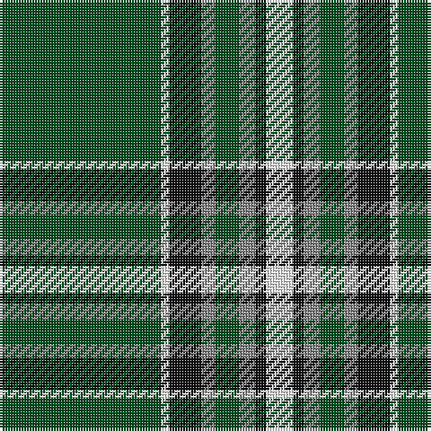

In pattern [GWKRGRKW](/patterns/gwkrgrkw/).

This was sourced from register-of-tartans.  It is a [8 stripes tartan](/stripes/stripes8/).

Original link https://www.tartanregister.gov.uk/tartanDetails.aspx?ref=11550

## Register references

External register numbers recorded for this tartan.

- Scottish Register of Tartans: [11550](https://www.tartanregister.gov.uk/tartanDetails.aspx?ref=11550)

## Thread count
G/60 W3 K12 N5 G9 N6 K4 W/10

## Palette
Each colour and its ΔE from the base-6 reference it is a variant of.

| Colour | Shade | Base | ΔE (OKLab) |
|---|---|---|---|
| G | <code style="background-color:#005020;">#005020</code> `#005020` | G <code style="background-color:#006100;">#006100</code> | 0.07 |
| K | <code style="background-color:#101010;">#101010</code> `#101010` | K <code style="background-color:#000000;">#000000</code> | 0.17 |
| N | <code style="background-color:#888888;">#888888</code> `#888888` | R <code style="background-color:#CC0000;">#CC0000</code> | 0.24 |
| W | <code style="background-color:#FFFFFF;">#FFFFFF</code> `#FFFFFF` | W <code style="background-color:#F7F7F7;">#F7F7F7</code> | 0.02 |

# Sample pattern

## Nearest tartans

The nearest existing variants by ΔTartan distance.

1. [University of Alberta (Corporate)](/setts/s10/k3g32k2g4y4g2y4g4k6w3~g005010-k101010-we0e0e0-ye8c000~x2/) — ΔT 1.01
1. [Walterström (2014)](/setts/s8/g78b13y6r3y5g6b9y6~b003c64-g003c14-ra00000-yfccc00~x2/) — ΔT 1.06
1. [Laggen Dress (Fashion)](/setts/s11/g42k10g2k2k2k2g10k6k2k3g2~g648860-k000000~x2/) — ΔT 1.11
1. [Birmingham Irish Pipes & Drums](/setts/s8/g48y3k6w4g3k15y3g4~g285800-k000000-wf8f8f8-yc88c00~x2/) — ΔT 1.11
1. [MacAuliffe (Name)](/setts/s8/g37w2g6b23y6b2y3b2~b2c2c80-g006818-wf8f8f8-ye8c000~x2/) — ΔT 1.15
1. [Limerick County Crest (Fashion)](/setts/s6/w12k3g50w3k13y6~g006818-k101010-we0e0e0-ybc8c00~x2/) — ΔT 1.18
1. [Madras 2 (Fashion)](/setts/s7/g30k2w3k1w4b6w2~b2888c4-g006818-k101010-we0e0e0~x4/) — ΔT 1.18
1. [Spencer (2013)](/setts/s6/g55y4b15w3r3w5~b2c2c80-g003c14-rc8002c-wffffff-yffd700~x2/) — ΔT 1.19
1. [Walterstrm (2014))](/setts/s8/g78b13y6r3y5g6b9y6~b2c2c80-g006818-rc80000-yfccc00~x2/) — ΔT 1.22
1. [Mullikin (2013)](/setts/s8/r5w4b6ba2g43ba2b4r3~b2c2c80-ba202060-g006818-rc80000-wfcfcfc~x2/) — ΔT 1.22

## Neighbour map

Every grey dot is one of 15726 variants placed by the first two principal components of the ΔTartan feature space (44% of its variance). Red is this tartan; blue dots are its nearest — click one to open its page.

<svg viewBox="0 0 640 380" role="img" style="max-width:100%;height:auto;border:1px solid #e0e0e0;border-radius:4px;display:block" xmlns="http://www.w3.org/2000/svg"><image href="/nn/cloud.v1.png" width="640" height="380"/><a href="/setts/s10/k3g32k2g4y4g2y4g4k6w3~g005010-k101010-we0e0e0-ye8c000~x2/"><circle cx="375.1" cy="147.4" r="4" fill="#3465a4"><title>University of Alberta (Corporate)</title></circle></a><a href="/setts/s8/g78b13y6r3y5g6b9y6~b003c64-g003c14-ra00000-yfccc00~x2/"><circle cx="424.9" cy="137.9" r="4" fill="#3465a4"><title>Walterström (2014)</title></circle></a><a href="/setts/s11/g42k10g2k2k2k2g10k6k2k3g2~g648860-k000000~x2/"><circle cx="371.7" cy="118.2" r="4" fill="#3465a4"><title>Laggen Dress (Fashion)</title></circle></a><a href="/setts/s8/g48y3k6w4g3k15y3g4~g285800-k000000-wf8f8f8-yc88c00~x2/"><circle cx="364.9" cy="153.8" r="4" fill="#3465a4"><title>Birmingham Irish Pipes &amp; Drums</title></circle></a><a href="/setts/s8/g37w2g6b23y6b2y3b2~b2c2c80-g006818-wf8f8f8-ye8c000~x2/"><circle cx="314.6" cy="156.8" r="4" fill="#3465a4"><title>MacAuliffe (Name)</title></circle></a><a href="/setts/s6/w12k3g50w3k13y6~g006818-k101010-we0e0e0-ybc8c00~x2/"><circle cx="306.9" cy="168.8" r="4" fill="#3465a4"><title>Limerick County Crest (Fashion)</title></circle></a><a href="/setts/s7/g30k2w3k1w4b6w2~b2888c4-g006818-k101010-we0e0e0~x4/"><circle cx="378.7" cy="132.2" r="4" fill="#3465a4"><title>Madras 2 (Fashion)</title></circle></a><a href="/setts/s6/g55y4b15w3r3w5~b2c2c80-g003c14-rc8002c-wffffff-yffd700~x2/"><circle cx="354.6" cy="144.0" r="4" fill="#3465a4"><title>Spencer (2013)</title></circle></a><a href="/setts/s8/g78b13y6r3y5g6b9y6~b2c2c80-g006818-rc80000-yfccc00~x2/"><circle cx="422.4" cy="134.3" r="4" fill="#3465a4"><title>Walterstrm (2014))</title></circle></a><a href="/setts/s8/r5w4b6ba2g43ba2b4r3~b2c2c80-ba202060-g006818-rc80000-wfcfcfc~x2/"><circle cx="365.0" cy="121.7" r="4" fill="#3465a4"><title>Mullikin (2013)</title></circle></a><circle cx="357.7" cy="145.4" r="5" fill="#c00000"/></svg>

ID: /setts/s8/g60w3k12r5g9r6k4w10~g005020-k101010-r888888-wffffff/
