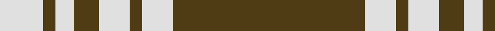
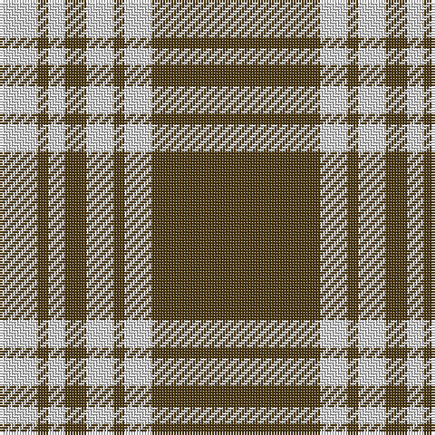

In pattern [GWGWGWGW](/patterns/gwgwgwgw/).

This was sourced from register-of-tartans.  It is a [8 stripes tartan](/stripes/stripes8/).

Original link https://www.tartanregister.gov.uk/tartanDetails.aspx?ref=2926

## Thread count
LN/14 T4 LN6 T8 LN10 T4 LN10 T/62

## Palette
Each colour and its ΔE from the base-6 reference it is a variant of.

| Colour | Shade | Base | ΔE (OKLab) |
|---|---|---|---|
| LN | <code style="background-color:#E0E0E0;">#E0E0E0</code> `#E0E0E0` | W <code style="background-color:#F7F7F7;">#F7F7F7</code> | 0.07 |
| T | <code style="background-color:#503C14;">#503C14</code> `#503C14` | G <code style="background-color:#006100;">#006100</code> | 0.14 |

# Sample pattern

## Nearest tartans

The nearest existing variants by ΔTartan distance.

1. [Menzies Brown & White Trade Tartan Tartan Number: 1752. Earliest known date: 1984 Nothing See products available Copyright © Blair Urquhart, Comrie, 2015](/setts/s8/g62w10g4w10g8w6g4w14-g604000-we0e0e0/) — ΔT 0.36
1. [Menzies, Brown & White](/setts/s8/r62w10r4w10r8w6r4w14-r806050-we0e0e0/) — ΔT 1.40
1. [Monoch Airline](/setts/s6/y8k12y2k2y32k4-k101010-yd09800/) — ΔT 1.53
1. [Yellow Pencil](/setts/s8/g96y18g12y18g24y8g4y32-g5b3a15-yf5b92f/) — ΔT 1.56
1. [Prince of Wales (Fashion)](/setts/s10/g12r24g8r4g8r4g64w4g8w12-g00542c-rc80000-we0e0e0/) — ΔT 1.58
1. [Coca Cola (Corporate)](/setts/s5/w15g15w15g80r6-g604000-rc80000-wd4e8f4/) — ΔT 1.62
1. [Coca Cola](/setts/s5/w14g14w14g80r6-g604000-rc80000-wd4e8f4/) — ΔT 1.66
1. [Loch Tummel](/setts/s5/g76w18g6k18w6-g603800-k101010-wfcfcfc/) — ΔT 1.69
1. [Schranz-Gritte](/setts/s10/y6k4y8k10y48k10y8k4y6k4-k101010-yd87c00/) — ΔT 1.71
1. [Gretna Football Club (Corporate)](/setts/s7/w36k8w36k95w4k4r6-k101010-rc80000-wfcfcdc/) — ΔT 1.74

## Neighbour map

Every grey dot is one of 15726 variants placed by the first two principal components of the ΔTartan feature space (44% of its variance). Red is this tartan; blue dots are its nearest — click one to open its page.

<svg viewBox="0 0 640 380" role="img" style="max-width:100%;height:auto;border:1px solid #e0e0e0;border-radius:4px;display:block" xmlns="http://www.w3.org/2000/svg"><image href="/nn/cloud.v1.png" width="640" height="380"/><a href="/setts/s8/g62w10g4w10g8w6g4w14-g604000-we0e0e0/"><circle cx="430.0" cy="172.4" r="4" fill="#3465a4"><title>Menzies Brown &amp; White Trade Tartan Tartan Number: 1752. Earliest known date: 1984 Nothing See products available Copyright © Blair Urquhart, Comrie, 2015</title></circle></a><a href="/setts/s8/r62w10r4w10r8w6r4w14-r806050-we0e0e0/"><circle cx="453.2" cy="178.3" r="4" fill="#3465a4"><title>Menzies, Brown &amp; White</title></circle></a><a href="/setts/s6/y8k12y2k2y32k4-k101010-yd09800/"><circle cx="448.7" cy="194.1" r="4" fill="#3465a4"><title>Monoch Airline</title></circle></a><a href="/setts/s8/g96y18g12y18g24y8g4y32-g5b3a15-yf5b92f/"><circle cx="439.4" cy="172.2" r="4" fill="#3465a4"><title>Yellow Pencil</title></circle></a><a href="/setts/s10/g12r24g8r4g8r4g64w4g8w12-g00542c-rc80000-we0e0e0/"><circle cx="416.1" cy="166.1" r="4" fill="#3465a4"><title>Prince of Wales (Fashion)</title></circle></a><a href="/setts/s5/w15g15w15g80r6-g604000-rc80000-wd4e8f4/"><circle cx="446.9" cy="200.1" r="4" fill="#3465a4"><title>Coca Cola (Corporate)</title></circle></a><a href="/setts/s5/w14g14w14g80r6-g604000-rc80000-wd4e8f4/"><circle cx="457.0" cy="198.8" r="4" fill="#3465a4"><title>Coca Cola</title></circle></a><a href="/setts/s5/g76w18g6k18w6-g603800-k101010-wfcfcfc/"><circle cx="383.2" cy="195.4" r="4" fill="#3465a4"><title>Loch Tummel</title></circle></a><a href="/setts/s10/y6k4y8k10y48k10y8k4y6k4-k101010-yd87c00/"><circle cx="448.9" cy="175.0" r="4" fill="#3465a4"><title>Schranz-Gritte</title></circle></a><a href="/setts/s7/w36k8w36k95w4k4r6-k101010-rc80000-wfcfcdc/"><circle cx="344.9" cy="146.7" r="4" fill="#3465a4"><title>Gretna Football Club (Corporate)</title></circle></a><circle cx="425.6" cy="173.2" r="5" fill="#c00000"/></svg>

ID: /setts/s8/g62w10g4w10g8w6g4w14-g503c14-we0e0e0/
