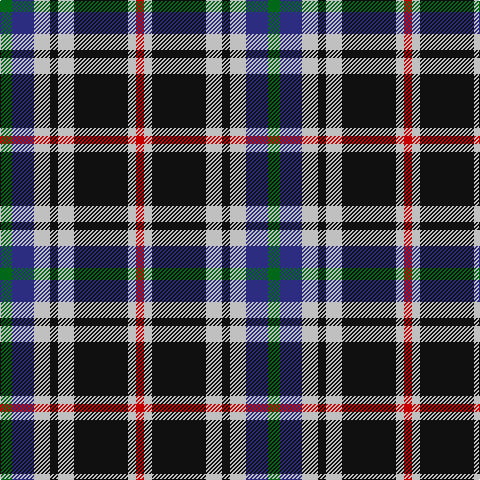

This page is one **sett** — a single exact thread-count. It belongs to the [tartan](/tartans/g6db11n8k4n8k27n4r4/)
(the same proportion at any scale), whose colour order is pattern [GBWKWKWR](/stripes/gbwkwkwr/).

Sourced from tartans-authority.  It is a [8 stripe tartan](/stripes/stripes8/).

Original link http://www.tartansauthority.com/tartan-ferret/display/11269/

## Thread count
G/12 DB22 N16 K8 N16 K54 N8 R/8

## Palette
Each colour and the base-6 reference it is a variant of.

| Colour | Shade | Base |
|---|---|---|
| DB | <code style="background-color:#2C2C80;">#2C2C80</code> `oklch(35.0% 0.138 276.6)` <small>#2C2C80</small> | B <code style="background-color:#2A418A;">#2A418A</code> |
| G | <code style="background-color:#006818;">#006818</code> `oklch(45.0% 0.142 145.0)` <small>#006818</small> | G <code style="background-color:#006100;">#006100</code> |
| K | <code style="background-color:#101010;">#101010</code> `oklch(17.3% 0.000 89.9)` <small>#101010</small> | K <code style="background-color:#000000;">#000000</code> |
| N | <code style="background-color:#C0C0C0;">#C0C0C0</code> `oklch(80.8% 0.000 89.9)` <small>#C0C0C0</small> | W <code style="background-color:#F7F7F7;">#F7F7F7</code> |
| R | <code style="background-color:#C80000;">#C80000</code> `oklch(52.3% 0.215 29.2)` <small>#C80000</small> | R <code style="background-color:#CC0000;">#CC0000</code> |

# Sample pattern

## Nearest tartans

The nearest existing variants by ΔTartan distance, with this tartan at the top so the swatches line up against it.

ΔTartan

Tartan

Sett

—

<a href="/ttd/edit/#slug=g6db11lb8k4lb8k27lb4r4~x2">Kervegant, Suzanne (Personal)</a> <a class="nn-out" href="/setts/s8/g6db11lb8k4lb8k27lb4r4~x2/" title="open its dictionary page">↗</a>

0.76

<a href="/ttd/edit/#slug=k20w3t20k3r3dg20r10w3k20~x2">Soutar (Name)</a> <a class="nn-out" href="/setts/s9/k20w3t20k3r3dg20r10w3k20~x2/" title="open its dictionary page">↗</a>

0.86

<a href="/ttd/edit/#slug=dg7dp3w1g2dg1r2dp1~x8">Lindley-Highfield (Name)</a> <a class="nn-out" href="/setts/s7/dg7dp3w1g2dg1r2dp1~x8/" title="open its dictionary page">↗</a>

0.87

<a href="/ttd/edit/#slug=g6db11lb8k4lb8r4lb8k27lb4r4~x2">Kervegant, Suzanne (Personal)</a> <a class="nn-out" href="/setts/s10/g6db11lb8k4lb8r4lb8k27lb4r4~x2/" title="open its dictionary page">↗</a>

0.87

<a href="/ttd/edit/#slug=k2t1p6g6r1g1~x4">Wilson's, No 183</a> <a class="nn-out" href="/setts/s6/k2t1p6g6r1g1~x4/" title="open its dictionary page">↗</a>

0.93

<a href="/ttd/edit/#slug=lt16k3lt16k26dp4k26n20w3n8">Scotsburn Croft</a> <a class="nn-out" href="/setts/s9/lt16k3lt16k26dp4k26n20w3n8/" title="open its dictionary page">↗</a>

0.97

<a href="/ttd/edit/#slug=lp4k16lr5n8lr2p2lr2p2n8k3~x2">Ryukoku University Heian Junior High School</a> <a class="nn-out" href="/setts/s10/lp4k16lr5n8lr2p2lr2p2n8k3~x2/" title="open its dictionary page">↗</a>

1.01

<a href="/ttd/edit/#slug=g6db11lr8k4lr8k4lr8k27lr4~x2">Brittany National (District)</a> <a class="nn-out" href="/setts/s9/g6db11lr8k4lr8k4lr8k27lr4~x2/" title="open its dictionary page">↗</a>

1.02

<a href="/ttd/edit/#slug=w6k29o29dp7k3r3~x2">Jewell of Kernow (Personal)</a> <a class="nn-out" href="/setts/s6/w6k29o29dp7k3r3~x2/" title="open its dictionary page">↗</a>

1.04

<a href="/ttd/edit/#slug=db18w3db3w3r3w3k5ly12~x2">Kile (Red line) (Personal)</a> <a class="nn-out" href="/setts/s8/db18w3db3w3r3w3k5ly12~x2/" title="open its dictionary page">↗</a>

1.04

<a href="/ttd/edit/#slug=db18o5db18ly14k3w3k3ly14o3~x2">Strakan</a> <a class="nn-out" href="/setts/s9/db18o5db18ly14k3w3k3ly14o3~x2/" title="open its dictionary page">↗</a>

## Neighbour map

Every grey dot is one of 14299 variants placed by the first two principal components of the ΔTartan feature space (44% of its variance). Red is this tartan; blue dots are its nearest — click one to open its page.

<svg viewBox="0 0 640 380" role="img" style="max-width:100%;height:auto;border:1px solid #e0e0e0;border-radius:4px;display:block" xmlns="http://www.w3.org/2000/svg"><image href="/nn/cloud.v1.png" width="640" height="380"/><a href="/setts/s9/k20w3t20k3r3dg20r10w3k20~x2/"><circle cx="135.0" cy="195.5" r="4" fill="#3465a4"><title>Soutar (Name)</title></circle></a><a href="/setts/s7/dg7dp3w1g2dg1r2dp1~x8/"><circle cx="185.5" cy="194.0" r="4" fill="#3465a4"><title>Lindley-Highfield (Name)</title></circle></a><a href="/setts/s10/g6db11lb8k4lb8r4lb8k27lb4r4~x2/"><circle cx="108.2" cy="168.6" r="4" fill="#3465a4"><title>Kervegant, Suzanne (Personal)</title></circle></a><a href="/setts/s6/k2t1p6g6r1g1~x4/"><circle cx="161.5" cy="205.4" r="4" fill="#3465a4"><title>Wilson's, No 183</title></circle></a><a href="/setts/s9/lt16k3lt16k26dp4k26n20w3n8/"><circle cx="150.8" cy="184.9" r="4" fill="#3465a4"><title>Scotsburn Croft</title></circle></a><a href="/setts/s10/lp4k16lr5n8lr2p2lr2p2n8k3~x2/"><circle cx="113.5" cy="165.8" r="4" fill="#3465a4"><title>Ryukoku University Heian Junior High School</title></circle></a><a href="/setts/s9/g6db11lr8k4lr8k4lr8k27lr4~x2/"><circle cx="172.4" cy="199.7" r="4" fill="#3465a4"><title>Brittany National (District)</title></circle></a><a href="/setts/s6/w6k29o29dp7k3r3~x2/"><circle cx="188.8" cy="177.3" r="4" fill="#3465a4"><title>Jewell of Kernow (Personal)</title></circle></a><a href="/setts/s8/db18w3db3w3r3w3k5ly12~x2/"><circle cx="121.5" cy="171.2" r="4" fill="#3465a4"><title>Kile (Red line) (Personal)</title></circle></a><a href="/setts/s9/db18o5db18ly14k3w3k3ly14o3~x2/"><circle cx="130.5" cy="182.4" r="4" fill="#3465a4"><title>Strakan</title></circle></a><circle cx="145.3" cy="184.6" r="5" fill="#c00000"/></svg>

ID: /setts/s8/g6db11lb8k4lb8k27lb4r4~x2/
