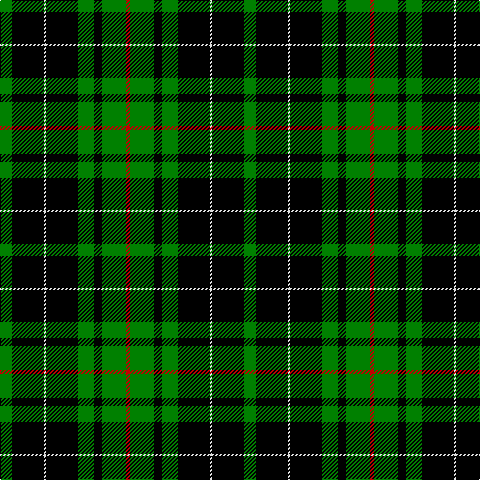

In pattern [GKWKGKGR](/patterns/gkwkgkgr/).

This was sourced from weddslist.  It is a [8 stripes tartan](/stripes/stripes8/).

Original link http://www.weddslist.com/cgi-bin/tartans/pg.pl?source=sts

## Thread count
G/12 K32 LN2 K32 G16 K8 G24 R/4

## Palette
Each colour and its ΔE from the base-6 reference it is a variant of.

| Colour | Shade | Base | ΔE (OKLab) |
|---|---|---|---|
| G | <code style="background-color:#008000;">#008000</code> `#008000` | G <code style="background-color:#006100;">#006100</code> | 0.10 |
| K | <code style="background-color:#000000;">#000000</code> `#000000` | K <code style="background-color:#000000;">#000000</code> | 0.00 |
| LN | <code style="background-color:#E0E0E0;">#E0E0E0</code> `#E0E0E0` | W <code style="background-color:#F7F7F7;">#F7F7F7</code> | 0.07 |
| R | <code style="background-color:#C00000;">#C00000</code> `#C00000` | R <code style="background-color:#CC0000;">#CC0000</code> | 0.03 |

# Sample pattern

## Nearest tartans

The nearest existing variants by ΔTartan distance.

1. [MacAulay Hunting](/setts/s8/g6k16w1k16g8k4g12r2~g004c00-k000000-rc80000-wd0d0d0~x2/) — ΔT 1.04
1. [Gunn](/setts/s6/g2k12g1k12g12r2~g008000-k000000-rc00000~x2/) — ΔT 1.21
1. [MacArthur, ?](/setts/s6/r3g30k12g6k16y2~g008000-k000000-rc00000-yf0c000~x2/) — ΔT 1.23
1. [Wilson's, No 167](/setts/s6/k20b2k6g16ba4k9~b5480b0-ba800080-g008000-k000000~x2/) — ΔT 1.31
1. [Forbes VS](/setts/s6/r1g16k8g3k4y1~g004c00-k000000-rc80000-yffc800/) — ΔT 1.32
1. [MacAulay Hunting](/setts/s8/g6k16y1k16g8k4g12r2~g11450d-k000000-raa0000-yaaaaaa~x2/) — ΔT 1.40
1. [MacArthur](/setts/s5/k32g6k12g30y3~g008000-k000000-yf0c000/) — ΔT 1.46
1. [MacDiarmid](/setts/s9/k12r2k28g12k1w3k1g12r4~g008000-k000000-rc00000-we0e0e0~x2/) — ΔT 1.50
1. [Hopetoun, Rejected design](/setts/s14/g11b1k1g2k12y1k12g2k2g11k2g2k12y1~b304080-g008000-k000000-yf0c000~x4/) — ΔT 1.52
1. [Douglas, (Black)](/setts/s5/k12b3g23k23r3~b304080-g008000-k000000-rc00000~x2/) — ΔT 1.52

## Neighbour map

Every grey dot is one of 15726 variants placed by the first two principal components of the ΔTartan feature space (44% of its variance). Red is this tartan; blue dots are its nearest — click one to open its page.

<svg viewBox="0 0 640 380" role="img" style="max-width:100%;height:auto;border:1px solid #e0e0e0;border-radius:4px;display:block" xmlns="http://www.w3.org/2000/svg"><image href="/nn/cloud.v1.png" width="640" height="380"/><a href="/setts/s8/g6k16w1k16g8k4g12r2~g004c00-k000000-rc80000-wd0d0d0~x2/"><circle cx="310.3" cy="214.8" r="4" fill="#3465a4"><title>MacAulay Hunting</title></circle></a><a href="/setts/s6/g2k12g1k12g12r2~g008000-k000000-rc00000~x2/"><circle cx="320.8" cy="237.7" r="4" fill="#3465a4"><title>Gunn</title></circle></a><a href="/setts/s6/r3g30k12g6k16y2~g008000-k000000-rc00000-yf0c000~x2/"><circle cx="274.3" cy="199.8" r="4" fill="#3465a4"><title>MacArthur, ?</title></circle></a><a href="/setts/s6/k20b2k6g16ba4k9~b5480b0-ba800080-g008000-k000000~x2/"><circle cx="296.0" cy="235.7" r="4" fill="#3465a4"><title>Wilson's, No 167</title></circle></a><a href="/setts/s6/r1g16k8g3k4y1~g004c00-k000000-rc80000-yffc800/"><circle cx="337.5" cy="200.2" r="4" fill="#3465a4"><title>Forbes VS</title></circle></a><a href="/setts/s8/g6k16y1k16g8k4g12r2~g11450d-k000000-raa0000-yaaaaaa~x2/"><circle cx="320.9" cy="218.6" r="4" fill="#3465a4"><title>MacAulay Hunting</title></circle></a><a href="/setts/s5/k32g6k12g30y3~g008000-k000000-yf0c000/"><circle cx="289.2" cy="249.4" r="4" fill="#3465a4"><title>MacArthur</title></circle></a><a href="/setts/s9/k12r2k28g12k1w3k1g12r4~g008000-k000000-rc00000-we0e0e0~x2/"><circle cx="311.7" cy="148.0" r="4" fill="#3465a4"><title>MacDiarmid</title></circle></a><a href="/setts/s14/g11b1k1g2k12y1k12g2k2g11k2g2k12y1~b304080-g008000-k000000-yf0c000~x4/"><circle cx="290.6" cy="169.6" r="4" fill="#3465a4"><title>Hopetoun, Rejected design</title></circle></a><a href="/setts/s5/k12b3g23k23r3~b304080-g008000-k000000-rc00000~x2/"><circle cx="255.6" cy="247.9" r="4" fill="#3465a4"><title>Douglas, (Black)</title></circle></a><circle cx="283.4" cy="204.1" r="5" fill="#c00000"/></svg>

ID: /setts/s8/g6k16w1k16g8k4g12r2~g008000-k000000-rc00000-we0e0e0~x2/
