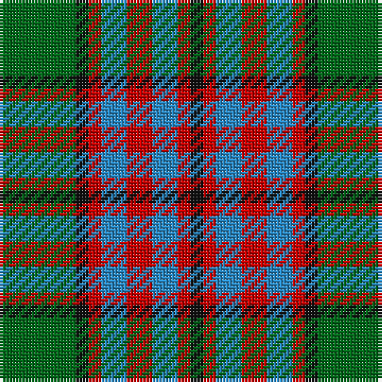

**Bands:** [GKRBRBRK](/stripes/gkrbrbrk/) · **Stripes:** [G K R T R T R K](/stripes/stripes8/) G K R T R T R K

This was sourced from register-of-tartans.  It is a [8 band tartan](/bands/bands8/).

Original link https://www.tartanregister.gov.uk/tartanDetails.aspx?ref=4725

## Register references

External register numbers recorded for this tartan.

- Scottish Register of Tartans: [4725](https://www.tartanregister.gov.uk/tartanDetails.aspx?ref=4725)
- Scottish Tartans Authority (ITI): 813
- Scottish Tartans World Register: 813

## Thread count
G/24 K4 R4 B8 R8 B8 R4 K/4

## Palette
Each colour and its ΔE from the base-6 reference it is a variant of.

| Colour | Shade | Base | ΔE (OKLab) |
|---|---|---|---|
| B | <code style="background-color:#2888C4;">#2888C4</code> `#2888C4` | B <code style="background-color:#2A418A;">#2A418A</code> | 0.21 |
| DG | <code style="background-color:#003820;">#003820</code> `#003820` | G <code style="background-color:#006100;">#006100</code> | 0.15 |
| G | <code style="background-color:#006818;">#006818</code> `#006818` | G <code style="background-color:#006100;">#006100</code> | 0.02 |
| K | <code style="background-color:#101010;">#101010</code> `#101010` | K <code style="background-color:#000000;">#000000</code> | 0.17 |
| LG | <code style="background-color:#789484;">#789484</code> `#789484` | G <code style="background-color:#006100;">#006100</code> | 0.24 |
| R | <code style="background-color:#C80000;">#C80000</code> `#C80000` | R <code style="background-color:#CC0000;">#CC0000</code> | 0.01 |
| Ra | <code style="background-color:#C80000;">#C80000</code> `#C80000` | R <code style="background-color:#CC0000;">#CC0000</code> | 0.01 |

# Sample pattern

## Nearest tartans

The nearest existing variants by ΔTartan distance.

1. [Wilson's No.179](/setts/s8/g6ly1r1t2r2t2r1ly1~x4/) — ΔT 0.81
1. [Cercle de Fermieres de St-Elie . . .](/setts/s7/r2ly1b8r1g7ly1r2~x6/) — ΔT 0.85
1. [Carnegie](/setts/s8/r33g17db50g17r11g17r9k7/) — ΔT 0.91
1. [Cape Breton District Tartan Tartan Number: 1883. Earliest known date: 1957 In 1907, Mrs Lillian Crewe Walsh of Glace Bay, Cape Breton, wrote a poem in praise of Cape Breton. This poem was given by Mrs Walsh to Mrs Grant in 1957 and the tartan designed to accord with the poem. Grey for our Cape Breton Steel, Green for our lofty See products available Copyright © Blair Urquhart, Comrie, 2015](/setts/s7/ly5k5g17k6o24k6ly3~x2/) — ΔT 0.93
1. [Daks (Brown)](/setts/s8/dy3k7dy2w2lo12k2lo2dy3~x2/) — ΔT 1.04
1. [Logan](/setts/s7/db9r3ly1r3g9r3ly1~x2/) — ΔT 1.06
1. [Stevenson (Name)](/setts/s9/ly1db6ly1r2ly1r2ly1g6r1~x8/) — ΔT 1.11
1. [Holden Monaro Corporate Tartan Tartan Number: 8700. Earliest known date: 1831 Holden Monaro GTS 1978 car seats. Reproduction colours. Warp 162 threads Weft 202 threads. Last weaving went through with slight difference. Sett size = 4 3/8th - 4 3/4 inch (112mm - 120mm) See products available Copyright © Blair Urquhart, Comrie, 2015](/setts/s8/lr10dt3lr3dt3lr3dt11dy11o3~x2/) — ΔT 1.15
1. [Lamont](/setts/s8/p11o2p2o2p2o11g14w2~x2/) — ΔT 1.16
1. [Stevenson Family Tartan Tartan Number: 1558. Earliest known date: 1980 Charles Stevenson of Glasgow emigrated to America in 1861. The Monitoring Committee of the Scottish Tartans Society operated until 1984 when the present system of accreditation was introduced for the 'Register of All Publicly Known Tartans'. The original count has been proportionately increased from the 1980 recording. See products available Copyright © Blair Urquhart, Comrie, 2015](/setts/s9/ly1db8ly1r2ly1r2ly1g8r1~x4/) — ΔT 1.16

## Neighbour map

Every grey dot is one of 14313 variants placed by the first two principal components of the ΔTartan feature space (44% of its variance). Red is this tartan; blue dots are its nearest — click one to open its page.

<svg viewBox="0 0 640 380" role="img" style="max-width:100%;height:auto;border:1px solid #e0e0e0;border-radius:4px;display:block" xmlns="http://www.w3.org/2000/svg"><image href="/nn/cloud.v1.png" width="640" height="380"/><a href="/setts/s8/g6ly1r1t2r2t2r1ly1~x4/"><circle cx="162.3" cy="212.9" r="4" fill="#3465a4"><title>Wilson's No.179</title></circle></a><a href="/setts/s7/r2ly1b8r1g7ly1r2~x6/"><circle cx="185.5" cy="203.4" r="4" fill="#3465a4"><title>Cercle de Fermieres de St-Elie . . .</title></circle></a><a href="/setts/s8/r33g17db50g17r11g17r9k7/"><circle cx="158.2" cy="221.0" r="4" fill="#3465a4"><title>Carnegie</title></circle></a><a href="/setts/s7/ly5k5g17k6o24k6ly3~x2/"><circle cx="152.5" cy="207.8" r="4" fill="#3465a4"><title>Cape Breton District Tartan Tartan Number: 1883. Earliest known date: 1957 In 1907, Mrs Lillian Crewe Walsh of Glace Bay, Cape Breton, wrote a poem in praise of Cape Breton. This poem was given by Mrs Walsh to Mrs Grant in 1957 and the tartan designed to accord with the poem. Grey for our Cape Breton Steel, Green for our lofty See products available Copyright © Blair Urquhart, Comrie, 2015</title></circle></a><a href="/setts/s8/dy3k7dy2w2lo12k2lo2dy3~x2/"><circle cx="179.4" cy="204.2" r="4" fill="#3465a4"><title>Daks (Brown)</title></circle></a><a href="/setts/s7/db9r3ly1r3g9r3ly1~x2/"><circle cx="167.0" cy="207.0" r="4" fill="#3465a4"><title>Logan</title></circle></a><a href="/setts/s9/ly1db6ly1r2ly1r2ly1g6r1~x8/"><circle cx="114.6" cy="197.4" r="4" fill="#3465a4"><title>Stevenson (Name)</title></circle></a><a href="/setts/s8/lr10dt3lr3dt3lr3dt11dy11o3~x2/"><circle cx="141.5" cy="250.1" r="4" fill="#3465a4"><title>Holden Monaro Corporate Tartan Tartan Number: 8700. Earliest known date: 1831 Holden Monaro GTS 1978 car seats. Reproduction colours. Warp 162 threads Weft 202 threads. Last weaving went through with slight difference. Sett size = 4 3/8th - 4 3/4 inch (112mm - 120mm) See products available Copyright © Blair Urquhart, Comrie, 2015</title></circle></a><a href="/setts/s8/p11o2p2o2p2o11g14w2~x2/"><circle cx="187.3" cy="211.2" r="4" fill="#3465a4"><title>Lamont</title></circle></a><a href="/setts/s9/ly1db8ly1r2ly1r2ly1g8r1~x4/"><circle cx="158.1" cy="176.1" r="4" fill="#3465a4"><title>Stevenson Family Tartan Tartan Number: 1558. Earliest known date: 1980 Charles Stevenson of Glasgow emigrated to America in 1861. The Monitoring Committee of the Scottish Tartans Society operated until 1984 when the present system of accreditation was introduced for the 'Register of All Publicly Known Tartans'. The original count has been proportionately increased from the 1980 recording. See products available Copyright © Blair Urquhart, Comrie, 2015</title></circle></a><circle cx="164.3" cy="218.3" r="5" fill="#c00000"/></svg>

ID: /setts/s8/g6k1r1t2r2t2r1k1~x4/
