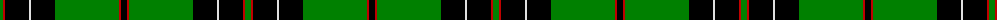
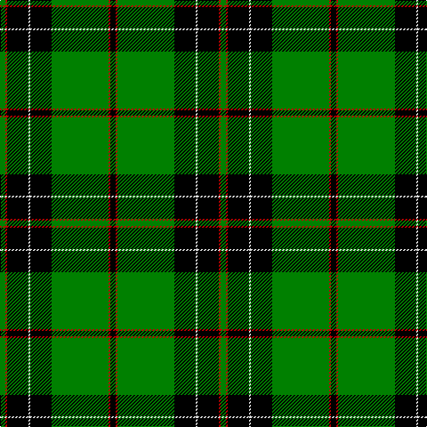

In pattern [GRKWKGRK](/patterns/grkwkgrk/).

This was sourced from weddslist.  It is a [8 stripes tartan](/stripes/stripes8/).

Original link http://www.weddslist.com/cgi-bin/tartans/pg.pl?source=sts

## Thread count
G/6 R2 K24 LN2 K24 G64 R2 K/6

## Palette
Each colour and its ΔE from the base-6 reference it is a variant of.

| Colour | Shade | Base | ΔE (OKLab) |
|---|---|---|---|
| G | <code style="background-color:#008000;">#008000</code> `#008000` | G <code style="background-color:#006400;">#006400</code> | 0.09 |
| K | <code style="background-color:#000000;">#000000</code> `#000000` | K <code style="background-color:#000000;">#000000</code> | 0.00 |
| LN | <code style="background-color:#E0E0E0;">#E0E0E0</code> `#E0E0E0` | W <code style="background-color:#F4F4F0;">#F4F4F0</code> | 0.06 |
| R | <code style="background-color:#C00000;">#C00000</code> `#C00000` | R <code style="background-color:#C80000;">#C80000</code> | 0.02 |

# Sample pattern

## Nearest tartans

The nearest existing variants by ΔTartan distance.

1. [Moran](/setts/s6/g110k34r18k22y4k8-g008000-k000000-rc00020-yf0c000/) — ΔT 0.93
1. [MacDiarmid](/setts/s9/k24r4k56g24k2w6k2g24r8-g008000-k000000-rc00000-we0e0e0/) — ΔT 1.35
1. [Mull Rugby Club (Old)](/setts/s8/g88w4g20b6k12w2r4k36-b288cc8-g007800-k000000-rc82800-wc8c8c8/) — ΔT 1.36
1. [Fort William](/setts/s11/g34b4ga4b4k42b4k6g60k4b4k8-b5480b0-g008000-ga30a010-k000000/) — ΔT 1.45
1. [Birmingham Irish Pipes & Drums](/setts/s8/g96y6k12w8g6k30y6g8-g285800-k000000-wf8f8f8-yc88c00/) — ΔT 1.47
1. [Duchess of Fife](/setts/s6/g140k52g24k28b6k32-b1474b4-g007800-k000000/) — ΔT 1.49
1. [Dropkick Murphys](/setts/s9/k6g55ga6k85ga4k4g12k2w5-g006818-ga289c18-k101010-we0e0e0/) — ΔT 1.49
1. [MacLean of Duart, hunting](/setts/s8/g6k12w2k12g4k4g32k2-g008000-k000000-we0e0e0/) — ΔT 1.50
1. [Keirnan](/setts/s10/w4g8k12r4k4r4k6r4g40w2-g008000-k000000-rc00000-we0e0e0/) — ΔT 1.50
1. [Malone (2016)](/setts/s11/k16g2k40g2k8g2k6g8w4g48y6-g005020-k000000-wf8f8f8-ybc8c00/) — ΔT 1.54

## Neighbour map

Every grey dot is one of 15726 variants placed by the first two principal components of the ΔTartan feature space (44% of its variance). Red is this tartan; blue dots are its nearest — click one to open its page.

<svg viewBox="0 0 640 380" role="img" style="max-width:100%;height:auto;border:1px solid #e0e0e0;border-radius:4px;display:block" xmlns="http://www.w3.org/2000/svg"><image href="/nn/cloud.v1.png" width="640" height="380"/><a href="/setts/s6/g110k34r18k22y4k8-g008000-k000000-rc00020-yf0c000/"><circle cx="326.0" cy="153.4" r="4" fill="#3465a4"><title>Moran</title></circle></a><a href="/setts/s9/k24r4k56g24k2w6k2g24r8-g008000-k000000-rc00000-we0e0e0/"><circle cx="311.3" cy="144.2" r="4" fill="#3465a4"><title>MacDiarmid</title></circle></a><a href="/setts/s8/g88w4g20b6k12w2r4k36-b288cc8-g007800-k000000-rc82800-wc8c8c8/"><circle cx="367.7" cy="104.2" r="4" fill="#3465a4"><title>Mull Rugby Club (Old)</title></circle></a><a href="/setts/s11/g34b4ga4b4k42b4k6g60k4b4k8-b5480b0-g008000-ga30a010-k000000/"><circle cx="284.0" cy="146.3" r="4" fill="#3465a4"><title>Fort William</title></circle></a><a href="/setts/s8/g96y6k12w8g6k30y6g8-g285800-k000000-wf8f8f8-yc88c00/"><circle cx="364.9" cy="149.9" r="4" fill="#3465a4"><title>Birmingham Irish Pipes &amp; Drums</title></circle></a><a href="/setts/s6/g140k52g24k28b6k32-b1474b4-g007800-k000000/"><circle cx="361.2" cy="196.1" r="4" fill="#3465a4"><title>Duchess of Fife</title></circle></a><a href="/setts/s9/k6g55ga6k85ga4k4g12k2w5-g006818-ga289c18-k101010-we0e0e0/"><circle cx="380.2" cy="120.5" r="4" fill="#3465a4"><title>Dropkick Murphys</title></circle></a><a href="/setts/s8/g6k12w2k12g4k4g32k2-g008000-k000000-we0e0e0/"><circle cx="332.1" cy="187.2" r="4" fill="#3465a4"><title>MacLean of Duart, hunting</title></circle></a><a href="/setts/s10/w4g8k12r4k4r4k6r4g40w2-g008000-k000000-rc00000-we0e0e0/"><circle cx="284.6" cy="128.6" r="4" fill="#3465a4"><title>Keirnan</title></circle></a><a href="/setts/s11/k16g2k40g2k8g2k6g8w4g48y6-g005020-k000000-wf8f8f8-ybc8c00/"><circle cx="307.9" cy="137.8" r="4" fill="#3465a4"><title>Malone (2016)</title></circle></a><circle cx="337.1" cy="132.4" r="5" fill="#c00000"/></svg>

ID: /setts/s8/g6r2k24w2k24g64r2k6-g008000-k000000-rc00000-we0e0e0/
