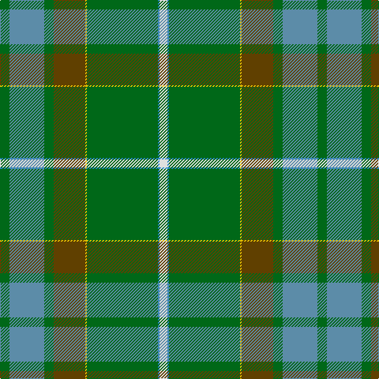

In pattern [GBGGYGBW](/stripes/gbggygbw/).

This was sourced from register-of-tartans.  It is a [8 stripe tartan](/stripes/stripes8/).

Original link https://www.tartanregister.gov.uk/tartanDetails.aspx?ref=5052

## Attestations

This cloth appears in 2 source records; the oldest owns this page.

- 01/12/2004 — Elbrick Hunting (Personal) (register-of-tartans, [record](https://www.tartanregister.gov.uk/tartanDetails.aspx?ref=5052))
- pre 2004 — Elbrick Hunting (Personal) (tartans-authority, [record](http://www.tartansauthority.com/tartan-ferret/display/7362/))

## Register references

External register numbers recorded for this tartan.

- Scottish Register of Tartans: [5052](https://www.tartanregister.gov.uk/tartanDetails.aspx?ref=5052)
- Scottish Tartans Authority (ITI): 7362
- Scottish Tartans World Register: 3034

## Thread count
G/12 Ba44 G12 T40 Y2 G90 B2 LN/10

## Palette
Each colour and the base-6 reference it is a variant of.

| Colour | Shade | Base |
|---|---|---|
| B | <code style="background-color:#2888C4;">#2888C4</code> `oklch(60.1% 0.125 241.5)` <small>#2888C4</small> | B <code style="background-color:#2A418A;">#2A418A</code> |
| Ba | <code style="background-color:#5C8CA8;">#5C8CA8</code> `oklch(61.7% 0.067 235.0)` <small>#5C8CA8</small> | B <code style="background-color:#2A418A;">#2A418A</code> |
| G | <code style="background-color:#006818;">#006818</code> `oklch(45.0% 0.142 145.0)` <small>#006818</small> | G <code style="background-color:#006100;">#006100</code> |
| LN | <code style="background-color:#E0E0E0;">#E0E0E0</code> `oklch(90.7% 0.000 89.9)` <small>#E0E0E0</small> | W <code style="background-color:#F7F7F7;">#F7F7F7</code> |
| T | <code style="background-color:#604000;">#604000</code> `oklch(39.8% 0.083 76.8)` <small>#604000</small> | G <code style="background-color:#006100;">#006100</code> |
| Y | <code style="background-color:#E8C000;">#E8C000</code> `oklch(81.9% 0.168 93.7)` <small>#E8C000</small> | Y <code style="background-color:#F2BF00;">#F2BF00</code> |

# Sample pattern

## Nearest tartans

The nearest existing variants by ΔTartan distance, with this tartan at the top so the swatches line up against it.

ΔTartan

Tartan

Sett

—

<a href="/ttd/edit/#slug=g6t22g6dy20ly1g45t1w5~x2">Elbrick Hunting (Personal)</a> <a class="nn-out" href="/setts/s8/g6t22g6dy20ly1g45t1w5~x2/" title="open its dictionary page">↗</a>

1.25

<a href="/ttd/edit/#slug=p4g4dy2w3g27dy30ly1r3~x2">Hannigan of Dirleton</a> <a class="nn-out" href="/setts/s8/p4g4dy2w3g27dy30ly1r3~x2/" title="open its dictionary page">↗</a>

1.47

<a href="/ttd/edit/#slug=g62o3g3o31k4g5t5r3~x2">Sheffield, City of (District)</a> <a class="nn-out" href="/setts/s8/g62o3g3o31k4g5t5r3~x2/" title="open its dictionary page">↗</a>

1.56

<a href="/ttd/edit/#slug=g92ly3k28n18r12db18w2g12">Mull Millennium</a> <a class="nn-out" href="/setts/s8/g92ly3k28n18r12db18w2g12/" title="open its dictionary page">↗</a>

1.57

<a href="/ttd/edit/#slug=g45k4r2g4r2k4n21r5~x2">Shiach (Personal)</a> <a class="nn-out" href="/setts/s8/g45k4r2g4r2k4n21r5~x2/" title="open its dictionary page">↗</a>

1.64

<a href="/ttd/edit/#slug=w4g10t24g42r3y4r4ly2">Muskoka</a> <a class="nn-out" href="/setts/s8/w4g10t24g42r3y4r4ly2/" title="open its dictionary page">↗</a>

1.68

<a href="/ttd/edit/#slug=db30r2db4w1o11g4ly2g22~x2">Yorkland</a> <a class="nn-out" href="/setts/s8/db30r2db4w1o11g4ly2g22~x2/" title="open its dictionary page">↗</a>

1.70

<a href="/ttd/edit/#slug=dp4g4y2w3g27y30ly1r3~x2">Hannigan of Dirleton (Personal)</a> <a class="nn-out" href="/setts/s8/dp4g4y2w3g27y30ly1r3~x2/" title="open its dictionary page">↗</a>

1.71

<a href="/ttd/edit/#slug=r3db6ly2db15dg12g39w3~x2">Wagland</a> <a class="nn-out" href="/setts/s7/r3db6ly2db15dg12g39w3~x2/" title="open its dictionary page">↗</a>

1.71

<a href="/ttd/edit/#slug=p4g24dg6lg4dg4lg4dg44lo1w4">Macmillan Cancer Support</a> <a class="nn-out" href="/setts/s9/p4g24dg6lg4dg4lg4dg44lo1w4/" title="open its dictionary page">↗</a>

1.72

<a href="/ttd/edit/#slug=y32w1k3w1g14y7k3dp3w1~x2">Leach Htg #2 (Name)</a> <a class="nn-out" href="/setts/s9/y32w1k3w1g14y7k3dp3w1~x2/" title="open its dictionary page">↗</a>

## Neighbour map

Every grey dot is one of 14299 variants placed by the first two principal components of the ΔTartan feature space (44% of its variance). Red is this tartan; blue dots are its nearest — click one to open its page.

<svg viewBox="0 0 640 380" role="img" style="max-width:100%;height:auto;border:1px solid #e0e0e0;border-radius:4px;display:block" xmlns="http://www.w3.org/2000/svg"><image href="/nn/cloud.v1.png" width="640" height="380"/><a href="/setts/s8/p4g4dy2w3g27dy30ly1r3~x2/"><circle cx="306.1" cy="129.9" r="4" fill="#3465a4"><title>Hannigan of Dirleton</title></circle></a><a href="/setts/s8/g62o3g3o31k4g5t5r3~x2/"><circle cx="364.5" cy="142.2" r="4" fill="#3465a4"><title>Sheffield, City of (District)</title></circle></a><a href="/setts/s8/g92ly3k28n18r12db18w2g12/"><circle cx="321.4" cy="94.2" r="4" fill="#3465a4"><title>Mull Millennium</title></circle></a><a href="/setts/s8/g45k4r2g4r2k4n21r5~x2/"><circle cx="369.3" cy="154.6" r="4" fill="#3465a4"><title>Shiach (Personal)</title></circle></a><a href="/setts/s8/w4g10t24g42r3y4r4ly2/"><circle cx="302.6" cy="124.1" r="4" fill="#3465a4"><title>Muskoka</title></circle></a><a href="/setts/s8/db30r2db4w1o11g4ly2g22~x2/"><circle cx="276.5" cy="130.5" r="4" fill="#3465a4"><title>Yorkland</title></circle></a><a href="/setts/s8/dp4g4y2w3g27y30ly1r3~x2/"><circle cx="333.1" cy="146.4" r="4" fill="#3465a4"><title>Hannigan of Dirleton (Personal)</title></circle></a><a href="/setts/s7/r3db6ly2db15dg12g39w3~x2/"><circle cx="281.6" cy="156.6" r="4" fill="#3465a4"><title>Wagland</title></circle></a><a href="/setts/s9/p4g24dg6lg4dg4lg4dg44lo1w4/"><circle cx="331.9" cy="91.2" r="4" fill="#3465a4"><title>Macmillan Cancer Support</title></circle></a><a href="/setts/s9/y32w1k3w1g14y7k3dp3w1~x2/"><circle cx="382.2" cy="121.1" r="4" fill="#3465a4"><title>Leach Htg #2 (Name)</title></circle></a><circle cx="345.8" cy="127.7" r="5" fill="#c00000"/></svg>

ID: /setts/s8/g6t22g6dy20ly1g45t1w5~x2/
