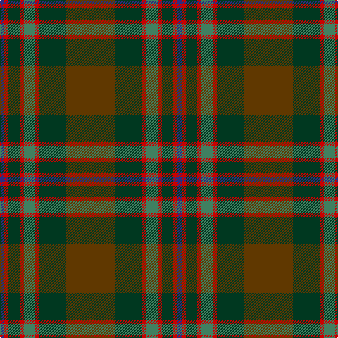

In pattern [BRGRGRGG](/patterns/brgrgrgg/).

This was sourced from tartans-authority.  It is a [8 stripes tartan](/stripes/stripes8/).

Original link http://www.tartansauthority.com/tartan-ferret/display/11022/

## Thread count
DB/6 R6 DG16 R6 G16 R6 DG38 T/70

## Palette
Each colour and its ΔE from the base-6 reference it is a variant of.

| Colour | Shade | Base | ΔE (OKLab) |
|---|---|---|---|
| DB | <code style="background-color:#2C2C80;">#2C2C80</code> `#2C2C80` | B <code style="background-color:#2C4084;">#2C4084</code> | 0.05 |
| DG | <code style="background-color:#003820;">#003820</code> `#003820` | G <code style="background-color:#006400;">#006400</code> | 0.16 |
| G | <code style="background-color:#408060;">#408060</code> `#408060` | G <code style="background-color:#006400;">#006400</code> | 0.13 |
| R | <code style="background-color:#C80000;">#C80000</code> `#C80000` | R <code style="background-color:#C80000;">#C80000</code> | 0.00 |
| T | <code style="background-color:#603800;">#603800</code> `#603800` | G <code style="background-color:#006400;">#006400</code> | 0.16 |

# Sample pattern

## Nearest tartans

The nearest existing variants by ΔTartan distance.

1. [John Muir Way](/setts/s8/g70ga38r6gb16r6ga16r6b6-b5f749c-g604000-ga003c14-gb767e52-rc80000/) — ΔT 0.37
1. [Scottish Crofting Foundation](/setts/s9/b12y6b36g4b4g20ga56r4ga8-b441800-g604000-ga5c6428-r880000-ya0b8a4/) — ΔT 0.56
1. [State Seal of Minnesota (Fashion)](/setts/s8/r8g92r20b20ga66b10ga8y6-b2c2c80-g006818-ga604000-r880000-ybc8c00/) — ΔT 0.81
1. [Cozumel](/setts/s9/g28k4ga4r4k4r28ga60k4y4-g604000-ga003820-k101010-ra00000-yd09800/) — ΔT 0.92
1. [Methven](/setts/s11/r4g6ga36r4ga4r42gb12g4gb4g48y4-g003820-ga503c14-gb5c6428-rb03000-yc88c00/) — ΔT 1.10
1. [Bennett, John Paul (Personal)](/setts/s7/g4ga62k41b6k4b38r4-b5b5758-g715937-ga1a4014-k101010-rb93e5a/) — ΔT 1.11
1. [Pubcrawlers (Corporate)](/setts/s7/g6ga8g4ga44b10r32y6-b5c5c5c-g006818-ga604000-r901c38-ye8c000/) — ΔT 1.13
1. [New South Wales Waratah](/setts/s10/g24b4r4b4ba52ga4g6ga6g48r8-b1c0070-ba14283c-g5c6428-ga003820-r880000/) — ΔT 1.26
1. [Brave for Men (Fashion)](/setts/s8/k5g5k5g34b33k6b5r2-b5c5c5c-g604000-k101010-r888888/) — ΔT 1.27
1. [Glasgow Cathedral 2000](/setts/s10/g44r6b20ba4b20r42g44r6y4b4-b003c64-ba1870a4-g005814-r940000-yb89800/) — ΔT 1.30

## Neighbour map

Every grey dot is one of 15726 variants placed by the first two principal components of the ΔTartan feature space (44% of its variance). Red is this tartan; blue dots are its nearest — click one to open its page.

<svg viewBox="0 0 640 380" role="img" style="max-width:100%;height:auto;border:1px solid #e0e0e0;border-radius:4px;display:block" xmlns="http://www.w3.org/2000/svg"><image href="/nn/cloud.v1.png" width="640" height="380"/><a href="/setts/s8/g70ga38r6gb16r6ga16r6b6-b5f749c-g604000-ga003c14-gb767e52-rc80000/"><circle cx="298.3" cy="197.6" r="4" fill="#3465a4"><title>John Muir Way</title></circle></a><a href="/setts/s9/b12y6b36g4b4g20ga56r4ga8-b441800-g604000-ga5c6428-r880000-ya0b8a4/"><circle cx="306.2" cy="186.1" r="4" fill="#3465a4"><title>Scottish Crofting Foundation</title></circle></a><a href="/setts/s8/r8g92r20b20ga66b10ga8y6-b2c2c80-g006818-ga604000-r880000-ybc8c00/"><circle cx="284.9" cy="186.4" r="4" fill="#3465a4"><title>State Seal of Minnesota (Fashion)</title></circle></a><a href="/setts/s9/g28k4ga4r4k4r28ga60k4y4-g604000-ga003820-k101010-ra00000-yd09800/"><circle cx="305.3" cy="167.0" r="4" fill="#3465a4"><title>Cozumel</title></circle></a><a href="/setts/s11/r4g6ga36r4ga4r42gb12g4gb4g48y4-g003820-ga503c14-gb5c6428-rb03000-yc88c00/"><circle cx="247.1" cy="171.9" r="4" fill="#3465a4"><title>Methven</title></circle></a><a href="/setts/s7/g4ga62k41b6k4b38r4-b5b5758-g715937-ga1a4014-k101010-rb93e5a/"><circle cx="286.6" cy="202.3" r="4" fill="#3465a4"><title>Bennett, John Paul (Personal)</title></circle></a><a href="/setts/s7/g6ga8g4ga44b10r32y6-b5c5c5c-g006818-ga604000-r901c38-ye8c000/"><circle cx="315.0" cy="208.1" r="4" fill="#3465a4"><title>Pubcrawlers (Corporate)</title></circle></a><a href="/setts/s10/g24b4r4b4ba52ga4g6ga6g48r8-b1c0070-ba14283c-g5c6428-ga003820-r880000/"><circle cx="319.3" cy="176.5" r="4" fill="#3465a4"><title>New South Wales Waratah</title></circle></a><a href="/setts/s8/k5g5k5g34b33k6b5r2-b5c5c5c-g604000-k101010-r888888/"><circle cx="352.7" cy="206.2" r="4" fill="#3465a4"><title>Brave for Men (Fashion)</title></circle></a><a href="/setts/s10/g44r6b20ba4b20r42g44r6y4b4-b003c64-ba1870a4-g005814-r940000-yb89800/"><circle cx="268.2" cy="194.6" r="4" fill="#3465a4"><title>Glasgow Cathedral 2000</title></circle></a><circle cx="296.6" cy="197.1" r="5" fill="#c00000"/></svg>

ID: /setts/s8/g70ga38r6gb16r6ga16r6b6-b2c2c80-g603800-ga003820-gb408060-rc80000/
