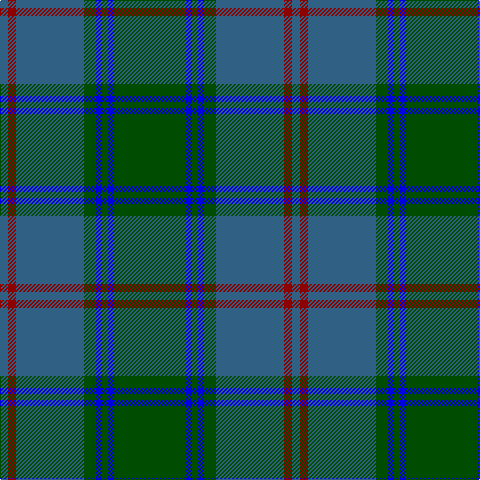

In pattern [BRBGBGBG](/patterns/brbgbgbg/).

This was sourced from register-of-tartans.  It is a [8 stripes tartan](/stripes/stripes8/).

Original link https://www.tartanregister.gov.uk/tartanDetails.aspx?ref=4528

## Thread count
Ba/8 DR8 Ba68 G12 B6 G6 B6 G/72

## Palette
Each colour and its ΔE from the base-6 reference it is a variant of.

| Colour | Shade | Base | ΔE (OKLab) |
|---|---|---|---|
| B | <code style="background-color:#0000E0;">#0000E0</code> `#0000E0` | B <code style="background-color:#2C4084;">#2C4084</code> | 0.17 |
| Ba | <code style="background-color:#306084;">#306084</code> `#306084` | B <code style="background-color:#2C4084;">#2C4084</code> | 0.10 |
| DR | <code style="background-color:#8C0000;">#8C0000</code> `#8C0000` | R <code style="background-color:#C80000;">#C80000</code> | 0.13 |
| G | <code style="background-color:#004C00;">#004C00</code> `#004C00` | G <code style="background-color:#006400;">#006400</code> | 0.08 |

# Sample pattern

## Nearest tartans

The nearest existing variants by ΔTartan distance.

1. [St. Andrews New Golf Club](/setts/s9/b8ba36r4ba4r4ba18g40ba6g8-b780078-ba003c64-g006818-r880000/) — ΔT 0.81
1. [Land's End Blue](/setts/s8/b4g18r4g18b4g4b52ga4-b003c64-g006818-ga003820-r901c38/) — ΔT 1.06
1. [Jones (Welsh Name)](/setts/s10/b6ba3b3ba15g7b7g5b17g46ga4-b202060-ba5c8ca8-g003820-ga285800/) — ΔT 1.13
1. [Gammell (Brown) (Personal)](/setts/s8/b40g4b4g4b4g12ga30g4-b2c2c80-g604000-ga006818/) — ΔT 1.34
1. [Stuart/Stewart of Appin #2](/setts/s10/g11r4g4r7g41b11ba4b41r4b8-b2c4084-ba3c82af-g005020-rdc0000/) — ΔT 1.34
1. [Ben Lomond Fashion Tartan Tartan Number: 6500. Earliest known date: pre 2005 See products available Copyright © Blair Urquhart, Comrie, 2015](/setts/s8/w6g5k6g42b42k5b5k5-b2d5c71-g3a5134-k1e1a10-we0e0e0/) — ΔT 1.39
1. [MacAuliffe/McAucliffe](/setts/s8/g76w4g12b48r12b4r6b4-b2c4084-g005020-rc87814-we0e0e0/) — ΔT 1.44
1. [Gammell Family Tartan Tartan Number: 597. Earliest known date: 1965 Designed (probably by David Thomas and Arthur Mackie of Strathmore Woollen Co) for the Hill family of Angus as a personal tartan. Tommy Gemmell (6.3.05) said "The tartan was designed using the largest Government sett by Mrs Hill's mother - a Mrs Gammell - who was a handweaver." See products available Copyright © Blair Urquhart, Comrie, 2015](/setts/s8/b64ba6b6ba6b6ba20g48r6-b202060-ba441800-g006818-r901c38/) — ΔT 1.45
1. [Shanahan (Corporate)](/setts/s9/k4r4k8y6g48k4g32b34r4-b1870a4-g00643c-k101010-rcc4438-ybc8c00/) — ΔT 1.46
1. [Walker Hunting (Name)](/setts/s12/r8b4g14b30g6b6g6b14g56k14g12k4-b202060-g205034-k101010-rc80000/) — ΔT 1.47

## Neighbour map

Every grey dot is one of 15726 variants placed by the first two principal components of the ΔTartan feature space (44% of its variance). Red is this tartan; blue dots are its nearest — click one to open its page.

<svg viewBox="0 0 640 380" role="img" style="max-width:100%;height:auto;border:1px solid #e0e0e0;border-radius:4px;display:block" xmlns="http://www.w3.org/2000/svg"><image href="/nn/cloud.v1.png" width="640" height="380"/><a href="/setts/s9/b8ba36r4ba4r4ba18g40ba6g8-b780078-ba003c64-g006818-r880000/"><circle cx="337.3" cy="224.9" r="4" fill="#3465a4"><title>St. Andrews New Golf Club</title></circle></a><a href="/setts/s8/b4g18r4g18b4g4b52ga4-b003c64-g006818-ga003820-r901c38/"><circle cx="421.3" cy="220.2" r="4" fill="#3465a4"><title>Land's End Blue</title></circle></a><a href="/setts/s10/b6ba3b3ba15g7b7g5b17g46ga4-b202060-ba5c8ca8-g003820-ga285800/"><circle cx="344.6" cy="190.0" r="4" fill="#3465a4"><title>Jones (Welsh Name)</title></circle></a><a href="/setts/s8/b40g4b4g4b4g12ga30g4-b2c2c80-g604000-ga006818/"><circle cx="337.0" cy="231.4" r="4" fill="#3465a4"><title>Gammell (Brown) (Personal)</title></circle></a><a href="/setts/s10/g11r4g4r7g41b11ba4b41r4b8-b2c4084-ba3c82af-g005020-rdc0000/"><circle cx="301.5" cy="199.7" r="4" fill="#3465a4"><title>Stuart/Stewart of Appin #2</title></circle></a><a href="/setts/s8/w6g5k6g42b42k5b5k5-b2d5c71-g3a5134-k1e1a10-we0e0e0/"><circle cx="290.0" cy="220.7" r="4" fill="#3465a4"><title>Ben Lomond Fashion Tartan Tartan Number: 6500. Earliest known date: pre 2005 See products available Copyright © Blair Urquhart, Comrie, 2015</title></circle></a><a href="/setts/s8/g76w4g12b48r12b4r6b4-b2c4084-g005020-rc87814-we0e0e0/"><circle cx="360.4" cy="173.5" r="4" fill="#3465a4"><title>MacAuliffe/McAucliffe</title></circle></a><a href="/setts/s8/b64ba6b6ba6b6ba20g48r6-b202060-ba441800-g006818-r901c38/"><circle cx="311.4" cy="209.7" r="4" fill="#3465a4"><title>Gammell Family Tartan Tartan Number: 597. Earliest known date: 1965 Designed (probably by David Thomas and Arthur Mackie of Strathmore Woollen Co) for the Hill family of Angus as a personal tartan. Tommy Gemmell (6.3.05) said &quot;The tartan was designed using the largest Government sett by Mrs Hill's mother - a Mrs Gammell - who was a handweaver.&quot; See products available Copyright © Blair Urquhart, Comrie, 2015</title></circle></a><a href="/setts/s9/k4r4k8y6g48k4g32b34r4-b1870a4-g00643c-k101010-rcc4438-ybc8c00/"><circle cx="316.6" cy="185.3" r="4" fill="#3465a4"><title>Shanahan (Corporate)</title></circle></a><a href="/setts/s12/r8b4g14b30g6b6g6b14g56k14g12k4-b202060-g205034-k101010-rc80000/"><circle cx="372.9" cy="202.3" r="4" fill="#3465a4"><title>Walker Hunting (Name)</title></circle></a><circle cx="356.8" cy="209.4" r="5" fill="#c00000"/></svg>

ID: /setts/s8/g72b6g6b6g12ba68r8ba8-b0000e0-ba306084-g004c00-r8c0000/
