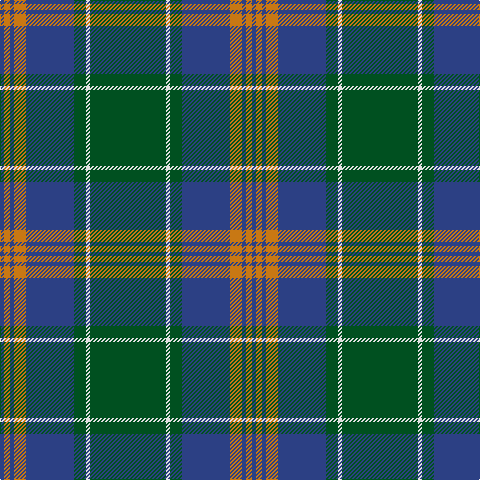

In pattern [BRBRBGWG](/patterns/brbrbgwg/).

This was sourced from register-of-tartans.  It is a [8 stripes tartan](/stripes/stripes8/).

Original link https://www.tartanregister.gov.uk/tartanDetails.aspx?ref=2289

## Thread count
B/4 O6 B4 O12 B48 G12 LN4 G/76

## Palette
Each colour and its ΔE from the base-6 reference it is a variant of.

| Colour | Shade | Base | ΔE (OKLab) |
|---|---|---|---|
| B | <code style="background-color:#2C4084;">#2C4084</code> `#2C4084` | B <code style="background-color:#2A418A;">#2A418A</code> | 0.01 |
| G | <code style="background-color:#005020;">#005020</code> `#005020` | G <code style="background-color:#006100;">#006100</code> | 0.07 |
| LN | <code style="background-color:#E0E0E0;">#E0E0E0</code> `#E0E0E0` | W <code style="background-color:#F7F7F7;">#F7F7F7</code> | 0.07 |
| O | <code style="background-color:#C87814;">#C87814</code> `#C87814` | R <code style="background-color:#CC0000;">#CC0000</code> | 0.17 |

# Sample pattern

## Nearest tartans

The nearest existing variants by ΔTartan distance.

1. [US Marine Corps](/setts/s8/g80r6g8r6g24b64y8r6-b2c2c80-g006818-rc80000-yd09800/) — ΔT 0.89
1. [U.S. Marine Corps (Military?)](/setts/s8/g80r6g8r6g24b64y8r6-b2c2c80-g005810-rc80000-ye8c000/) — ΔT 0.92
1. [Leatherneck U.S.Marine Corps Corporate Tartan Tartan Number: 975. Earliest known date: 1986 Designed by Madam Leask and the Scottish Tartans Society Accredited in 1981. See products available Copyright © Blair Urquhart, Comrie, 2015](/setts/s8/g56r4g4r4g16b48y6r4-b2c2c80-g006818-rc80000-ye8c000/) — ΔT 0.96
1. [Leatherneck, U.S.Marine Corps](/setts/s8/g56r4g4r4g16b48ga6r4-b304080-g008000-ga908000-rc00000/) — ΔT 1.07
1. [Harley (Leslie), Robert](/setts/s8/g8k12y4k12g8b32g64k4-b202060-g006818-k101010-ye8c000/) — ΔT 1.09
1. [Johnston Clan Tartan Tartan Number: 1063. Earliest known date: 1842 A powerful Border Clan who pursued a deadly feud with the Maxwells. Their stronghold was Lochwood Tower, near Beattock, which was burned down by the Maxwells in 1593. The tartan was first published in the Vestiarium Scoticum in 1842. Before that time Border tartans were generally un-named. More likely the tartan came from the Aberdeenshire Johnstons, whose family seat is at Caskieben, Blackburn. (Ref: The Setts.. No. 82. D.C.Stewart.) See products available Copyright © Blair Urquhart, Comrie, 2015](/setts/s8/y6g4k2g60b48k4b4k4-b2c2c80-g006818-k101010-ye8c000/) — ΔT 1.15
1. [Shaw (Clan 1)](/setts/s6/g48k4b6k4b16r4-b2c2c80-g006818-k101010-rc80000/) — ΔT 1.17
1. [Harley (Leslie), Robert](/setts/s8/g8k12y4k12g8b32g64k4-b000048-g005020-k101010-yffe600/) — ΔT 1.18
1. [Wicklow](/setts/s10/b4ba8g24ba6b12bb4ba48b4ba4g4-b401000-ba304080-bb5480b0-g008000/) — ΔT 1.19
1. [Leatherneck](/setts/s8/g80r6g8r6g24b64y8r6-b1c0070-g006818-r880000-yd09800/) — ΔT 1.20

## Neighbour map

Every grey dot is one of 15726 variants placed by the first two principal components of the ΔTartan feature space (44% of its variance). Red is this tartan; blue dots are its nearest — click one to open its page.

<svg viewBox="0 0 640 380" role="img" style="max-width:100%;height:auto;border:1px solid #e0e0e0;border-radius:4px;display:block" xmlns="http://www.w3.org/2000/svg"><image href="/nn/cloud.v1.png" width="640" height="380"/><a href="/setts/s8/g80r6g8r6g24b64y8r6-b2c2c80-g006818-rc80000-yd09800/"><circle cx="340.7" cy="185.0" r="4" fill="#3465a4"><title>US Marine Corps</title></circle></a><a href="/setts/s8/g80r6g8r6g24b64y8r6-b2c2c80-g005810-rc80000-ye8c000/"><circle cx="339.3" cy="184.7" r="4" fill="#3465a4"><title>U.S. Marine Corps (Military?)</title></circle></a><a href="/setts/s8/g56r4g4r4g16b48y6r4-b2c2c80-g006818-rc80000-ye8c000/"><circle cx="327.1" cy="177.0" r="4" fill="#3465a4"><title>Leatherneck U.S.Marine Corps Corporate Tartan Tartan Number: 975. Earliest known date: 1986 Designed by Madam Leask and the Scottish Tartans Society Accredited in 1981. See products available Copyright © Blair Urquhart, Comrie, 2015</title></circle></a><a href="/setts/s8/g56r4g4r4g16b48ga6r4-b304080-g008000-ga908000-rc00000/"><circle cx="337.9" cy="182.5" r="4" fill="#3465a4"><title>Leatherneck, U.S.Marine Corps</title></circle></a><a href="/setts/s8/g8k12y4k12g8b32g64k4-b202060-g006818-k101010-ye8c000/"><circle cx="334.2" cy="184.3" r="4" fill="#3465a4"><title>Harley (Leslie), Robert</title></circle></a><a href="/setts/s8/y6g4k2g60b48k4b4k4-b2c2c80-g006818-k101010-ye8c000/"><circle cx="343.9" cy="142.9" r="4" fill="#3465a4"><title>Johnston Clan Tartan Tartan Number: 1063. Earliest known date: 1842 A powerful Border Clan who pursued a deadly feud with the Maxwells. Their stronghold was Lochwood Tower, near Beattock, which was burned down by the Maxwells in 1593. The tartan was first published in the Vestiarium Scoticum in 1842. Before that time Border tartans were generally un-named. More likely the tartan came from the Aberdeenshire Johnstons, whose family seat is at Caskieben, Blackburn. (Ref: The Setts.. No. 82. D.C.Stewart.) See products available Copyright © Blair Urquhart, Comrie, 2015</title></circle></a><a href="/setts/s6/g48k4b6k4b16r4-b2c2c80-g006818-k101010-rc80000/"><circle cx="366.7" cy="203.8" r="4" fill="#3465a4"><title>Shaw (Clan 1)</title></circle></a><a href="/setts/s8/g8k12y4k12g8b32g64k4-b000048-g005020-k101010-yffe600/"><circle cx="342.0" cy="190.5" r="4" fill="#3465a4"><title>Harley (Leslie), Robert</title></circle></a><a href="/setts/s10/b4ba8g24ba6b12bb4ba48b4ba4g4-b401000-ba304080-bb5480b0-g008000/"><circle cx="344.5" cy="183.5" r="4" fill="#3465a4"><title>Wicklow</title></circle></a><a href="/setts/s8/g80r6g8r6g24b64y8r6-b1c0070-g006818-r880000-yd09800/"><circle cx="327.9" cy="181.8" r="4" fill="#3465a4"><title>Leatherneck</title></circle></a><circle cx="360.4" cy="173.5" r="5" fill="#c00000"/></svg>

ID: /setts/s8/g76w4g12b48r12b4r6b4-b2c4084-g005020-rc87814-we0e0e0/
