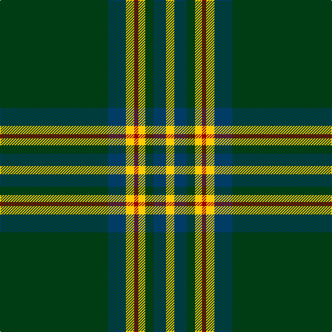

In pattern [GBYRYGBY](/patterns/gbyrygby/).

This was sourced from register-of-tartans.  It is a [8 stripes tartan](/stripes/stripes8/).

Original link https://www.tartanregister.gov.uk/tartanDetails.aspx?ref=11080

## Thread count
DG/156 DB26 Y12 DR6 Y10 DG12 DB18 Y/12

## Palette
Each colour and its ΔE from the base-6 reference it is a variant of.

| Colour | Shade | Base | ΔE (OKLab) |
|---|---|---|---|
| DB | <code style="background-color:#003C64;">#003C64</code> `#003C64` | B <code style="background-color:#2A418A;">#2A418A</code> | 0.08 |
| DG | <code style="background-color:#003C14;">#003C14</code> `#003C14` | G <code style="background-color:#006100;">#006100</code> | 0.13 |
| DR | <code style="background-color:#A00000;">#A00000</code> `#A00000` | R <code style="background-color:#CC0000;">#CC0000</code> | 0.09 |
| Y | <code style="background-color:#FCCC00;">#FCCC00</code> `#FCCC00` | Y <code style="background-color:#F2BF00;">#F2BF00</code> | 0.04 |

# Sample pattern

## Nearest tartans

The nearest existing variants by ΔTartan distance.

1. [Walterstrm (2014))](/setts/s8/g78b13y6r3y5g6b9y6x2~b2c2c80-g006818-rc80000-yfccc00/) — ΔT 0.96
1. [New York Jets](/setts/s8/g60w3k12r5g9r6k4w10~g005020-k101010-r888888-wffffff/) — ΔT 1.06
1. [Glenfeshie (Personal)](/setts/s9/r4g3b3g44b16g10w2g2b2x2~b6c0070-g006818-rc8002c-wfcfcfc/) — ΔT 1.07
1. [Scotts Valley](/setts/s9/g20r1y1r1w1g1r1w1b5x4~b00008c-g004c00-r8c0000-wc8c8c8-yc89800/) — ΔT 1.13
1. [University of Alberta (Corporate)](/setts/s10/k3g32k2g4y4g2y4g4k6w3x2~g005010-k101010-we0e0e0-ye8c000/) — ΔT 1.14
1. [Dryfe](/setts/s11/g42k10y2k2r2k2g10r6k2r3g2x2~g004c00-k000000-r780028-yfc9898/) — ΔT 1.18
1. [Forde Irish Family Tartan Tartan Number: 829. Earliest known date: c1890 This pattern was recorded by Bill Johnston, Shippak, USA in 1978 along with other patterns extracted from the 'Clan Originaux' at Pendleton Mill. This and other Irish patterns appear to have originated in the former Waterford Mill in Ireland before they arrived at Pendleton in the late 19thC See products available Copyright © Blair Urquhart, Comrie, 2015](/setts/s10/g16y1k2r1k1r1k2y1k1g1x4~g006818-k101010-rc80000-ye8c000/) — ΔT 1.22
1. [Birmingham Irish Pipes & Drums](/setts/s8/g48y3k6w4g3k15y3g4x2~g285800-k000000-wf8f8f8-yc88c00/) — ΔT 1.25
1. [Moran (French) (Name)](/setts/s10/g67k2g2k2g2y8r8k8y2b7x2~b2888c4-g003820-k101010-rc80000-ye8c000/) — ΔT 1.26
1. [Forde](/setts/s10/g30y2k3r2k2r2k3y2k2g4x2~g006818-k101010-rc80000-ye8c000/) — ΔT 1.26

## Neighbour map

Every grey dot is one of 15726 variants placed by the first two principal components of the ΔTartan feature space (44% of its variance). Red is this tartan; blue dots are its nearest — click one to open its page.

<svg viewBox="0 0 640 380" role="img" style="max-width:100%;height:auto;border:1px solid #e0e0e0;border-radius:4px;display:block" xmlns="http://www.w3.org/2000/svg"><image href="/nn/cloud.v1.png" width="640" height="380"/><a href="/setts/s8/g78b13y6r3y5g6b9y6x2~b2c2c80-g006818-rc80000-yfccc00/"><circle cx="422.4" cy="134.3" r="4" fill="#3465a4"><title>Walterstrm (2014))</title></circle></a><a href="/setts/s8/g60w3k12r5g9r6k4w10~g005020-k101010-r888888-wffffff/"><circle cx="357.7" cy="145.4" r="4" fill="#3465a4"><title>New York Jets</title></circle></a><a href="/setts/s9/r4g3b3g44b16g10w2g2b2x2~b6c0070-g006818-rc8002c-wfcfcfc/"><circle cx="448.1" cy="148.5" r="4" fill="#3465a4"><title>Glenfeshie (Personal)</title></circle></a><a href="/setts/s9/g20r1y1r1w1g1r1w1b5x4~b00008c-g004c00-r8c0000-wc8c8c8-yc89800/"><circle cx="400.5" cy="122.0" r="4" fill="#3465a4"><title>Scotts Valley</title></circle></a><a href="/setts/s10/k3g32k2g4y4g2y4g4k6w3x2~g005010-k101010-we0e0e0-ye8c000/"><circle cx="375.1" cy="147.4" r="4" fill="#3465a4"><title>University of Alberta (Corporate)</title></circle></a><a href="/setts/s11/g42k10y2k2r2k2g10r6k2r3g2x2~g004c00-k000000-r780028-yfc9898/"><circle cx="413.7" cy="137.8" r="4" fill="#3465a4"><title>Dryfe</title></circle></a><a href="/setts/s10/g16y1k2r1k1r1k2y1k1g1x4~g006818-k101010-rc80000-ye8c000/"><circle cx="387.0" cy="137.1" r="4" fill="#3465a4"><title>Forde Irish Family Tartan Tartan Number: 829. Earliest known date: c1890 This pattern was recorded by Bill Johnston, Shippak, USA in 1978 along with other patterns extracted from the 'Clan Originaux' at Pendleton Mill. This and other Irish patterns appear to have originated in the former Waterford Mill in Ireland before they arrived at Pendleton in the late 19thC See products available Copyright © Blair Urquhart, Comrie, 2015</title></circle></a><a href="/setts/s8/g48y3k6w4g3k15y3g4x2~g285800-k000000-wf8f8f8-yc88c00/"><circle cx="364.9" cy="153.8" r="4" fill="#3465a4"><title>Birmingham Irish Pipes &amp; Drums</title></circle></a><a href="/setts/s10/g67k2g2k2g2y8r8k8y2b7x2~b2888c4-g003820-k101010-rc80000-ye8c000/"><circle cx="413.6" cy="92.2" r="4" fill="#3465a4"><title>Moran (French) (Name)</title></circle></a><a href="/setts/s10/g30y2k3r2k2r2k3y2k2g4x2~g006818-k101010-rc80000-ye8c000/"><circle cx="398.9" cy="142.9" r="4" fill="#3465a4"><title>Forde</title></circle></a><circle cx="424.9" cy="137.9" r="5" fill="#c00000"/></svg>

ID: /setts/s8/g78b13y6r3y5g6b9y6x2~b003c64-g003c14-ra00000-yfccc00/
