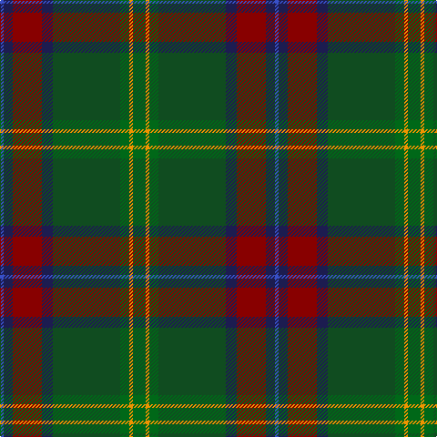

**Bands:** [BBRBGGYG](/stripes/bbrbggyg/) · **Stripes:** [B DB R DB DG G LO G](/stripes/stripes8/) B DB R DB DG G LO G

This was sourced from register-of-tartans.  It is a [8 band tartan](/bands/bands8/).

Original link https://www.tartanregister.gov.uk/tartanDetails.aspx?ref=10095

## Attestations

This cloth appears in 3 source records; the oldest owns this page.

- 25/09/2009 — Telfer Green (register-of-tartans, [record](https://www.tartanregister.gov.uk/tartanDetails.aspx?ref=10095))
- pre 2009 — Telfer Green (Name) (tartans-authority, [record](http://www.tartansauthority.com/tartan-ferret/display/10095/))
- undated — Telfer Green Name Tartan Tartan Number: 10095. Earliest known date: 2009 A tartan partly inspired by the Hunting Stewart that the designer wears occasionally, and the brooding darkness of the forests. The electric blue stripe is reminiscent of summer lightning across the Scottish landscape, and the sun (gold) is never far away. This tartan is dedicated to all who enjoy nature, trees and plants; to professionals and hobbyists in radio, electronics and communication; and those who are interested in the weather, storms and lightning. Although there are no restrictions, anyone intending to manufacture or use this tartan is encouraged to contact the designer (or his direct descendants) and a choice of preferred charities will be offered for a suggested donation. Copyright of this design belongs to Duncan Telfer. See products available Copyright © Blair Urquhart, Comrie, 2015 (house-of-tartan, [record](http://www.house-of-tartan.scotland.net/house/TartanViewjs.asp?colr=Def&tnam=10095))

## Register references

External register numbers recorded for this tartan.

- Scottish Register of Tartans: [10095](https://www.tartanregister.gov.uk/tartanDetails.aspx?ref=10095)

## Thread count
B/4 DB10 DR32 DB12 G74 Ga10 DY4 Ga/14

## Palette
Each colour and its ΔE from the base-6 reference it is a variant of.

| Colour | Shade | Base | ΔE (OKLab) |
|---|---|---|---|
| B | <code style="background-color:#3850C8;">#3850C8</code> `#3850C8` | B <code style="background-color:#2A418A;">#2A418A</code> | 0.11 |
| DB | <code style="background-color:#1C1C50;">#1C1C50</code> `#1C1C50` | B <code style="background-color:#2A418A;">#2A418A</code> | 0.14 |
| DR | <code style="background-color:#880000;">#880000</code> `#880000` | R <code style="background-color:#CC0000;">#CC0000</code> | 0.15 |
| DY | <code style="background-color:#F09400;">#F09400</code> `#F09400` | Y <code style="background-color:#F2BF00;">#F2BF00</code> | 0.10 |
| G | <code style="background-color:#104C20;">#104C20</code> `#104C20` | G <code style="background-color:#006100;">#006100</code> | 0.08 |
| Ga | <code style="background-color:#006818;">#006818</code> `#006818` | G <code style="background-color:#006100;">#006100</code> | 0.02 |

# Sample pattern

## Nearest tartans

The nearest existing variants by ΔTartan distance.

1. [Waterford, County](/setts/s6/dg42lo2y16db7do16r5~x2/) — ΔT 0.98
1. [Glencross (Tynron) (Personal)](/setts/s6/o3dg13dt13lo2dg34w3~x2/) — ΔT 1.05
1. [Aberuchill District Tartan Tartan Number: 6814. Earliest known date: 2005 Aberuchill lends it name to the area south of Comrie where the river Ruchil meets the river Earn. The two rivers form the boundaries of the Aberuchill Estate for which this tartan was created. See products available Copyright © Blair Urquhart, Comrie, 2015](/setts/s8/m8k2y10dp30y30g55k4o6/) — ΔT 1.08
1. [Dobson (Palm Bay) (Personal)](/setts/s6/g15lo1do2db5k4dg5~x6/) — ΔT 1.24
1. [Cozumel](/setts/s9/dy7k1dg1r1k1r7dg15k1lo1~x4/) — ΔT 1.28
1. [State Seal of Minnesota (Fashion)](/setts/s8/r4g46r10db10dy33db5dy4lo3~x2/) — ΔT 1.30
1. [Batten of Argyll (Baddenach)](/setts/s8/dp10k2dg10dp30dg30dg55k4r8/) — ΔT 1.31
1. [New South Wales Waratah](/setts/s10/y12db2r2db2dt26dg2y3dg3y24r4~x2/) — ΔT 1.32
1. [Wagland](/setts/s7/r3db6ly2db15dg12g39w3~x2/) — ΔT 1.34
1. [Ogg of Tarragann Hunting (Personal)](/setts/s12/lo2g2lo1g10k6r1dy14r1dy14r1t6r2~x2/) — ΔT 1.40

## Neighbour map

Every grey dot is one of 14313 variants placed by the first two principal components of the ΔTartan feature space (44% of its variance). Red is this tartan; blue dots are its nearest — click one to open its page.

<svg viewBox="0 0 640 380" role="img" style="max-width:100%;height:auto;border:1px solid #e0e0e0;border-radius:4px;display:block" xmlns="http://www.w3.org/2000/svg"><image href="/nn/cloud.v1.png" width="640" height="380"/><a href="/setts/s6/dg42lo2y16db7do16r5~x2/"><circle cx="302.4" cy="191.3" r="4" fill="#3465a4"><title>Waterford, County</title></circle></a><a href="/setts/s6/o3dg13dt13lo2dg34w3~x2/"><circle cx="302.3" cy="193.2" r="4" fill="#3465a4"><title>Glencross (Tynron) (Personal)</title></circle></a><a href="/setts/s8/m8k2y10dp30y30g55k4o6/"><circle cx="243.5" cy="150.8" r="4" fill="#3465a4"><title>Aberuchill District Tartan Tartan Number: 6814. Earliest known date: 2005 Aberuchill lends it name to the area south of Comrie where the river Ruchil meets the river Earn. The two rivers form the boundaries of the Aberuchill Estate for which this tartan was created. See products available Copyright © Blair Urquhart, Comrie, 2015</title></circle></a><a href="/setts/s6/g15lo1do2db5k4dg5~x6/"><circle cx="266.2" cy="207.2" r="4" fill="#3465a4"><title>Dobson (Palm Bay) (Personal)</title></circle></a><a href="/setts/s9/dy7k1dg1r1k1r7dg15k1lo1~x4/"><circle cx="309.5" cy="174.1" r="4" fill="#3465a4"><title>Cozumel</title></circle></a><a href="/setts/s8/r4g46r10db10dy33db5dy4lo3~x2/"><circle cx="289.4" cy="194.8" r="4" fill="#3465a4"><title>State Seal of Minnesota (Fashion)</title></circle></a><a href="/setts/s8/dp10k2dg10dp30dg30dg55k4r8/"><circle cx="255.8" cy="167.7" r="4" fill="#3465a4"><title>Batten of Argyll (Baddenach)</title></circle></a><a href="/setts/s10/y12db2r2db2dt26dg2y3dg3y24r4~x2/"><circle cx="323.7" cy="184.2" r="4" fill="#3465a4"><title>New South Wales Waratah</title></circle></a><a href="/setts/s7/r3db6ly2db15dg12g39w3~x2/"><circle cx="281.7" cy="156.5" r="4" fill="#3465a4"><title>Wagland</title></circle></a><a href="/setts/s12/lo2g2lo1g10k6r1dy14r1dy14r1t6r2~x2/"><circle cx="243.8" cy="150.2" r="4" fill="#3465a4"><title>Ogg of Tarragann Hunting (Personal)</title></circle></a><circle cx="285.4" cy="163.0" r="5" fill="#c00000"/></svg>

ID: /setts/s8/g7lo2g5dg37db6r16db5b2~x2/
