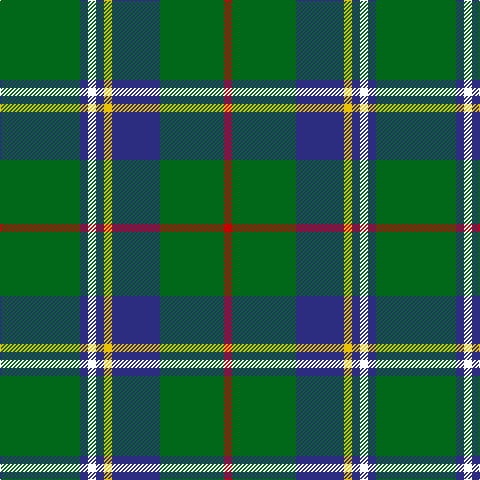

In pattern [GBWBYBGR](/patterns/gbwbybgr/).

This was sourced from register-of-tartans.  It is a [8 stripes tartan](/stripes/stripes8/).

Original link https://www.tartanregister.gov.uk/tartanDetails.aspx?ref=2839

## Attestations

This cloth appears in 2 source records; the oldest owns this page.

- 01/01/1986 — Marshall Field (register-of-tartans, [record](https://www.tartanregister.gov.uk/tartanDetails.aspx?ref=2839))
- 1986 — Marshall Field (Corporate) (tartans-authority, [record](http://www.tartansauthority.com/tartan-ferret/display/747/))

## Thread count
G/80 DB8 W8 DB8 Y8 DB48 G64 R/8

## Palette
Each colour and its ΔE from the base-6 reference it is a variant of.

| Colour | Shade | Base | ΔE (OKLab) |
|---|---|---|---|
| DB | <code style="background-color:#2C2C80;">#2C2C80</code> `#2C2C80` | B <code style="background-color:#2C4084;">#2C4084</code> | 0.05 |
| G | <code style="background-color:#006818;">#006818</code> `#006818` | G <code style="background-color:#006400;">#006400</code> | 0.02 |
| R | <code style="background-color:#C80000;">#C80000</code> `#C80000` | R <code style="background-color:#C80000;">#C80000</code> | 0.00 |
| W | <code style="background-color:#FCFCFC;">#FCFCFC</code> `#FCFCFC` | W <code style="background-color:#F4F4F0;">#F4F4F0</code> | 0.03 |
| Y | <code style="background-color:#E8C000;">#E8C000</code> `#E8C000` | Y <code style="background-color:#E8C000;">#E8C000</code> | 0.00 |

# Sample pattern

## Nearest tartans

The nearest existing variants by ΔTartan distance.

1. [William & Mary GALA (Corporate)](/setts/s11/k6b20g50y4g4y6g4y4g50b20w6-b2c2c80-g285800-k101010-wf8f8f8-ye8c000/) — ΔT 0.91
1. [Duke of York Hunting Royal Family Tartan Tartan Number: 745. Earliest known date: pre 2003 Kinloch Anderson Gift. See products available Copyright © Blair Urquhart, Comrie, 2015](/setts/s8/g99b20w8b30y8b10y8g46-b2c2c80-g006818-we0e0e0-ye8c000/) — ΔT 0.95
1. [Duke of York Hunting](/setts/s8/g99b20w8b30y8b10y8g46-b2c2c80-g006818-wfcfcfc-ye8c000/) — ΔT 0.96
1. [Vorwerk, The](/setts/s9/g40b8g8w8ba5w13k9g40r4-b2c2c80-ba202060-g006818-k101010-rc80000-wc49cd8/) — ΔT 0.97
1. [Henderson/MacKendrick](/setts/s9/w4b24g16b4g64k4g16k24y4-b2c2c80-g006818-k101010-we0e0e0-ye8c000/) — ΔT 1.00
1. [MacKendrick](/setts/s9/w2b12g8b2g32k2g8k12y2-b2c2c80-g006818-k101010-we0e0e0-ye8c000/) — ΔT 1.00
1. [Ronald, Clan (Clan)](/setts/s11/b8r4g40r4k24g48r8g4r4g12w8-b2c2c80-g006818-k101010-rc80000-we0e0e0/) — ΔT 1.09
1. [Carrick Hunting District Tartan Tartan Number: 721. Earliest known date: 1930 This sample comes from the MacGregor-Hastie collection which forms the basis of the cloth archive of the Scottish Tartans Society. Some of the samples, including this one, were unmarked. One can assume that the sample dates between 1930 and 1950. See products available Copyright © Blair Urquhart, Comrie, 2015](/setts/s8/g26b2g2b2g6ba10k8y4-b780078-ba2c2c80-g006818-k101010-ye8c000/) — ΔT 1.10
1. [Faskin Family (Aberdeenshire)](/setts/s9/b2ba20k20g24k2g24b4g32w2-b2d8acd-ba770676-g016817-k101010-wffffff/) — ΔT 1.14
1. [Faskin (Name)](/setts/s9/b2ba20k20g24k2g24b4g32w2-b2888c4-ba780078-g006818-k101010-we0e0e0/) — ΔT 1.16

## Neighbour map

Every grey dot is one of 15726 variants placed by the first two principal components of the ΔTartan feature space (44% of its variance). Red is this tartan; blue dots are its nearest — click one to open its page.

<svg viewBox="0 0 640 380" role="img" style="max-width:100%;height:auto;border:1px solid #e0e0e0;border-radius:4px;display:block" xmlns="http://www.w3.org/2000/svg"><image href="/nn/cloud.v1.png" width="640" height="380"/><a href="/setts/s11/k6b20g50y4g4y6g4y4g50b20w6-b2c2c80-g285800-k101010-wf8f8f8-ye8c000/"><circle cx="320.5" cy="150.9" r="4" fill="#3465a4"><title>William &amp; Mary GALA (Corporate)</title></circle></a><a href="/setts/s8/g99b20w8b30y8b10y8g46-b2c2c80-g006818-we0e0e0-ye8c000/"><circle cx="359.4" cy="188.3" r="4" fill="#3465a4"><title>Duke of York Hunting Royal Family Tartan Tartan Number: 745. Earliest known date: pre 2003 Kinloch Anderson Gift. See products available Copyright © Blair Urquhart, Comrie, 2015</title></circle></a><a href="/setts/s8/g99b20w8b30y8b10y8g46-b2c2c80-g006818-wfcfcfc-ye8c000/"><circle cx="354.5" cy="186.1" r="4" fill="#3465a4"><title>Duke of York Hunting</title></circle></a><a href="/setts/s9/g40b8g8w8ba5w13k9g40r4-b2c2c80-ba202060-g006818-k101010-rc80000-wc49cd8/"><circle cx="306.8" cy="166.8" r="4" fill="#3465a4"><title>Vorwerk, The</title></circle></a><a href="/setts/s9/w4b24g16b4g64k4g16k24y4-b2c2c80-g006818-k101010-we0e0e0-ye8c000/"><circle cx="323.2" cy="162.1" r="4" fill="#3465a4"><title>Henderson/MacKendrick</title></circle></a><a href="/setts/s9/w2b12g8b2g32k2g8k12y2-b2c2c80-g006818-k101010-we0e0e0-ye8c000/"><circle cx="323.2" cy="162.1" r="4" fill="#3465a4"><title>MacKendrick</title></circle></a><a href="/setts/s11/b8r4g40r4k24g48r8g4r4g12w8-b2c2c80-g006818-k101010-rc80000-we0e0e0/"><circle cx="321.0" cy="158.6" r="4" fill="#3465a4"><title>Ronald, Clan (Clan)</title></circle></a><a href="/setts/s8/g26b2g2b2g6ba10k8y4-b780078-ba2c2c80-g006818-k101010-ye8c000/"><circle cx="285.7" cy="170.0" r="4" fill="#3465a4"><title>Carrick Hunting District Tartan Tartan Number: 721. Earliest known date: 1930 This sample comes from the MacGregor-Hastie collection which forms the basis of the cloth archive of the Scottish Tartans Society. Some of the samples, including this one, were unmarked. One can assume that the sample dates between 1930 and 1950. See products available Copyright © Blair Urquhart, Comrie, 2015</title></circle></a><a href="/setts/s9/b2ba20k20g24k2g24b4g32w2-b2d8acd-ba770676-g016817-k101010-wffffff/"><circle cx="315.2" cy="179.4" r="4" fill="#3465a4"><title>Faskin Family (Aberdeenshire)</title></circle></a><a href="/setts/s9/b2ba20k20g24k2g24b4g32w2-b2888c4-ba780078-g006818-k101010-we0e0e0/"><circle cx="318.2" cy="180.7" r="4" fill="#3465a4"><title>Faskin (Name)</title></circle></a><circle cx="323.6" cy="183.7" r="5" fill="#c00000"/></svg>

ID: /setts/s8/g80b8w8b8y8b48g64r8-b2c2c80-g006818-rc80000-wfcfcfc-ye8c000/
