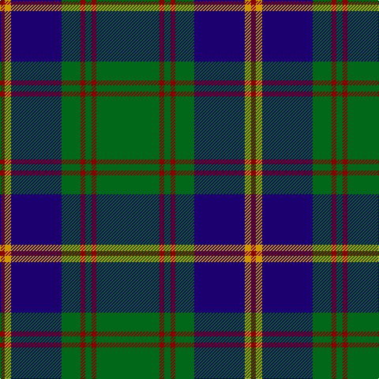

In pattern [GRGRGBYR](/patterns/grgrgbyr/).

This was sourced from register-of-tartans.  It is a [8 stripes tartan](/stripes/stripes8/).

Original link https://www.tartanregister.gov.uk/tartanDetails.aspx?ref=5022

## Thread count
DR/6 DY8 DB64 G24 DR6 G8 DR6 G/80

## Palette
Each colour and its ΔE from the base-6 reference it is a variant of.

| Colour | Shade | Base | ΔE (OKLab) |
|---|---|---|---|
| DB | <code style="background-color:#1C0070;">#1C0070</code> `#1C0070` | B <code style="background-color:#2C4084;">#2C4084</code> | 0.14 |
| DR | <code style="background-color:#880000;">#880000</code> `#880000` | R <code style="background-color:#C80000;">#C80000</code> | 0.14 |
| DY | <code style="background-color:#D09800;">#D09800</code> `#D09800` | Y <code style="background-color:#E8C000;">#E8C000</code> | 0.11 |
| G | <code style="background-color:#006818;">#006818</code> `#006818` | G <code style="background-color:#006400;">#006400</code> | 0.02 |

# Sample pattern

## Nearest tartans

The nearest existing variants by ΔTartan distance.

1. [U.S. Marine Corps (Military?)](/setts/s8/g80r6g8r6g24b64y8r6-b2c2c80-g005810-rc80000-ye8c000/) — ΔT 0.46
1. [Leatherneck U.S.Marine Corps Corporate Tartan Tartan Number: 975. Earliest known date: 1986 Designed by Madam Leask and the Scottish Tartans Society Accredited in 1981. See products available Copyright © Blair Urquhart, Comrie, 2015](/setts/s8/g56r4g4r4g16b48y6r4-b2c2c80-g006818-rc80000-ye8c000/) — ΔT 0.47
1. [US Marine Corps](/setts/s8/g80r6g8r6g24b64y8r6-b2c2c80-g006818-rc80000-yd09800/) — ΔT 0.61
1. [Tennessee State (US State)](/setts/s10/r8b48w4b4g4r4g28b4g48w4-b2c2c80-g006818-rc80000-we0e0e0/) — ΔT 0.75
1. [Rowan](/setts/s9/b2k2b16y2g24y2b16k2b2-b304080-g008000-k000000-yf0c000/) — ΔT 0.77
1. [Harley (Leslie), Robert](/setts/s8/g8k12y4k12g8b32g64k4-b202060-g006818-k101010-ye8c000/) — ΔT 0.78
1. [MacArthur-Fox Green](/setts/s10/r8g8k4g62k20y6g10k22g12k6-g00643c-k101010-rc80000-yfccc00/) — ΔT 0.90
1. [Glen Esk](/setts/s8/g40r4g4r8g32b40g4y4-b0000b4-g004800-r9c0030-yfcc800/) — ΔT 0.93
1. [Childers](/setts/s10/k8g26k8ga16k88ga16k8g26k8w6-g006818-ga408060-k101010-we0e0e0/) — ΔT 0.95
1. [Tennessee State American District Tartan Tartan Number: 3067. Earliest known date: 1999 Official state tartan recorded at the Grandfather Mountain Highland Games, 1999. This ties in with the tartan displayed on the Tennessee Highland Game website. Colour choice explained as follows: Green for Agriculture; Blue for the Smoky Mountains; Purple for the State Flower the Iris; Red for Sacrifices of Veterans and Pioneers of the Volunteer State; White to symbolize the 3 Grand Divisions of the State of Tennessee. See products available Copyright © Blair Urquhart, Comrie, 2015](/setts/s10/r8b48w4b4g4r4g28b4g48w4-b1c0070-g006818-rc80000-we0e0e0/) — ΔT 0.95

## Neighbour map

Every grey dot is one of 15726 variants placed by the first two principal components of the ΔTartan feature space (44% of its variance). Red is this tartan; blue dots are its nearest — click one to open its page.

<svg viewBox="0 0 640 380" role="img" style="max-width:100%;height:auto;border:1px solid #e0e0e0;border-radius:4px;display:block" xmlns="http://www.w3.org/2000/svg"><image href="/nn/cloud.v1.png" width="640" height="380"/><a href="/setts/s8/g80r6g8r6g24b64y8r6-b2c2c80-g005810-rc80000-ye8c000/"><circle cx="339.3" cy="184.7" r="4" fill="#3465a4"><title>U.S. Marine Corps (Military?)</title></circle></a><a href="/setts/s8/g56r4g4r4g16b48y6r4-b2c2c80-g006818-rc80000-ye8c000/"><circle cx="327.1" cy="177.0" r="4" fill="#3465a4"><title>Leatherneck U.S.Marine Corps Corporate Tartan Tartan Number: 975. Earliest known date: 1986 Designed by Madam Leask and the Scottish Tartans Society Accredited in 1981. See products available Copyright © Blair Urquhart, Comrie, 2015</title></circle></a><a href="/setts/s8/g80r6g8r6g24b64y8r6-b2c2c80-g006818-rc80000-yd09800/"><circle cx="340.7" cy="185.0" r="4" fill="#3465a4"><title>US Marine Corps</title></circle></a><a href="/setts/s10/r8b48w4b4g4r4g28b4g48w4-b2c2c80-g006818-rc80000-we0e0e0/"><circle cx="297.4" cy="169.7" r="4" fill="#3465a4"><title>Tennessee State (US State)</title></circle></a><a href="/setts/s9/b2k2b16y2g24y2b16k2b2-b304080-g008000-k000000-yf0c000/"><circle cx="293.6" cy="174.7" r="4" fill="#3465a4"><title>Rowan</title></circle></a><a href="/setts/s8/g8k12y4k12g8b32g64k4-b202060-g006818-k101010-ye8c000/"><circle cx="334.2" cy="184.3" r="4" fill="#3465a4"><title>Harley (Leslie), Robert</title></circle></a><a href="/setts/s10/r8g8k4g62k20y6g10k22g12k6-g00643c-k101010-rc80000-yfccc00/"><circle cx="346.6" cy="172.9" r="4" fill="#3465a4"><title>MacArthur-Fox Green</title></circle></a><a href="/setts/s8/g40r4g4r8g32b40g4y4-b0000b4-g004800-r9c0030-yfcc800/"><circle cx="321.6" cy="204.7" r="4" fill="#3465a4"><title>Glen Esk</title></circle></a><a href="/setts/s10/k8g26k8ga16k88ga16k8g26k8w6-g006818-ga408060-k101010-we0e0e0/"><circle cx="325.7" cy="167.9" r="4" fill="#3465a4"><title>Childers</title></circle></a><a href="/setts/s10/r8b48w4b4g4r4g28b4g48w4-b1c0070-g006818-rc80000-we0e0e0/"><circle cx="282.3" cy="164.4" r="4" fill="#3465a4"><title>Tennessee State American District Tartan Tartan Number: 3067. Earliest known date: 1999 Official state tartan recorded at the Grandfather Mountain Highland Games, 1999. This ties in with the tartan displayed on the Tennessee Highland Game website. Colour choice explained as follows: Green for Agriculture; Blue for the Smoky Mountains; Purple for the State Flower the Iris; Red for Sacrifices of Veterans and Pioneers of the Volunteer State; White to symbolize the 3 Grand Divisions of the State of Tennessee. See products available Copyright © Blair Urquhart, Comrie, 2015</title></circle></a><circle cx="327.9" cy="181.8" r="5" fill="#c00000"/></svg>

ID: /setts/s8/g80r6g8r6g24b64y8r6-b1c0070-g006818-r880000-yd09800/
