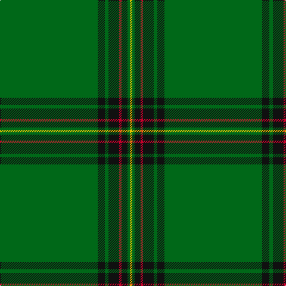

**Bands:** [GKGKRKGY](/stripes/gkgkrkgy/) · **Stripes:** [G K G K R K G LY](/stripes/stripes8/) G K G K R K G LY

This was sourced from register-of-tartans.  It is a [8 band tartan](/bands/bands8/).

Original link https://www.tartanregister.gov.uk/tartanDetails.aspx?ref=791

## Attestations

This cloth appears in 2 source records; the oldest owns this page.

- 01/01/1998 — Crane of Cluny (Personal) (register-of-tartans, [record](https://www.tartanregister.gov.uk/tartanDetails.aspx?ref=791))
- Aug. 1998 — Crane of Clunie (Personal) (tartans-authority, [record](http://www.tartansauthority.com/tartan-ferret/display/2674/))

## Register references

External register numbers recorded for this tartan.

- Scottish Register of Tartans: [791](https://www.tartanregister.gov.uk/tartanDetails.aspx?ref=791)
- Scottish Tartans Authority (ITI): 2674
- Scottish Tartans World Register: 2674

## Thread count
G/164 K12 G6 K18 R4 K10 G4 Y/4

## Palette
Each colour and its ΔE from the base-6 reference it is a variant of.

| Colour | Shade | Base | ΔE (OKLab) |
|---|---|---|---|
| G | <code style="background-color:#006818;">#006818</code> `#006818` | G <code style="background-color:#006100;">#006100</code> | 0.02 |
| K | <code style="background-color:#101010;">#101010</code> `#101010` | K <code style="background-color:#000000;">#000000</code> | 0.17 |
| R | <code style="background-color:#C8002C;">#C8002C</code> `#C8002C` | R <code style="background-color:#CC0000;">#CC0000</code> | 0.03 |
| Y | <code style="background-color:#E8C000;">#E8C000</code> `#E8C000` | Y <code style="background-color:#F2BF00;">#F2BF00</code> | 0.02 |

# Sample pattern

## Nearest tartans

The nearest existing variants by ΔTartan distance.

1. [Stewart from Cairnie](/setts/s8/dg83k6dg3k9r2k5dg2ly2~x2/) — ΔT 1.23
1. [Braemar Royal Highland Gathering](/setts/s6/ly3k6g64lb2k4r3~x2/) — ΔT 1.27
1. [Mar, Tribe of (Clan)](/setts/s5/ly2k3g45k4r2~x2/) — ΔT 1.46
1. [Mar Tribe](/setts/s5/ly2k3g45k3r2/) — ΔT 1.50
1. [Delta Lambda Phi (Corporate)](/setts/s12/lo5k1lo6g20w1g3w1g3w1g30k1lo2~x2/) — ΔT 1.59
1. [Unidentified #12](/setts/s11/ly2k1dg36k1r2k1r2k1dg36k1t2~x2/) — ΔT 1.62
1. [Highland Hospice (Fashion)](/setts/s10/g51dp3g5lo3g5dp5g5dp5g5lo3~x2/) — ΔT 1.72
1. [Stirling Castle (Corporate)](/setts/s13/db2k6db2g34w1g5w1g5w1g34ly1k13db1~x2/) — ΔT 1.83
1. [MacBeorn](/setts/s7/g55dg6g7dg17ly1dg2ly2~x2/) — ΔT 1.88
1. [Kinfauns Castle (Corporate)](/setts/s6/r4dp12g2dp2g46w1~x2/) — ΔT 1.88

## Neighbour map

Every grey dot is one of 14313 variants placed by the first two principal components of the ΔTartan feature space (44% of its variance). Red is this tartan; blue dots are its nearest — click one to open its page.

<svg viewBox="0 0 640 380" role="img" style="max-width:100%;height:auto;border:1px solid #e0e0e0;border-radius:4px;display:block" xmlns="http://www.w3.org/2000/svg"><image href="/nn/cloud.v1.png" width="640" height="380"/><a href="/setts/s8/dg83k6dg3k9r2k5dg2ly2~x2/"><circle cx="623.0" cy="148.7" r="4" fill="#3465a4"><title>Stewart from Cairnie</title></circle></a><a href="/setts/s6/ly3k6g64lb2k4r3~x2/"><circle cx="539.9" cy="136.9" r="4" fill="#3465a4"><title>Braemar Royal Highland Gathering</title></circle></a><a href="/setts/s5/ly2k3g45k4r2~x2/"><circle cx="577.6" cy="187.7" r="4" fill="#3465a4"><title>Mar, Tribe of (Clan)</title></circle></a><a href="/setts/s5/ly2k3g45k3r2/"><circle cx="589.7" cy="185.2" r="4" fill="#3465a4"><title>Mar Tribe</title></circle></a><a href="/setts/s12/lo5k1lo6g20w1g3w1g3w1g30k1lo2~x2/"><circle cx="515.1" cy="131.9" r="4" fill="#3465a4"><title>Delta Lambda Phi (Corporate)</title></circle></a><a href="/setts/s11/ly2k1dg36k1r2k1r2k1dg36k1t2~x2/"><circle cx="626.0" cy="124.5" r="4" fill="#3465a4"><title>Unidentified #12</title></circle></a><a href="/setts/s10/g51dp3g5lo3g5dp5g5dp5g5lo3~x2/"><circle cx="559.9" cy="179.4" r="4" fill="#3465a4"><title>Highland Hospice (Fashion)</title></circle></a><a href="/setts/s13/db2k6db2g34w1g5w1g5w1g34ly1k13db1~x2/"><circle cx="479.6" cy="112.7" r="4" fill="#3465a4"><title>Stirling Castle (Corporate)</title></circle></a><a href="/setts/s7/g55dg6g7dg17ly1dg2ly2~x2/"><circle cx="514.5" cy="157.2" r="4" fill="#3465a4"><title>MacBeorn</title></circle></a><a href="/setts/s6/r4dp12g2dp2g46w1~x2/"><circle cx="518.8" cy="141.2" r="4" fill="#3465a4"><title>Kinfauns Castle (Corporate)</title></circle></a><circle cx="590.1" cy="133.2" r="5" fill="#c00000"/></svg>

ID: /setts/s8/g82k6g3k9r2k5g2ly2~x2/
