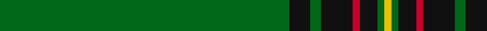

In pattern [GKGKRKGY](/patterns/gkgkrkgy/).

This was sourced from register-of-tartans.  It is a [8 stripes tartan](/stripes/stripes8/).

Original link https://www.tartanregister.gov.uk/tartanDetails.aspx?ref=791

## Attestations

This cloth appears in 2 source records; the oldest owns this page.

- 01/01/1998 — Crane of Cluny (Personal) (register-of-tartans, [record](https://www.tartanregister.gov.uk/tartanDetails.aspx?ref=791))
- Aug. 1998 — Crane of Clunie (Personal) (tartans-authority, [record](http://www.tartansauthority.com/tartan-ferret/display/2674/))

## Register references

External register numbers recorded for this tartan.

- Scottish Register of Tartans: [791](https://www.tartanregister.gov.uk/tartanDetails.aspx?ref=791)
- Scottish Tartans Authority (ITI): 2674
- Scottish Tartans World Register: 2674

## Thread count
G/164 K12 G6 K18 R4 K10 G4 Y/4

## Palette
Each colour and its ΔE from the base-6 reference it is a variant of.

| Colour | Shade | Base | ΔE (OKLab) |
|---|---|---|---|
| G | <code style="background-color:#006818;">#006818</code> `#006818` | G <code style="background-color:#006100;">#006100</code> | 0.02 |
| K | <code style="background-color:#101010;">#101010</code> `#101010` | K <code style="background-color:#000000;">#000000</code> | 0.17 |
| R | <code style="background-color:#C8002C;">#C8002C</code> `#C8002C` | R <code style="background-color:#CC0000;">#CC0000</code> | 0.03 |
| Y | <code style="background-color:#E8C000;">#E8C000</code> `#E8C000` | Y <code style="background-color:#F2BF00;">#F2BF00</code> | 0.02 |

# Sample pattern

## Nearest tartans

The nearest existing variants by ΔTartan distance.

1. [Stewart from Cairnie](/setts/s8/g83k6g3k9r2k5g2y2~g005020-k101010-rdc0000-ye8c000~x2/) — ΔT 1.23
1. [Braemar Royal Highland Gathering](/setts/s6/r3k4w2g64k6y3~g006818-k101010-rc80000-wc0c0c0-ye8c000~x2/) — ΔT 1.27
1. [Mar, Tribe of (Clan)](/setts/s5/r2k4g45k3y2~g006818-k101010-r880000-ye8c000~x2/) — ΔT 1.46
1. [Mar (Tribe of..) District Tartan Tartan Number: 1586. Earliest known date: 1978 There is much debate over the true representation of the Mar District tartan. In order that the matter should be settled and the design be "known and recognised as the proper tartan of the Tribe of Mar", the Rt Hon Margaret of Mar, Countess of Mar, made a petition to the Lord Lyon to record this sett. The designer is unknown and the date is possibly pre 1850. Frank Adam called the sett Skene, and said it came from the Duke of Fife whose ancestors owned Mar Lodge. Both Skenes and Robertsons lived in the Mar district in the north east of Scotland. See products available Copyright © Blair Urquhart, Comrie, 2015](/setts/s5/r2k4g45k3y2~g006818-k101010-rc80000-ye8c000/) — ΔT 1.47
1. [Mar Tribe](/setts/s5/r2k3g45k3y2~g006818-k101010-rc80000-ye8c000/) — ΔT 1.50
1. [Delta Lambda Phi (Corporate)](/setts/s12/y5k1y6g20w1g3w1g3w1g30k1y2~g006818-k101010-wfcfcfc-ybc8c00~x2/) — ΔT 1.59
1. [Unidentified #12](/setts/s11/b2k1g36k1r2k1r2k1g36k1y2~b3c82af-g005020-k101010-rdc0000-ye8c000~x2/) — ΔT 1.62
1. [Highland Hospice (Fashion)](/setts/s10/g51b3g5y3g5b5g5b5g5y3~b28003c-g006818-ybc8c00~x2/) — ΔT 1.72
1. [Stirling Castle (Corporate)](/setts/s13/b2k6b2g34w1g5w1g5w1g34y1k13b1~b2c2c80-g006818-k101010-we0e0e0-ye8c000~x2/) — ΔT 1.83
1. [Kinfauns Castle (Corporate)](/setts/s6/r4b12g2b2g46w1~b780078-g006818-rc80000-we0e0e0~x2/) — ΔT 1.88

## Neighbour map

Every grey dot is one of 15726 variants placed by the first two principal components of the ΔTartan feature space (44% of its variance). Red is this tartan; blue dots are its nearest — click one to open its page.

<svg viewBox="0 0 640 380" role="img" style="max-width:100%;height:auto;border:1px solid #e0e0e0;border-radius:4px;display:block" xmlns="http://www.w3.org/2000/svg"><image href="/nn/cloud.v1.png" width="640" height="380"/><a href="/setts/s8/g83k6g3k9r2k5g2y2~g005020-k101010-rdc0000-ye8c000~x2/"><circle cx="621.2" cy="144.5" r="4" fill="#3465a4"><title>Stewart from Cairnie</title></circle></a><a href="/setts/s6/r3k4w2g64k6y3~g006818-k101010-rc80000-wc0c0c0-ye8c000~x2/"><circle cx="537.7" cy="137.0" r="4" fill="#3465a4"><title>Braemar Royal Highland Gathering</title></circle></a><a href="/setts/s5/r2k4g45k3y2~g006818-k101010-r880000-ye8c000~x2/"><circle cx="575.7" cy="187.5" r="4" fill="#3465a4"><title>Mar, Tribe of (Clan)</title></circle></a><a href="/setts/s5/r2k4g45k3y2~g006818-k101010-rc80000-ye8c000/"><circle cx="571.2" cy="185.3" r="4" fill="#3465a4"><title>Mar (Tribe of..) District Tartan Tartan Number: 1586. Earliest known date: 1978 There is much debate over the true representation of the Mar District tartan. In order that the matter should be settled and the design be &quot;known and recognised as the proper tartan of the Tribe of Mar&quot;, the Rt Hon Margaret of Mar, Countess of Mar, made a petition to the Lord Lyon to record this sett. The designer is unknown and the date is possibly pre 1850. Frank Adam called the sett Skene, and said it came from the Duke of Fife whose ancestors owned Mar Lodge. Both Skenes and Robertsons lived in the Mar district in the north east of Scotland. See products available Copyright © Blair Urquhart, Comrie, 2015</title></circle></a><a href="/setts/s5/r2k3g45k3y2~g006818-k101010-rc80000-ye8c000/"><circle cx="587.9" cy="185.6" r="4" fill="#3465a4"><title>Mar Tribe</title></circle></a><a href="/setts/s12/y5k1y6g20w1g3w1g3w1g30k1y2~g006818-k101010-wfcfcfc-ybc8c00~x2/"><circle cx="513.1" cy="131.3" r="4" fill="#3465a4"><title>Delta Lambda Phi (Corporate)</title></circle></a><a href="/setts/s11/b2k1g36k1r2k1r2k1g36k1y2~b3c82af-g005020-k101010-rdc0000-ye8c000~x2/"><circle cx="624.7" cy="122.0" r="4" fill="#3465a4"><title>Unidentified #12</title></circle></a><a href="/setts/s10/g51b3g5y3g5b5g5b5g5y3~b28003c-g006818-ybc8c00~x2/"><circle cx="557.7" cy="178.9" r="4" fill="#3465a4"><title>Highland Hospice (Fashion)</title></circle></a><a href="/setts/s13/b2k6b2g34w1g5w1g5w1g34y1k13b1~b2c2c80-g006818-k101010-we0e0e0-ye8c000~x2/"><circle cx="477.0" cy="110.9" r="4" fill="#3465a4"><title>Stirling Castle (Corporate)</title></circle></a><a href="/setts/s6/r4b12g2b2g46w1~b780078-g006818-rc80000-we0e0e0~x2/"><circle cx="517.0" cy="141.6" r="4" fill="#3465a4"><title>Kinfauns Castle (Corporate)</title></circle></a><circle cx="587.9" cy="132.1" r="5" fill="#c00000"/></svg>

ID: /setts/s8/g82k6g3k9r2k5g2y2~g006818-k101010-rc8002c-ye8c000~x2/
