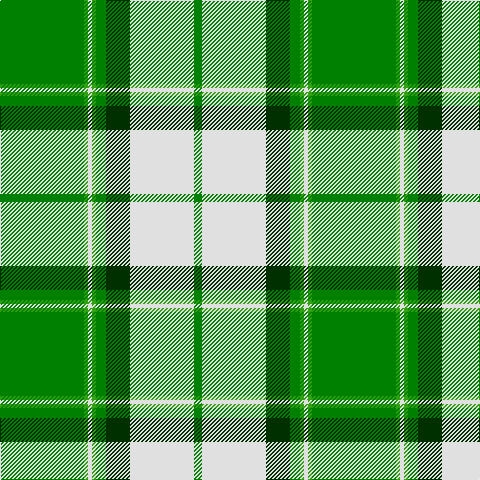

In pattern [GGWGGGWG](/patterns/ggwgggwg/).

This was sourced from weddslist.  It is a [8 stripes tartan](/stripes/stripes8/).

Original link http://www.weddslist.com/cgi-bin/tartans/pg.pl?source=sts

## Thread count
Ga/84 G4 LN4 G4 Ga10 DG24 LN64 Ga/8

## Palette
Each colour and its ΔE from the base-6 reference it is a variant of.

| Colour | Shade | Base | ΔE (OKLab) |
|---|---|---|---|
| DG | <code style="background-color:#003000;">#003000</code> `#003000` | G <code style="background-color:#006100;">#006100</code> | 0.17 |
| G | <code style="background-color:#30A010;">#30A010</code> `#30A010` | G <code style="background-color:#006100;">#006100</code> | 0.20 |
| Ga | <code style="background-color:#008000;">#008000</code> `#008000` | G <code style="background-color:#006100;">#006100</code> | 0.10 |
| LN | <code style="background-color:#E0E0E0;">#E0E0E0</code> `#E0E0E0` | W <code style="background-color:#F7F7F7;">#F7F7F7</code> | 0.07 |

# Sample pattern

## Nearest tartans

The nearest existing variants by ΔTartan distance.

1. [Longniddry Green District Tartan Tartan Number: 764. Earliest known date: pre 1992 A dancers tartan from D.C. Dalgleish weavers of Selkirk See products available Copyright © Blair Urquhart, Comrie, 2015](/setts/s8/g84ga4w4ga4g10gb24w64g8-g006818-ga289c18-gb003820-we0e0e0/) — ΔT 0.54
1. [Longniddry Green (Dance)](/setts/s8/g84ga4w4ga4g10b24w64g8-b1c1c1c-g006818-ga289c18-wfcfcfc/) — ΔT 0.85
1. [Uist, Green (Dance)](/setts/s7/g6r4g54ga6w60ga4w6-g006818-ga003820-rc80000-wf0e0c8/) — ΔT 1.19
1. [Longniddry Green Error (Dance)](/setts/s8/g84y2w4y2g10ga24w64g8-g006818-ga003820-wfcfcfc-ye8c000/) — ΔT 1.29
1. [McGill (Personal)](/setts/s13/g4w20g6y8g6y8g48w4g8w8g2ya8g2-g006818-we0e0e0-ybc8c00-yad87c00/) — ΔT 1.36
1. [Livingstone Wedding Dress](/setts/s11/g52r10k2r4k2r10g32r10w32g4w16-g008000-k000000-rc00000-we0e0e0/) — ΔT 1.41
1. [Cunningham Dress Green (Dance) Fashion Tartan Tartan Number: 6532. Earliest known date: 01/01/1988 A dancers' tartan now woven by D C Dalgliesh of Selkirk /Threadcount and colours aren't 100% original. Generated manually./ See products available Copyright © Blair Urquhart, Comrie, 2015](/setts/s7/w8g4w80g80k4g4y8-g289c18-k101010-we0e0e0-ye8c000/) — ΔT 1.42
1. [Monroig, Eric (Personal)](/setts/s12/r4b4g32y2b12r2y2r2b12y2g32y4-b38508c-g008b00-rff0000-yffe600/) — ΔT 1.43
1. [Limerick County Crest (Fashion)](/setts/s6/w24k6g100w6k26y12-g006818-k101010-we0e0e0-ybc8c00/) — ΔT 1.49
1. [Drummond of Perth Dress (Dance)](/setts/s9/g82y6ga14b6w48g20ga14b14w6-b5c5c5c-g285800-ga408060-wfcfcfc-ybc8c00/) — ΔT 1.52

## Neighbour map

Every grey dot is one of 15726 variants placed by the first two principal components of the ΔTartan feature space (44% of its variance). Red is this tartan; blue dots are its nearest — click one to open its page.

<svg viewBox="0 0 640 380" role="img" style="max-width:100%;height:auto;border:1px solid #e0e0e0;border-radius:4px;display:block" xmlns="http://www.w3.org/2000/svg"><image href="/nn/cloud.v1.png" width="640" height="380"/><a href="/setts/s8/g84ga4w4ga4g10gb24w64g8-g006818-ga289c18-gb003820-we0e0e0/"><circle cx="277.1" cy="138.2" r="4" fill="#3465a4"><title>Longniddry Green District Tartan Tartan Number: 764. Earliest known date: pre 1992 A dancers tartan from D.C. Dalgleish weavers of Selkirk See products available Copyright © Blair Urquhart, Comrie, 2015</title></circle></a><a href="/setts/s8/g84ga4w4ga4g10b24w64g8-b1c1c1c-g006818-ga289c18-wfcfcfc/"><circle cx="263.3" cy="130.3" r="4" fill="#3465a4"><title>Longniddry Green (Dance)</title></circle></a><a href="/setts/s7/g6r4g54ga6w60ga4w6-g006818-ga003820-rc80000-wf0e0c8/"><circle cx="265.2" cy="146.6" r="4" fill="#3465a4"><title>Uist, Green (Dance)</title></circle></a><a href="/setts/s8/g84y2w4y2g10ga24w64g8-g006818-ga003820-wfcfcfc-ye8c000/"><circle cx="300.2" cy="104.5" r="4" fill="#3465a4"><title>Longniddry Green Error (Dance)</title></circle></a><a href="/setts/s13/g4w20g6y8g6y8g48w4g8w8g2ya8g2-g006818-we0e0e0-ybc8c00-yad87c00/"><circle cx="320.1" cy="117.6" r="4" fill="#3465a4"><title>McGill (Personal)</title></circle></a><a href="/setts/s11/g52r10k2r4k2r10g32r10w32g4w16-g008000-k000000-rc00000-we0e0e0/"><circle cx="267.8" cy="123.6" r="4" fill="#3465a4"><title>Livingstone Wedding Dress</title></circle></a><a href="/setts/s7/w8g4w80g80k4g4y8-g289c18-k101010-we0e0e0-ye8c000/"><circle cx="308.8" cy="141.4" r="4" fill="#3465a4"><title>Cunningham Dress Green (Dance) Fashion Tartan Tartan Number: 6532. Earliest known date: 01/01/1988 A dancers' tartan now woven by D C Dalgliesh of Selkirk /Threadcount and colours aren't 100% original. Generated manually./ See products available Copyright © Blair Urquhart, Comrie, 2015</title></circle></a><a href="/setts/s12/r4b4g32y2b12r2y2r2b12y2g32y4-b38508c-g008b00-rff0000-yffe600/"><circle cx="321.2" cy="142.0" r="4" fill="#3465a4"><title>Monroig, Eric (Personal)</title></circle></a><a href="/setts/s6/w24k6g100w6k26y12-g006818-k101010-we0e0e0-ybc8c00/"><circle cx="307.0" cy="166.0" r="4" fill="#3465a4"><title>Limerick County Crest (Fashion)</title></circle></a><a href="/setts/s9/g82y6ga14b6w48g20ga14b14w6-b5c5c5c-g285800-ga408060-wfcfcfc-ybc8c00/"><circle cx="209.1" cy="136.9" r="4" fill="#3465a4"><title>Drummond of Perth Dress (Dance)</title></circle></a><circle cx="277.6" cy="138.5" r="5" fill="#c00000"/></svg>

ID: /setts/s8/g84ga4w4ga4g10gb24w64g8-g008000-ga30a010-gb003000-we0e0e0/
