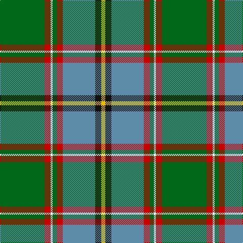

In pattern [GRKGRBKY](/patterns/grkgrbky/).

This was sourced from house-of-tartan.  It is a [8 stripes tartan](/stripes/stripes8/).

Original link http://www.house-of-tartan.scotland.net/house/TartanViewjs.asp?colr=Def&tnam=2297

## Thread count
G/88 R12 W4 G8 R12 B64 K12 Y/8

## Palette
Each colour and its ΔE from the base-6 reference it is a variant of.

| Colour | Shade | Base | ΔE (OKLab) |
|---|---|---|---|
| B | <code style="background-color:#5C8CA8;">#5C8CA8</code> `#5C8CA8` | B <code style="background-color:#2A418A;">#2A418A</code> | 0.23 |
| DB | <code style="background-color:#2C2C80;">#2C2C80</code> `#2C2C80` | B <code style="background-color:#2A418A;">#2A418A</code> | 0.06 |
| G | <code style="background-color:#006818;">#006818</code> `#006818` | G <code style="background-color:#006100;">#006100</code> | 0.02 |
| K | <code style="background-color:#101010;">#101010</code> `#101010` | K <code style="background-color:#000000;">#000000</code> | 0.17 |
| R | <code style="background-color:#C80000;">#C80000</code> `#C80000` | R <code style="background-color:#CC0000;">#CC0000</code> | 0.01 |
| Y | <code style="background-color:#E8C000;">#E8C000</code> `#E8C000` | Y <code style="background-color:#F2BF00;">#F2BF00</code> | 0.02 |

# Sample pattern

## Nearest tartans

The nearest existing variants by ΔTartan distance.

1. [Stirling University (Corporate)](/setts/s8/g88r12w4g8r12b64k12y8-b5c8ca8-g006818-k101010-rc80000-wfcfcfc-ye8c000/) — ΔT 0.16
1. [Currie](/setts/s11/b32w6b2y8g48r2g6r8g6r2ba16-b304080-ba5480b0-g008000-rc00000-we0e0e0-yf0c000/) — ΔT 0.87
1. [Wagland (Name)](/setts/s7/r6b12y4b30g24ga78w6-b2c2c80-g006818-ga285800-rc80000-we0e0e0-ye8c000/) — ΔT 1.01
1. [COG USA, THE](/setts/s6/y36g72b36r4w4ba4-b5f749c-ba373875-g1e492b-rca2625-wf9f5ef-ye0a126/) — ΔT 1.03
1. [Cates Hunting (Clan)](/setts/s9/g46r14ga50y10g34k10y2w2r2-g003820-ga006818-k101010-rc80000-wf8f8f8-ye8c000/) — ΔT 1.09
1. [McAvoy (Personal)](/setts/s10/y6g10k4g10w2g34b8r2b44w4-b003c64-g285800-k101010-rc80000-we0e0e0-ye8c000/) — ΔT 1.10
1. [Canadian Centennial](/setts/s8/r6w12r4g64b72k4b8y4-b304080-g008000-k000000-rc00000-we0e0e0-yf0c000/) — ΔT 1.12
1. [Yorkland](/setts/s8/b60r4b8w2ra22g8y4g44-b304080-g008000-rc00000-ra806050-we0e0e0-yf0c000/) — ΔT 1.16
1. [Layton, Mervin](/setts/s8/g8r6g48k2w14k2ga48y6-g006633-ga008b45-k101010-rdb2929-wffffff-yffd700/) — ΔT 1.18
1. [Mission](/setts/s8/y8b56k4g44k8w8ga8k4-b5c8ca8-g006818-ga408060-k101010-wffe1ff-yffa500/) — ΔT 1.19

## Neighbour map

Every grey dot is one of 15726 variants placed by the first two principal components of the ΔTartan feature space (44% of its variance). Red is this tartan; blue dots are its nearest — click one to open its page.

<svg viewBox="0 0 640 380" role="img" style="max-width:100%;height:auto;border:1px solid #e0e0e0;border-radius:4px;display:block" xmlns="http://www.w3.org/2000/svg"><image href="/nn/cloud.v1.png" width="640" height="380"/><a href="/setts/s8/g88r12w4g8r12b64k12y8-b5c8ca8-g006818-k101010-rc80000-wfcfcfc-ye8c000/"><circle cx="245.7" cy="120.7" r="4" fill="#3465a4"><title>Stirling University (Corporate)</title></circle></a><a href="/setts/s11/b32w6b2y8g48r2g6r8g6r2ba16-b304080-ba5480b0-g008000-rc00000-we0e0e0-yf0c000/"><circle cx="211.9" cy="100.7" r="4" fill="#3465a4"><title>Currie</title></circle></a><a href="/setts/s7/r6b12y4b30g24ga78w6-b2c2c80-g006818-ga285800-rc80000-we0e0e0-ye8c000/"><circle cx="267.0" cy="148.9" r="4" fill="#3465a4"><title>Wagland (Name)</title></circle></a><a href="/setts/s6/y36g72b36r4w4ba4-b5f749c-ba373875-g1e492b-rca2625-wf9f5ef-ye0a126/"><circle cx="227.9" cy="145.6" r="4" fill="#3465a4"><title>COG USA, THE</title></circle></a><a href="/setts/s9/g46r14ga50y10g34k10y2w2r2-g003820-ga006818-k101010-rc80000-wf8f8f8-ye8c000/"><circle cx="243.7" cy="130.3" r="4" fill="#3465a4"><title>Cates Hunting (Clan)</title></circle></a><a href="/setts/s10/y6g10k4g10w2g34b8r2b44w4-b003c64-g285800-k101010-rc80000-we0e0e0-ye8c000/"><circle cx="253.5" cy="123.9" r="4" fill="#3465a4"><title>McAvoy (Personal)</title></circle></a><a href="/setts/s8/r6w12r4g64b72k4b8y4-b304080-g008000-k000000-rc00000-we0e0e0-yf0c000/"><circle cx="238.1" cy="118.1" r="4" fill="#3465a4"><title>Canadian Centennial</title></circle></a><a href="/setts/s8/b60r4b8w2ra22g8y4g44-b304080-g008000-rc00000-ra806050-we0e0e0-yf0c000/"><circle cx="271.0" cy="125.2" r="4" fill="#3465a4"><title>Yorkland</title></circle></a><a href="/setts/s8/g8r6g48k2w14k2ga48y6-g006633-ga008b45-k101010-rdb2929-wffffff-yffd700/"><circle cx="213.8" cy="117.7" r="4" fill="#3465a4"><title>Layton, Mervin</title></circle></a><a href="/setts/s8/y8b56k4g44k8w8ga8k4-b5c8ca8-g006818-ga408060-k101010-wffe1ff-yffa500/"><circle cx="176.4" cy="133.9" r="4" fill="#3465a4"><title>Mission</title></circle></a><circle cx="245.6" cy="121.4" r="5" fill="#c00000"/></svg>

ID: /setts/s8/g88r12k4g8r12b64ka12y8-b5c8ca8-g006818-k000000-ka101010-rc80000-ye8c000/
