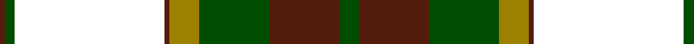

In pattern [BGWBGGBG](/patterns/bgwbggbg/).

This was sourced from register-of-tartans.  It is a [8 stripes tartan](/stripes/stripes8/).

Original link https://www.tartanregister.gov.uk/tartanDetails.aspx?ref=5077

## Thread count
DR/2 G4 W60 DR2 LG12 G28 DR28 G/8

## Palette
Each colour and its ΔE from the base-6 reference it is a variant of.

| Colour | Shade | Base | ΔE (OKLab) |
|---|---|---|---|
| DR | <code style="background-color:#541C0C;">#541C0C</code> `#541C0C` | B <code style="background-color:#2C4084;">#2C4084</code> | 0.20 |
| G | <code style="background-color:#004C00;">#004C00</code> `#004C00` | G <code style="background-color:#006400;">#006400</code> | 0.08 |
| LG | <code style="background-color:#9C8000;">#9C8000</code> `#9C8000` | G <code style="background-color:#006400;">#006400</code> | 0.21 |
| W | <code style="background-color:#FFFFFF;">#FFFFFF</code> `#FFFFFF` | W <code style="background-color:#F4F4F0;">#F4F4F0</code> | 0.03 |

# Sample pattern

## Nearest tartans

The nearest existing variants by ΔTartan distance.

1. [Dogwood](/setts/s8/g16b40g40r24b4w104g8b4-b381c0c-g004800-rb07430-wf8f4d0/) — ΔT 0.43
1. [Dogwood Trade Tartan Tartan Number: 913. Earliest known date: 1968 The registered tartan of the Dinwiddie Clan. Dinwiddies are normally associated with the Maxwells, but Lord Lyon stated, in 1988, that Dinwiddies were a sept of no other clan. See products available Copyright © Blair Urquhart, Comrie, 2015](/setts/s8/g6r24g24y10r2w50g4r2-g006818-r880000-we0e0e0-ya08858/) — ΔT 0.69
1. [Dogwood](/setts/s8/g6r24g24ra10r2w50g4r2-g008000-r800000-ra906030-we0e0e0/) — ΔT 0.71
1. [Prince Edward Island, Dress](/setts/s9/g44r4g8r4g8r36w48r2y6-g006818-r880000-we0e0e0-yd09800/) — ΔT 1.01
1. [Scott Dress Tartan Tartan Number: 1006. Earliest known date: pre 2003 Based on the 'Red' Scott from the Vestiarium Scoticum. See products available Copyright © Blair Urquhart, Comrie, 2015](/setts/s11/g8r4k2w60r20g28r8g10w4g10r8-g006818-k101010-rc80000-we0e0e0/) — ΔT 1.03
1. [Crawford Arisaid (Dance)](/setts/s9/r12w2r4w50r6g24r6g24r6-g006818-r880000-wfcfcfc/) — ΔT 1.05
1. [Scott, dress](/setts/s11/g8r4k2w60r20g28r8g10w4g10r8-g008000-k000000-rc00000-we0e0e0/) — ΔT 1.08
1. [Pearce Scotch Plaid 4 (Fashion)](/setts/s7/y12g72w10b8w60b2w4-b1474b4-g003820-we0e0e0-ye8c000/) — ΔT 1.14
1. [Fiander, Julian (Personal)](/setts/s9/r12g4w42y4k16y4g64w2k6-g006818-k101010-rc80000-wfcfcfc-ye8c000/) — ΔT 1.20
1. [Bannockbane Green](/setts/s8/b6y4b60y2w36ya60yb4ya6-b1c1c1c-wececd8-ybc8c00-ya809850-ybd87c00/) — ΔT 1.24

## Neighbour map

Every grey dot is one of 15726 variants placed by the first two principal components of the ΔTartan feature space (44% of its variance). Red is this tartan; blue dots are its nearest — click one to open its page.

<svg viewBox="0 0 640 380" role="img" style="max-width:100%;height:auto;border:1px solid #e0e0e0;border-radius:4px;display:block" xmlns="http://www.w3.org/2000/svg"><image href="/nn/cloud.v1.png" width="640" height="380"/><a href="/setts/s8/g16b40g40r24b4w104g8b4-b381c0c-g004800-rb07430-wf8f4d0/"><circle cx="214.9" cy="120.2" r="4" fill="#3465a4"><title>Dogwood</title></circle></a><a href="/setts/s8/g6r24g24y10r2w50g4r2-g006818-r880000-we0e0e0-ya08858/"><circle cx="220.4" cy="126.0" r="4" fill="#3465a4"><title>Dogwood Trade Tartan Tartan Number: 913. Earliest known date: 1968 The registered tartan of the Dinwiddie Clan. Dinwiddies are normally associated with the Maxwells, but Lord Lyon stated, in 1988, that Dinwiddies were a sept of no other clan. See products available Copyright © Blair Urquhart, Comrie, 2015</title></circle></a><a href="/setts/s8/g6r24g24ra10r2w50g4r2-g008000-r800000-ra906030-we0e0e0/"><circle cx="220.3" cy="126.2" r="4" fill="#3465a4"><title>Dogwood</title></circle></a><a href="/setts/s9/g44r4g8r4g8r36w48r2y6-g006818-r880000-we0e0e0-yd09800/"><circle cx="211.3" cy="127.8" r="4" fill="#3465a4"><title>Prince Edward Island, Dress</title></circle></a><a href="/setts/s11/g8r4k2w60r20g28r8g10w4g10r8-g006818-k101010-rc80000-we0e0e0/"><circle cx="232.5" cy="101.8" r="4" fill="#3465a4"><title>Scott Dress Tartan Tartan Number: 1006. Earliest known date: pre 2003 Based on the 'Red' Scott from the Vestiarium Scoticum. See products available Copyright © Blair Urquhart, Comrie, 2015</title></circle></a><a href="/setts/s9/r12w2r4w50r6g24r6g24r6-g006818-r880000-wfcfcfc/"><circle cx="227.0" cy="135.9" r="4" fill="#3465a4"><title>Crawford Arisaid (Dance)</title></circle></a><a href="/setts/s11/g8r4k2w60r20g28r8g10w4g10r8-g008000-k000000-rc00000-we0e0e0/"><circle cx="232.4" cy="102.3" r="4" fill="#3465a4"><title>Scott, dress</title></circle></a><a href="/setts/s7/y12g72w10b8w60b2w4-b1474b4-g003820-we0e0e0-ye8c000/"><circle cx="266.3" cy="115.8" r="4" fill="#3465a4"><title>Pearce Scotch Plaid 4 (Fashion)</title></circle></a><a href="/setts/s9/r12g4w42y4k16y4g64w2k6-g006818-k101010-rc80000-wfcfcfc-ye8c000/"><circle cx="212.9" cy="87.6" r="4" fill="#3465a4"><title>Fiander, Julian (Personal)</title></circle></a><a href="/setts/s8/b6y4b60y2w36ya60yb4ya6-b1c1c1c-wececd8-ybc8c00-ya809850-ybd87c00/"><circle cx="198.9" cy="105.4" r="4" fill="#3465a4"><title>Bannockbane Green</title></circle></a><circle cx="212.5" cy="113.1" r="5" fill="#c00000"/></svg>

ID: /setts/s8/g8b28g28ga12b2w60g4b2-b541c0c-g004c00-ga9c8000-wffffff/
