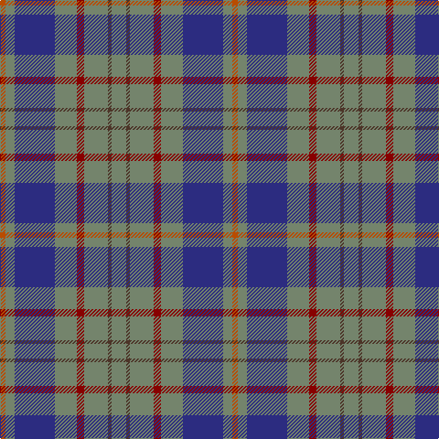

In pattern [GBGRGBGR](/patterns/gbgrgbgr/).

This was sourced from tartans-authority.  It is a [8 stripes tartan](/stripes/stripes8/).

Original link http://www.tartansauthority.com/tartan-ferret/display/2262/

## Thread count
DO/6 N10 DB44 N24 DR8 N26 T4 N/16

## Palette
Each colour and its ΔE from the base-6 reference it is a variant of.

| Colour | Shade | Base | ΔE (OKLab) |
|---|---|---|---|
| DB | <code style="background-color:#2C2C80;">#2C2C80</code> `#2C2C80` | B <code style="background-color:#2A418A;">#2A418A</code> | 0.06 |
| DO | <code style="background-color:#B84C00;">#B84C00</code> `#B84C00` | R <code style="background-color:#CC0000;">#CC0000</code> | 0.08 |
| DR | <code style="background-color:#880000;">#880000</code> `#880000` | R <code style="background-color:#CC0000;">#CC0000</code> | 0.15 |
| N | <code style="background-color:#74846C;">#74846C</code> `#74846C` | G <code style="background-color:#006100;">#006100</code> | 0.20 |
| T | <code style="background-color:#4C3428;">#4C3428</code> `#4C3428` | B <code style="background-color:#2A418A;">#2A418A</code> | 0.17 |

# Sample pattern

## Nearest tartans

The nearest existing variants by ΔTartan distance.

1. [Kildare, County](/setts/s14/g8b2g13r4g12ba22g5ra3g5ba22g12r4g13b2~b4c3428-ba2c2c80-g74846c-r880000-rab84c00~x2/) — ΔT 1.15
1. [HMS Duncan (Military)](/setts/s6/b3r15ba15ra2ba15y3~b780078-ba003c64-r888888-rac80000-ycca800~x2/) — ΔT 1.16
1. [Cameron Hunting](/setts/s6/b15r5b30ba32b4y3~b4c3428-ba1474b4-rc80000-yd09800~x2/) — ΔT 1.20
1. [Bute Heather, Grey (Fashion)](/setts/s11/y13ya2b38k13b8k8b17k2b17k4r11~b5c5c5c-k101010-r888888-ya0a0a0-yab8b8b8/) — ΔT 1.30
1. [Bahamas](/setts/s8/b8y2b22g6r2w10g12b3~b40647c-g004800-rc80000-wc8c8c8-y9c9c00~x2/) — ΔT 1.31
1. [Bermuda Plaid (1947) (District)](/setts/s7/b33r8ba12g12b8ba2b8~b5c8ca8-ba2c2c80-g006818-rc80000~x2/) — ΔT 1.31
1. [Wellington (Wilson 122)](/setts/s8/g14b11ba3k2ba3b11g14y1~b440044-ba2888c4-g408060-k101010-ye8c000~x2/) — ΔT 1.34
1. [Donegal Irish County Tartan Tartan Number: 2247. Earliest known date: 1996 One of a series of Irish District tartans designed by Polly Wittering of the House of Edgar, with colours reminiscent of the Country with soft warm colours dominating. See products available Copyright © Blair Urquhart, Comrie, 2015](/setts/s10/y3g17b3g3b3k5b18r2b8r2~b406088-g508c60-k000000-r8c0020-yd09000~x2/) — ΔT 1.36
1. [Donegal](/setts/s10/g3ga17b3ga3b3ba5b18r2b8r2~b304080-ba401000-g908000-ga008000-rc00000~x2/) — ΔT 1.38
1. [Donegal, County](/setts/s10/y3g17b3g3b3ba5b18r2b8r2~b1474b4-ba441800-g285800-r880000-ybc8c00~x2/) — ΔT 1.41

## Neighbour map

Every grey dot is one of 15726 variants placed by the first two principal components of the ΔTartan feature space (44% of its variance). Red is this tartan; blue dots are its nearest — click one to open its page.

<svg viewBox="0 0 640 380" role="img" style="max-width:100%;height:auto;border:1px solid #e0e0e0;border-radius:4px;display:block" xmlns="http://www.w3.org/2000/svg"><image href="/nn/cloud.v1.png" width="640" height="380"/><a href="/setts/s14/g8b2g13r4g12ba22g5ra3g5ba22g12r4g13b2~b4c3428-ba2c2c80-g74846c-r880000-rab84c00~x2/"><circle cx="283.2" cy="180.1" r="4" fill="#3465a4"><title>Kildare, County</title></circle></a><a href="/setts/s6/b3r15ba15ra2ba15y3~b780078-ba003c64-r888888-rac80000-ycca800~x2/"><circle cx="277.1" cy="229.4" r="4" fill="#3465a4"><title>HMS Duncan (Military)</title></circle></a><a href="/setts/s6/b15r5b30ba32b4y3~b4c3428-ba1474b4-rc80000-yd09800~x2/"><circle cx="347.4" cy="231.0" r="4" fill="#3465a4"><title>Cameron Hunting</title></circle></a><a href="/setts/s11/y13ya2b38k13b8k8b17k2b17k4r11~b5c5c5c-k101010-r888888-ya0a0a0-yab8b8b8/"><circle cx="331.7" cy="163.8" r="4" fill="#3465a4"><title>Bute Heather, Grey (Fashion)</title></circle></a><a href="/setts/s8/b8y2b22g6r2w10g12b3~b40647c-g004800-rc80000-wc8c8c8-y9c9c00~x2/"><circle cx="246.8" cy="192.3" r="4" fill="#3465a4"><title>Bahamas</title></circle></a><a href="/setts/s7/b33r8ba12g12b8ba2b8~b5c8ca8-ba2c2c80-g006818-rc80000~x2/"><circle cx="345.1" cy="207.0" r="4" fill="#3465a4"><title>Bermuda Plaid (1947) (District)</title></circle></a><a href="/setts/s8/g14b11ba3k2ba3b11g14y1~b440044-ba2888c4-g408060-k101010-ye8c000~x2/"><circle cx="243.0" cy="187.2" r="4" fill="#3465a4"><title>Wellington (Wilson 122)</title></circle></a><a href="/setts/s10/y3g17b3g3b3k5b18r2b8r2~b406088-g508c60-k000000-r8c0020-yd09000~x2/"><circle cx="246.5" cy="180.4" r="4" fill="#3465a4"><title>Donegal Irish County Tartan Tartan Number: 2247. Earliest known date: 1996 One of a series of Irish District tartans designed by Polly Wittering of the House of Edgar, with colours reminiscent of the Country with soft warm colours dominating. See products available Copyright © Blair Urquhart, Comrie, 2015</title></circle></a><a href="/setts/s10/g3ga17b3ga3b3ba5b18r2b8r2~b304080-ba401000-g908000-ga008000-rc00000~x2/"><circle cx="256.5" cy="185.9" r="4" fill="#3465a4"><title>Donegal</title></circle></a><a href="/setts/s10/y3g17b3g3b3ba5b18r2b8r2~b1474b4-ba441800-g285800-r880000-ybc8c00~x2/"><circle cx="263.7" cy="189.8" r="4" fill="#3465a4"><title>Donegal, County</title></circle></a><circle cx="301.2" cy="203.3" r="5" fill="#c00000"/></svg>

ID: /setts/s8/g8b2g13r4g12ba22g5ra3~b4c3428-ba2c2c80-g74846c-r880000-rab84c00~x2/
