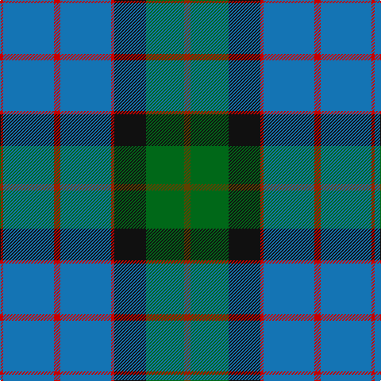

In pattern [GGKRBRBR](/patterns/ggkrbrbr/).

This was sourced from register-of-tartans.  It is a [8 stripes tartan](/stripes/stripes8/).

Original link https://www.tartanregister.gov.uk/tartanDetails.aspx?ref=2776

## Thread count
R/4 B64 R8 B64 R4 K40 G48 T/8

## Palette
Each colour and its ΔE from the base-6 reference it is a variant of.

| Colour | Shade | Base | ΔE (OKLab) |
|---|---|---|---|
| B | <code style="background-color:#1474B4;">#1474B4</code> `#1474B4` | B <code style="background-color:#2A418A;">#2A418A</code> | 0.15 |
| G | <code style="background-color:#006818;">#006818</code> `#006818` | G <code style="background-color:#006100;">#006100</code> | 0.02 |
| K | <code style="background-color:#101010;">#101010</code> `#101010` | K <code style="background-color:#000000;">#000000</code> | 0.17 |
| R | <code style="background-color:#C80000;">#C80000</code> `#C80000` | R <code style="background-color:#CC0000;">#CC0000</code> | 0.01 |
| T | <code style="background-color:#604000;">#604000</code> `#604000` | G <code style="background-color:#006100;">#006100</code> | 0.14 |

# Sample pattern

## Nearest tartans

The nearest existing variants by ΔTartan distance.

1. [Dollar Academy (1999) (Corporate)](/setts/s8/w8b76k16b16k16g36ba8k4-b005088-ba1c0070-g006818-k101010-we0e0e0/) — ΔT 0.83
1. [Gillies Clan Tartan Tartan Number: 309. Earliest known date: c.1930 A name associated with Badenoch and the Hebrides. It means 'servant of Jesus'. See products available Copyright © Blair Urquhart, Comrie, 2015](/setts/s8/b64k24b24g12r12g36k4y6-b2c2c80-g006818-k101010-rc80000-ye8c000/) — ΔT 1.02
1. [American Soc.of Travel Agents (Corp)](/setts/s9/b4r20b2r2b20ra2b20g20w4-b2c2c80-g006818-r888888-rac80000-we0e0e0/) — ΔT 1.04
1. [Hardie Clan Tartan Tartan Number: 3903. Earliest known date: 2001 Designed by Paul Hardie of Ecclesmachan, West Lothian so that the Hardie family could have their own tartan. Hardie's have worn the MacHardie tartan till now. See products available Copyright © Blair Urquhart, Comrie, 2015](/setts/s6/r8g18w4g48b74ra6-b2c2c80-g006818-r9c68a4-rac80000-we0e0e0/) — ΔT 1.08
1. [Gillies (House of Edgar)](/setts/s8/b64k24b24g12r12g36k4y6-b1474b4-g289c18-k101010-rc80000-ye8c000/) — ΔT 1.09
1. [Wellington (Wilson 122)](/setts/s8/g28b22ba6k4ba6b22g28y2-b440044-ba2888c4-g408060-k101010-ye8c000/) — ΔT 1.12
1. [Carrick Hunting (Personal)](/setts/s8/g52b4g4b4g12ba20k16y8-b780078-ba1474b4-g408060-k101010-ye8c000/) — ΔT 1.12
1. [Bahamas](/setts/s8/b16y4b44g12r4w20g24b6-b40647c-g004800-rc80000-wc8c8c8-y9c9c00/) — ΔT 1.13
1. [Ferguson of Atholl Clan](/setts/s7/b48k16g16r4g16k2w4-b1860a8-g006818-k101010-rc80000-wfcfcfc/) — ΔT 1.13
1. [Rhode Island, State of](/setts/s7/b8ba56b22w4b4g28y4-b14283c-ba1474b4-g408060-we0e0e0-ye8c000/) — ΔT 1.14

## Neighbour map

Every grey dot is one of 15726 variants placed by the first two principal components of the ΔTartan feature space (44% of its variance). Red is this tartan; blue dots are its nearest — click one to open its page.

<svg viewBox="0 0 640 380" role="img" style="max-width:100%;height:auto;border:1px solid #e0e0e0;border-radius:4px;display:block" xmlns="http://www.w3.org/2000/svg"><image href="/nn/cloud.v1.png" width="640" height="380"/><a href="/setts/s8/w8b76k16b16k16g36ba8k4-b005088-ba1c0070-g006818-k101010-we0e0e0/"><circle cx="279.1" cy="164.6" r="4" fill="#3465a4"><title>Dollar Academy (1999) (Corporate)</title></circle></a><a href="/setts/s8/b64k24b24g12r12g36k4y6-b2c2c80-g006818-k101010-rc80000-ye8c000/"><circle cx="246.4" cy="177.7" r="4" fill="#3465a4"><title>Gillies Clan Tartan Tartan Number: 309. Earliest known date: c.1930 A name associated with Badenoch and the Hebrides. It means 'servant of Jesus'. See products available Copyright © Blair Urquhart, Comrie, 2015</title></circle></a><a href="/setts/s9/b4r20b2r2b20ra2b20g20w4-b2c2c80-g006818-r888888-rac80000-we0e0e0/"><circle cx="228.4" cy="184.4" r="4" fill="#3465a4"><title>American Soc.of Travel Agents (Corp)</title></circle></a><a href="/setts/s6/r8g18w4g48b74ra6-b2c2c80-g006818-r9c68a4-rac80000-we0e0e0/"><circle cx="295.2" cy="176.2" r="4" fill="#3465a4"><title>Hardie Clan Tartan Tartan Number: 3903. Earliest known date: 2001 Designed by Paul Hardie of Ecclesmachan, West Lothian so that the Hardie family could have their own tartan. Hardie's have worn the MacHardie tartan till now. See products available Copyright © Blair Urquhart, Comrie, 2015</title></circle></a><a href="/setts/s8/b64k24b24g12r12g36k4y6-b1474b4-g289c18-k101010-rc80000-ye8c000/"><circle cx="220.0" cy="167.0" r="4" fill="#3465a4"><title>Gillies (House of Edgar)</title></circle></a><a href="/setts/s8/g28b22ba6k4ba6b22g28y2-b440044-ba2888c4-g408060-k101010-ye8c000/"><circle cx="242.3" cy="186.7" r="4" fill="#3465a4"><title>Wellington (Wilson 122)</title></circle></a><a href="/setts/s8/g52b4g4b4g12ba20k16y8-b780078-ba1474b4-g408060-k101010-ye8c000/"><circle cx="289.8" cy="168.2" r="4" fill="#3465a4"><title>Carrick Hunting (Personal)</title></circle></a><a href="/setts/s8/b16y4b44g12r4w20g24b6-b40647c-g004800-rc80000-wc8c8c8-y9c9c00/"><circle cx="246.1" cy="192.4" r="4" fill="#3465a4"><title>Bahamas</title></circle></a><a href="/setts/s7/b48k16g16r4g16k2w4-b1860a8-g006818-k101010-rc80000-wfcfcfc/"><circle cx="248.6" cy="153.3" r="4" fill="#3465a4"><title>Ferguson of Atholl Clan</title></circle></a><a href="/setts/s7/b8ba56b22w4b4g28y4-b14283c-ba1474b4-g408060-we0e0e0-ye8c000/"><circle cx="241.5" cy="176.4" r="4" fill="#3465a4"><title>Rhode Island, State of</title></circle></a><circle cx="270.4" cy="176.7" r="5" fill="#c00000"/></svg>

ID: /setts/s8/g8ga48k40r4b64r8b64r4-b1474b4-g604000-ga006818-k101010-rc80000/
