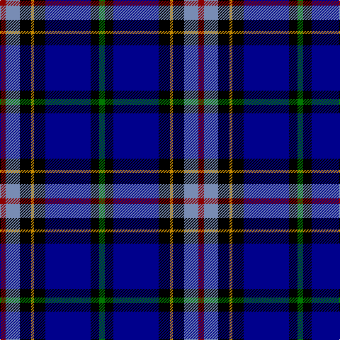

In pattern [GKBKYKBR](/patterns/gkbkykbr/).

This was sourced from register-of-tartans.  It is a [8 stripes tartan](/stripes/stripes8/).

Original link https://www.tartanregister.gov.uk/tartanDetails.aspx?ref=120

## Thread count
DR/8 B20 K16 DY4 K16 DB64 K12 G/8

## Palette
Each colour and its ΔE from the base-6 reference it is a variant of.

| Colour | Shade | Base | ΔE (OKLab) |
|---|---|---|---|
| B | <code style="background-color:#788CB4;">#788CB4</code> `#788CB4` | B <code style="background-color:#2C4084;">#2C4084</code> | 0.25 |
| DB | <code style="background-color:#00008C;">#00008C</code> `#00008C` | B <code style="background-color:#2C4084;">#2C4084</code> | 0.13 |
| DR | <code style="background-color:#8C0000;">#8C0000</code> `#8C0000` | R <code style="background-color:#C80000;">#C80000</code> | 0.13 |
| DY | <code style="background-color:#C88C00;">#C88C00</code> `#C88C00` | Y <code style="background-color:#E8C000;">#E8C000</code> | 0.15 |
| G | <code style="background-color:#007800;">#007800</code> `#007800` | G <code style="background-color:#006400;">#006400</code> | 0.06 |
| K | <code style="background-color:#000000;">#000000</code> `#000000` | K <code style="background-color:#000000;">#000000</code> | 0.00 |
| N | <code style="background-color:#C8C8C8;">#C8C8C8</code> `#C8C8C8` | W <code style="background-color:#F4F4F0;">#F4F4F0</code> | 0.13 |
| P | <code style="background-color:#64008C;">#64008C</code> `#64008C` | B <code style="background-color:#2C4084;">#2C4084</code> | 0.13 |

# Sample pattern

## Nearest tartans

The nearest existing variants by ΔTartan distance.

1. [Unidentified 7](/setts/s7/b70r4k32y4ba50w4ba12-b000050-ba8080d0-k000000-rc00000-we0e0e0-yf0c000/) — ΔT 0.89
1. [Banff and Buchan](/setts/s8/k34w4k6b32ba56b4ba6y4-b000064-ba3c74a4-k000000-wc8c8c8-yc48800/) — ΔT 1.03
1. [Unidentified #23](/setts/s7/b70r4k32y4ba50w4ba12-b080848-ba0596fa-k101010-rdc0000-we0e0e0-ye8c000/) — ΔT 1.15
1. [Crookdake-Cheng (Personal)](/setts/s10/r4b48w12k12g12k8g4k4g4k2-b00008c-g007800-k000000-r8c0000-wc8c8c8/) — ΔT 1.21
1. [Scottish Italian](/setts/s8/b22ba10g8w6r6k32ba56b4-b1474b4-ba202060-g006818-k101010-rc80000-wfcfcfc/) — ΔT 1.21
1. [Atlantic Police Academy](/setts/s6/k66y8w6b66r4g4-b000064-g005020-k101010-rdc0000-we0e0e0-yfadc00/) — ΔT 1.22
1. [US Forces (Thurso) Regimental Tartan Tartan Number: 549. Earliest known date: 1986 Originally listed as MacNeil, this sett was identified by Ken Dalgliesh, weaver in Selkirk, in 1999. See products available Copyright © Blair Urquhart, Comrie, 2015](/setts/s7/b70r4k32y4ba50w4ba12-b202060-ba2888c4-k101010-rc80000-we0e0e0-ye8c000/) — ΔT 1.34
1. [Nery](/setts/s7/y12g56r8k40r6b90k10-b00008c-g007800-k000000-r8c0000-yc88c00/) — ΔT 1.34
1. [Pipers' Trail, The](/setts/s6/w4b54k53ba4bb8y4-b2c2c80-ba780078-bb5c8ca8-k101010-wfcfcfc-yfccc00/) — ΔT 1.34
1. [Anne Arundel County](/setts/s8/g8k14b66ka18ga4ka18gb20r8-b304080-g008000-ga604000-gb808080-k000030-ka000000-rc00000/) — ΔT 1.36

## Neighbour map

Every grey dot is one of 15726 variants placed by the first two principal components of the ΔTartan feature space (44% of its variance). Red is this tartan; blue dots are its nearest — click one to open its page.

<svg viewBox="0 0 640 380" role="img" style="max-width:100%;height:auto;border:1px solid #e0e0e0;border-radius:4px;display:block" xmlns="http://www.w3.org/2000/svg"><image href="/nn/cloud.v1.png" width="640" height="380"/><a href="/setts/s7/b70r4k32y4ba50w4ba12-b000050-ba8080d0-k000000-rc00000-we0e0e0-yf0c000/"><circle cx="171.7" cy="133.6" r="4" fill="#3465a4"><title>Unidentified 7</title></circle></a><a href="/setts/s8/k34w4k6b32ba56b4ba6y4-b000064-ba3c74a4-k000000-wc8c8c8-yc48800/"><circle cx="193.9" cy="154.3" r="4" fill="#3465a4"><title>Banff and Buchan</title></circle></a><a href="/setts/s7/b70r4k32y4ba50w4ba12-b080848-ba0596fa-k101010-rdc0000-we0e0e0-ye8c000/"><circle cx="171.8" cy="136.7" r="4" fill="#3465a4"><title>Unidentified #23</title></circle></a><a href="/setts/s10/r4b48w12k12g12k8g4k4g4k2-b00008c-g007800-k000000-r8c0000-wc8c8c8/"><circle cx="177.7" cy="97.6" r="4" fill="#3465a4"><title>Crookdake-Cheng (Personal)</title></circle></a><a href="/setts/s8/b22ba10g8w6r6k32ba56b4-b1474b4-ba202060-g006818-k101010-rc80000-wfcfcfc/"><circle cx="203.0" cy="152.3" r="4" fill="#3465a4"><title>Scottish Italian</title></circle></a><a href="/setts/s6/k66y8w6b66r4g4-b000064-g005020-k101010-rdc0000-we0e0e0-yfadc00/"><circle cx="234.4" cy="148.7" r="4" fill="#3465a4"><title>Atlantic Police Academy</title></circle></a><a href="/setts/s7/b70r4k32y4ba50w4ba12-b202060-ba2888c4-k101010-rc80000-we0e0e0-ye8c000/"><circle cx="193.2" cy="143.5" r="4" fill="#3465a4"><title>US Forces (Thurso) Regimental Tartan Tartan Number: 549. Earliest known date: 1986 Originally listed as MacNeil, this sett was identified by Ken Dalgliesh, weaver in Selkirk, in 1999. See products available Copyright © Blair Urquhart, Comrie, 2015</title></circle></a><a href="/setts/s7/y12g56r8k40r6b90k10-b00008c-g007800-k000000-r8c0000-yc88c00/"><circle cx="177.8" cy="165.4" r="4" fill="#3465a4"><title>Nery</title></circle></a><a href="/setts/s6/w4b54k53ba4bb8y4-b2c2c80-ba780078-bb5c8ca8-k101010-wfcfcfc-yfccc00/"><circle cx="227.7" cy="155.8" r="4" fill="#3465a4"><title>Pipers' Trail, The</title></circle></a><a href="/setts/s8/g8k14b66ka18ga4ka18gb20r8-b304080-g008000-ga604000-gb808080-k000030-ka000000-rc00000/"><circle cx="156.4" cy="124.8" r="4" fill="#3465a4"><title>Anne Arundel County</title></circle></a><circle cx="178.7" cy="140.1" r="5" fill="#c00000"/></svg>

ID: /setts/s8/g8k12b64k16y4k16ba20r8-b00008c-ba788cb4-g007800-k000000-r8c0000-yc88c00/
