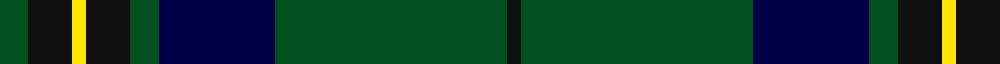

In pattern [GKYKGBGK](/patterns/gkykgbgk/).

This was sourced from register-of-tartans.  It is a [8 stripes tartan](/stripes/stripes8/).

Original link https://www.tartanregister.gov.uk/tartanDetails.aspx?ref=10986

## Thread count
G/8 K12 Y4 K12 G8 DB32 G64 K/4

## Palette
Each colour and its ΔE from the base-6 reference it is a variant of.

| Colour | Shade | Base | ΔE (OKLab) |
|---|---|---|---|
| DB | <code style="background-color:#000048;">#000048</code> `#000048` | B <code style="background-color:#2C4084;">#2C4084</code> | 0.21 |
| G | <code style="background-color:#005020;">#005020</code> `#005020` | G <code style="background-color:#006400;">#006400</code> | 0.08 |
| K | <code style="background-color:#101010;">#101010</code> `#101010` | K <code style="background-color:#000000;">#000000</code> | 0.17 |
| Y | <code style="background-color:#FFE600;">#FFE600</code> `#FFE600` | Y <code style="background-color:#E8C000;">#E8C000</code> | 0.10 |

# Sample pattern

## Nearest tartans

The nearest existing variants by ΔTartan distance.

1. [Harley (Leslie), Robert](/setts/s8/g8k12y4k12g8b32g64k4-b202060-g006818-k101010-ye8c000/) — ΔT 0.72
1. [Page](/setts/s7/g92k36g12k26r8k8w8-g004810-k101010-rc80000-we0e0e0/) — ΔT 1.03
1. [Leatherneck](/setts/s8/g80r6g8r6g24b64y8r6-b1c0070-g006818-r880000-yd09800/) — ΔT 1.07
1. [U.S. Marine Corps (Military?)](/setts/s8/g80r6g8r6g24b64y8r6-b2c2c80-g005810-rc80000-ye8c000/) — ΔT 1.07
1. [Lockhart Family Tartan Tartan Number: 2258. Earliest known date: 1996 The clan tartan approved by the chief and the Lockhart Family Association 1996. The tartan was registered in the Lyon Court Book. LCB 100 on 11th June 1996. See products available Copyright © Blair Urquhart, Comrie, 2015](/setts/s9/g26k6g68k12b32r4b32k6g26-b202060-g006818-k101010-rc80000/) — ΔT 1.12
1. [Childers](/setts/s10/k8g26k8ga16k88ga16k8g26k8w6-g006818-ga408060-k101010-we0e0e0/) — ΔT 1.14
1. [Scottish Chieftain](/setts/s10/k38r2g6k4k6k4g4k4g40w4-g005020-k101010-rdc0000-we0e0e0/) — ΔT 1.15
1. [MacHardy (Clan)](/setts/s8/b12r6g52b52w4b54r10g10-b14283c-g006428-rc80000-we0e0e0/) — ΔT 1.17
1. [MacAuliffe/McAucliffe](/setts/s8/g76w4g12b48r12b4r6b4-b2c4084-g005020-rc87814-we0e0e0/) — ΔT 1.18
1. [MacIntyre LC](/setts/s6/g8b24r6b24g64y8-b000052-g11450d-raa0000-yaaaaaa/) — ΔT 1.21

## Neighbour map

Every grey dot is one of 15726 variants placed by the first two principal components of the ΔTartan feature space (44% of its variance). Red is this tartan; blue dots are its nearest — click one to open its page.

<svg viewBox="0 0 640 380" role="img" style="max-width:100%;height:auto;border:1px solid #e0e0e0;border-radius:4px;display:block" xmlns="http://www.w3.org/2000/svg"><image href="/nn/cloud.v1.png" width="640" height="380"/><a href="/setts/s8/g8k12y4k12g8b32g64k4-b202060-g006818-k101010-ye8c000/"><circle cx="334.2" cy="184.3" r="4" fill="#3465a4"><title>Harley (Leslie), Robert</title></circle></a><a href="/setts/s7/g92k36g12k26r8k8w8-g004810-k101010-rc80000-we0e0e0/"><circle cx="341.2" cy="205.6" r="4" fill="#3465a4"><title>Page</title></circle></a><a href="/setts/s8/g80r6g8r6g24b64y8r6-b1c0070-g006818-r880000-yd09800/"><circle cx="327.9" cy="181.8" r="4" fill="#3465a4"><title>Leatherneck</title></circle></a><a href="/setts/s8/g80r6g8r6g24b64y8r6-b2c2c80-g005810-rc80000-ye8c000/"><circle cx="339.3" cy="184.7" r="4" fill="#3465a4"><title>U.S. Marine Corps (Military?)</title></circle></a><a href="/setts/s9/g26k6g68k12b32r4b32k6g26-b202060-g006818-k101010-rc80000/"><circle cx="343.6" cy="204.2" r="4" fill="#3465a4"><title>Lockhart Family Tartan Tartan Number: 2258. Earliest known date: 1996 The clan tartan approved by the chief and the Lockhart Family Association 1996. The tartan was registered in the Lyon Court Book. LCB 100 on 11th June 1996. See products available Copyright © Blair Urquhart, Comrie, 2015</title></circle></a><a href="/setts/s10/k8g26k8ga16k88ga16k8g26k8w6-g006818-ga408060-k101010-we0e0e0/"><circle cx="325.7" cy="167.9" r="4" fill="#3465a4"><title>Childers</title></circle></a><a href="/setts/s10/k38r2g6k4k6k4g4k4g40w4-g005020-k101010-rdc0000-we0e0e0/"><circle cx="356.9" cy="160.4" r="4" fill="#3465a4"><title>Scottish Chieftain</title></circle></a><a href="/setts/s8/b12r6g52b52w4b54r10g10-b14283c-g006428-rc80000-we0e0e0/"><circle cx="362.8" cy="211.2" r="4" fill="#3465a4"><title>MacHardy (Clan)</title></circle></a><a href="/setts/s8/g76w4g12b48r12b4r6b4-b2c4084-g005020-rc87814-we0e0e0/"><circle cx="360.4" cy="173.5" r="4" fill="#3465a4"><title>MacAuliffe/McAucliffe</title></circle></a><a href="/setts/s6/g8b24r6b24g64y8-b000052-g11450d-raa0000-yaaaaaa/"><circle cx="319.1" cy="224.4" r="4" fill="#3465a4"><title>MacIntyre LC</title></circle></a><circle cx="342.0" cy="190.5" r="5" fill="#c00000"/></svg>

ID: /setts/s8/g8k12y4k12g8b32g64k4-b000048-g005020-k101010-yffe600/
