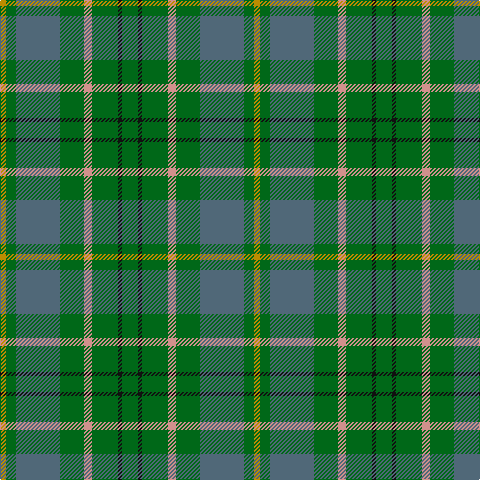

**Bands:** [GKGYGBGY](/stripes/gkgygbgy/) · **Stripes:** [G K G LR G N G LO](/stripes/stripes8/) G K G LR G N G LO

This was sourced from register-of-tartans.  It is a [8 band tartan](/bands/bands8/).

Original link https://www.tartanregister.gov.uk/tartanDetails.aspx?ref=4080

## Attestations

This cloth appears in 2 source records; the oldest owns this page.

- 01/01/1955 — Taylor (register-of-tartans, [record](https://www.tartanregister.gov.uk/tartanDetails.aspx?ref=4080))
- 1955 — Taylor (Clan) (tartans-authority, [record](http://www.tartansauthority.com/tartan-ferret/display/809/))

## Register references

External register numbers recorded for this tartan.

- Scottish Register of Tartans: [4080](https://www.tartanregister.gov.uk/tartanDetails.aspx?ref=4080)
- Scottish Tartans Authority (ITI): 809
- Scottish Tartans World Register: 809

## Thread count
DY/6 G10 N44 G24 LR8 G26 K4 G/16

## Palette
Each colour and its ΔE from the base-6 reference it is a variant of.

| Colour | Shade | Base | ΔE (OKLab) |
|---|---|---|---|
| DY | <code style="background-color:#BC8C00;">#BC8C00</code> `#BC8C00` | Y <code style="background-color:#F2BF00;">#F2BF00</code> | 0.16 |
| G | <code style="background-color:#006818;">#006818</code> `#006818` | G <code style="background-color:#006100;">#006100</code> | 0.02 |
| K | <code style="background-color:#101010;">#101010</code> `#101010` | K <code style="background-color:#000000;">#000000</code> | 0.17 |
| LR | <code style="background-color:#D0908C;">#D0908C</code> `#D0908C` | Y <code style="background-color:#F2BF00;">#F2BF00</code> | 0.19 |
| N | <code style="background-color:#506878;">#506878</code> `#506878` | B <code style="background-color:#2A418A;">#2A418A</code> | 0.14 |

# Sample pattern

## Nearest tartans

The nearest existing variants by ΔTartan distance.

1. [Kildare](/setts/s8/g8dr2g13r4g12t22g5y3~x2/) — ΔT 0.98
1. [Harkness Htg (Name)](/setts/s10/g10n2w2n16g6ly2g4r2g3n6~x4/) — ΔT 1.17
1. [Scottish Pup](/setts/s8/dg8do2dg13db4dg12n22dg5ly3~x2/) — ΔT 1.32
1. [Hesco](/setts/s7/dp3n24n10n2g11n8w3~x2/) — ΔT 1.41
1. [MacKinnon, hunting](/setts/s7/g1o8g8r1g8o8w1~x4/) — ΔT 1.44
1. [Daks (Loden)](/setts/s8/db3dy7g2y2g14dy2g2db3~x2/) — ΔT 1.47
1. [Hueg (Hunting) (Personal)](/setts/s10/dt17g5dt5g17dt4g17k2dy2k2g5~x2/) — ΔT 1.51
1. [Simple Technology](/setts/s8/g28db9dg18w3dg18db9g28r3~x2/) — ΔT 1.52
1. [Daks, Tartan-Loden](/setts/s8/db3o7g2r2g14o2g2db3~x2/) — ΔT 1.53
1. [Exabyte](/setts/s5/lb3g47db4n34r3~x2/) — ΔT 1.55

## Neighbour map

Every grey dot is one of 14313 variants placed by the first two principal components of the ΔTartan feature space (44% of its variance). Red is this tartan; blue dots are its nearest — click one to open its page.

<svg viewBox="0 0 640 380" role="img" style="max-width:100%;height:auto;border:1px solid #e0e0e0;border-radius:4px;display:block" xmlns="http://www.w3.org/2000/svg"><image href="/nn/cloud.v1.png" width="640" height="380"/><a href="/setts/s8/g8dr2g13r4g12t22g5y3~x2/"><circle cx="349.7" cy="238.7" r="4" fill="#3465a4"><title>Kildare</title></circle></a><a href="/setts/s10/g10n2w2n16g6ly2g4r2g3n6~x4/"><circle cx="283.7" cy="231.2" r="4" fill="#3465a4"><title>Harkness Htg (Name)</title></circle></a><a href="/setts/s8/dg8do2dg13db4dg12n22dg5ly3~x2/"><circle cx="358.2" cy="250.1" r="4" fill="#3465a4"><title>Scottish Pup</title></circle></a><a href="/setts/s7/dp3n24n10n2g11n8w3~x2/"><circle cx="324.3" cy="217.5" r="4" fill="#3465a4"><title>Hesco</title></circle></a><a href="/setts/s7/g1o8g8r1g8o8w1~x4/"><circle cx="335.3" cy="268.0" r="4" fill="#3465a4"><title>MacKinnon, hunting</title></circle></a><a href="/setts/s8/db3dy7g2y2g14dy2g2db3~x2/"><circle cx="329.5" cy="256.0" r="4" fill="#3465a4"><title>Daks (Loden)</title></circle></a><a href="/setts/s10/dt17g5dt5g17dt4g17k2dy2k2g5~x2/"><circle cx="380.8" cy="255.9" r="4" fill="#3465a4"><title>Hueg (Hunting) (Personal)</title></circle></a><a href="/setts/s8/g28db9dg18w3dg18db9g28r3~x2/"><circle cx="252.9" cy="239.8" r="4" fill="#3465a4"><title>Simple Technology</title></circle></a><a href="/setts/s8/db3o7g2r2g14o2g2db3~x2/"><circle cx="305.0" cy="239.0" r="4" fill="#3465a4"><title>Daks, Tartan-Loden</title></circle></a><a href="/setts/s5/lb3g47db4n34r3~x2/"><circle cx="380.7" cy="225.9" r="4" fill="#3465a4"><title>Exabyte</title></circle></a><circle cx="336.2" cy="237.1" r="5" fill="#c00000"/></svg>

ID: /setts/s8/g8k2g13lr4g12n22g5lo3~x2/
