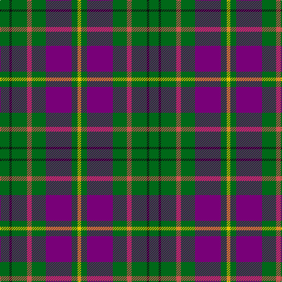

In pattern [GKGRGBGY](/patterns/gkgrgbgy/).

This was sourced from house-of-tartan.  It is a [8 stripes tartan](/stripes/stripes8/).

Original link http://www.house-of-tartan.scotland.net/house/TartanViewjs.asp?colr=Def&tnam=809

## Thread count
G/16 K4 G26 DO8 G24 P44 G10 Y/6

## Palette
Each colour and its ΔE from the base-6 reference it is a variant of.

| Colour | Shade | Base | ΔE (OKLab) |
|---|---|---|---|
| DO | <code style="background-color:#D05054;">#D05054</code> `#D05054` | R <code style="background-color:#CC0000;">#CC0000</code> | 0.09 |
| G | <code style="background-color:#006818;">#006818</code> `#006818` | G <code style="background-color:#006100;">#006100</code> | 0.02 |
| K | <code style="background-color:#101010;">#101010</code> `#101010` | K <code style="background-color:#000000;">#000000</code> | 0.17 |
| P | <code style="background-color:#780078;">#780078</code> `#780078` | B <code style="background-color:#2A418A;">#2A418A</code> | 0.17 |
| Y | <code style="background-color:#E8C000;">#E8C000</code> `#E8C000` | Y <code style="background-color:#F2BF00;">#F2BF00</code> | 0.02 |

# Sample pattern

## Nearest tartans

The nearest existing variants by ΔTartan distance.

1. [Lawrence of Broughty Ferry (Corporat](/setts/s6/g20k2g20b25w2ba3x2~b780078-ba5c8ca8-g006818-k101010-we0e0e0/) — ΔT 0.80
1. [Lossiemouth/Hersbruck](/setts/s6/g26b3g12k10ba15w2x2~b2c2c80-ba780078-g006818-k101010-we0e0e0/) — ΔT 0.95
1. [MacNamara](/setts/s7/y4b17k11r17b27k2w3x2~b506878-k101010-rc80000-we0e0e0-ye8c000/) — ΔT 1.02
1. [MacConnell Clan Tartan Tartan Number: 141. Earliest known date: 1989 Based on MacDonald Hunting without the black. For use by the McConnells in addition to the MacDonald. Sample in STA Johnston Collection states 'from Margaret McConnel of Highland Heritage (USA). See products available Copyright © Blair Urquhart, Comrie, 2015](/setts/s10/b22g6b5ba2g22r6g5r4g9w3x2~b2c2c80-ba5c8ca8-g006818-rc80000-we0e0e0/) — ΔT 1.07
1. [Otago Peninsula](/setts/s12/g4k4r4k2g12k2g12k2r4g4w1ra4x2~g006030-k000030-r802040-rad03030-we0e0e0/) — ΔT 1.14
1. [Wellington (Wilson 122)](/setts/s8/g14b11ba3k2ba3b11g14y1x2~b440044-ba2888c4-g408060-k101010-ye8c000/) — ΔT 1.20
1. [Bahamas](/setts/s8/b8y2b22g6r2w10g12b3x2~b40647c-g004800-rc80000-wc8c8c8-y9c9c00/) — ΔT 1.22
1. [Duchess of York](/setts/s9/b1r9g5r1k5r1g5r9w1x2~b304080-g008000-k000000-r703000-we0e0e0/) — ΔT 1.23
1. [Montreat](/setts/s11/y2b10k2r5k2b19k2b19g17k2y2x2~b546488-g007800-k000000-r8c0000-yc88c00/) — ΔT 1.24
1. [Arkansas](/setts/s7/g3w1g12r6g3k3ga2x4~g004010-ga008000-k000000-rc00020-we0e0e0/) — ΔT 1.27

## Neighbour map

Every grey dot is one of 15726 variants placed by the first two principal components of the ΔTartan feature space (44% of its variance). Red is this tartan; blue dots are its nearest — click one to open its page.

<svg viewBox="0 0 640 380" role="img" style="max-width:100%;height:auto;border:1px solid #e0e0e0;border-radius:4px;display:block" xmlns="http://www.w3.org/2000/svg"><image href="/nn/cloud.v1.png" width="640" height="380"/><a href="/setts/s6/g20k2g20b25w2ba3x2~b780078-ba5c8ca8-g006818-k101010-we0e0e0/"><circle cx="301.7" cy="196.9" r="4" fill="#3465a4"><title>Lawrence of Broughty Ferry (Corporat</title></circle></a><a href="/setts/s6/g26b3g12k10ba15w2x2~b2c2c80-ba780078-g006818-k101010-we0e0e0/"><circle cx="273.2" cy="206.3" r="4" fill="#3465a4"><title>Lossiemouth/Hersbruck</title></circle></a><a href="/setts/s7/y4b17k11r17b27k2w3x2~b506878-k101010-rc80000-we0e0e0-ye8c000/"><circle cx="262.3" cy="181.5" r="4" fill="#3465a4"><title>MacNamara</title></circle></a><a href="/setts/s10/b22g6b5ba2g22r6g5r4g9w3x2~b2c2c80-ba5c8ca8-g006818-rc80000-we0e0e0/"><circle cx="245.8" cy="177.9" r="4" fill="#3465a4"><title>MacConnell Clan Tartan Tartan Number: 141. Earliest known date: 1989 Based on MacDonald Hunting without the black. For use by the McConnells in addition to the MacDonald. Sample in STA Johnston Collection states 'from Margaret McConnel of Highland Heritage (USA). See products available Copyright © Blair Urquhart, Comrie, 2015</title></circle></a><a href="/setts/s12/g4k4r4k2g12k2g12k2r4g4w1ra4x2~g006030-k000030-r802040-rad03030-we0e0e0/"><circle cx="279.0" cy="178.1" r="4" fill="#3465a4"><title>Otago Peninsula</title></circle></a><a href="/setts/s8/g14b11ba3k2ba3b11g14y1x2~b440044-ba2888c4-g408060-k101010-ye8c000/"><circle cx="243.0" cy="187.2" r="4" fill="#3465a4"><title>Wellington (Wilson 122)</title></circle></a><a href="/setts/s8/b8y2b22g6r2w10g12b3x2~b40647c-g004800-rc80000-wc8c8c8-y9c9c00/"><circle cx="246.8" cy="192.3" r="4" fill="#3465a4"><title>Bahamas</title></circle></a><a href="/setts/s9/b1r9g5r1k5r1g5r9w1x2~b304080-g008000-k000000-r703000-we0e0e0/"><circle cx="246.9" cy="189.4" r="4" fill="#3465a4"><title>Duchess of York</title></circle></a><a href="/setts/s11/y2b10k2r5k2b19k2b19g17k2y2x2~b546488-g007800-k000000-r8c0000-yc88c00/"><circle cx="283.8" cy="169.6" r="4" fill="#3465a4"><title>Montreat</title></circle></a><a href="/setts/s7/g3w1g12r6g3k3ga2x4~g004010-ga008000-k000000-rc00020-we0e0e0/"><circle cx="292.9" cy="191.4" r="4" fill="#3465a4"><title>Arkansas</title></circle></a><circle cx="272.8" cy="193.3" r="5" fill="#c00000"/></svg>

ID: /setts/s8/g8k2g13r4g12b22g5y3x2~b780078-g006818-k101010-rd05054-ye8c000/
