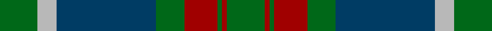
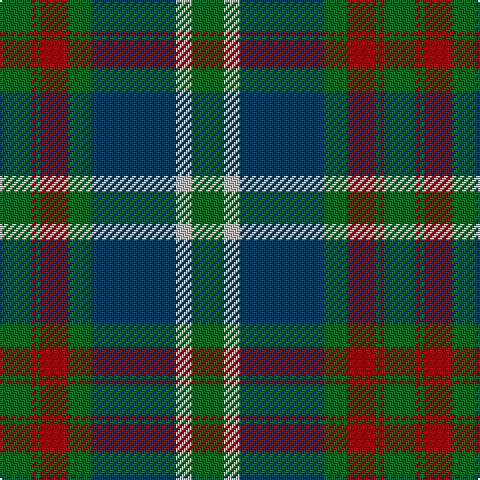

In pattern [GRGRGBYG](/stripes/grgrgbyg/).

This was sourced from register-of-tartans.  It is a [8 stripe tartan](/stripes/stripes8/).

Original link https://www.tartanregister.gov.uk/tartanDetails.aspx?ref=596

## Attestations

This cloth appears in 2 source records; the oldest owns this page.

- 01/01/1840 — Cathcart (register-of-tartans, [record](https://www.tartanregister.gov.uk/tartanDetails.aspx?ref=596))
- pre 1840 — Cathcart (Artefact) (tartans-authority, [record](http://www.tartansauthority.com/tartan-ferret/display/4479/))

## Register references

External register numbers recorded for this tartan.

- Scottish Register of Tartans: [596](https://www.tartanregister.gov.uk/tartanDetails.aspx?ref=596)
- Scottish Tartans Authority (ITI): 4479

## Thread count
G/16 N8 DB42 G12 DR14 G2 DR2 G/16

## Palette
Each colour and the base-6 reference it is a variant of.

| Colour | Shade | Base |
|---|---|---|
| DB | <code style="background-color:#003C64;">#003C64</code> `oklch(34.5% 0.089 246.0)` <small>#003C64</small> | B <code style="background-color:#2A418A;">#2A418A</code> |
| DR | <code style="background-color:#A00000;">#A00000</code> `oklch(44.3% 0.182 29.2)` <small>#A00000</small> | R <code style="background-color:#CC0000;">#CC0000</code> |
| G | <code style="background-color:#006818;">#006818</code> `oklch(45.0% 0.142 145.0)` <small>#006818</small> | G <code style="background-color:#006100;">#006100</code> |
| N | <code style="background-color:#B8B8B8;">#B8B8B8</code> `oklch(78.3% 0.000 89.9)` <small>#B8B8B8</small> | Y <code style="background-color:#F2BF00;">#F2BF00</code> |

# Sample pattern

## Nearest tartans

The nearest existing variants by ΔTartan distance.

1. [Maine Acadia](/setts/s9/g5k1lo2k1g19k15lo2y20g3~x2/) — ΔT 0.83
1. [Dalbraith-Eastern Western Motor Group](/setts/s8/o28g2o4db18g23db2g3o4~x2/) — ΔT 0.95
1. [Maine Acadia (Fashion)](/setts/s9/dg5k1ly2k1dg19k15ly2dt20dg3~x2/) — ΔT 0.96
1. [Dundas Clan Tartan Tartan Number: 1041. Earliest known date: 1842 The Dundas tartan originated in the Vestiarium Scoticum (1842). The design has the traditional green, black, blue background of the Highland military tartans with twin red stripes on the green. Dundas's played an important role in restoring the Highland way of life after the penalties imposed as a result of the '45 rebellion. It was Henry Dundas, who in 1784, introduced the bill to parliament restoring estates forfieted to the Crown after the uprising, following the repeal on the wearing of tartan in 1782. The Chief today is Sir David Dundas of Dundas, Bart. Appears in Edgars 'Old and Rare' See products available Copyright © Blair Urquhart, Comrie, 2015](/setts/s7/k4db16k12g24r1g2k2~x2/) — ΔT 0.97
1. [Hunting, The](/setts/s11/g24ly3g4ly1g17k25t2k2t2k2t22~x2/) — ΔT 1.18
1. [George (Personal)](/setts/s9/r6db2r1db16r3db16dg28w2dg4~x2/) — ΔT 1.18
1. [MacTavish Hunting Clan Tartan Tartan Number: 232. Earliest known date: pre 2003 See Lord Thomson See products available Copyright © Blair Urquhart, Comrie, 2015](/setts/s6/t3dy26g4t13k13t2~x2/) — ΔT 1.18
1. [Norwich No.052](/setts/s8/g19w1db12t2db2t2db2t16~x2/) — ΔT 1.20
1. [Cork Irish County Tartan Tartan Number: 2253. Earliest known date: 1996 One of a series of Irish District tartans designed by Polly Wittering of the House of Edgar, with colours reminiscent of the Country with soft warm colours dominating. See products available Copyright © Blair Urquhart, Comrie, 2015](/setts/s9/g28r12g4db20lo2db3lo2db3g7~x2/) — ΔT 1.20
1. [Abercrombie](/setts/s9/g14w1g7k7db2k2db2k2db7~x4/) — ΔT 1.20

## Neighbour map

Every grey dot is one of 14299 variants placed by the first two principal components of the ΔTartan feature space (44% of its variance). Red is this tartan; blue dots are its nearest — click one to open its page.

<svg viewBox="0 0 640 380" role="img" style="max-width:100%;height:auto;border:1px solid #e0e0e0;border-radius:4px;display:block" xmlns="http://www.w3.org/2000/svg"><image href="/nn/cloud.v1.png" width="640" height="380"/><a href="/setts/s9/g5k1lo2k1g19k15lo2y20g3~x2/"><circle cx="252.7" cy="172.2" r="4" fill="#3465a4"><title>Maine Acadia</title></circle></a><a href="/setts/s8/o28g2o4db18g23db2g3o4~x2/"><circle cx="231.6" cy="188.1" r="4" fill="#3465a4"><title>Dalbraith-Eastern Western Motor Group</title></circle></a><a href="/setts/s9/dg5k1ly2k1dg19k15ly2dt20dg3~x2/"><circle cx="263.0" cy="182.0" r="4" fill="#3465a4"><title>Maine Acadia (Fashion)</title></circle></a><a href="/setts/s7/k4db16k12g24r1g2k2~x2/"><circle cx="292.1" cy="190.9" r="4" fill="#3465a4"><title>Dundas Clan Tartan Tartan Number: 1041. Earliest known date: 1842 The Dundas tartan originated in the Vestiarium Scoticum (1842). The design has the traditional green, black, blue background of the Highland military tartans with twin red stripes on the green. Dundas's played an important role in restoring the Highland way of life after the penalties imposed as a result of the '45 rebellion. It was Henry Dundas, who in 1784, introduced the bill to parliament restoring estates forfieted to the Crown after the uprising, following the repeal on the wearing of tartan in 1782. The Chief today is Sir David Dundas of Dundas, Bart. Appears in Edgars 'Old and Rare' See products available Copyright © Blair Urquhart, Comrie, 2015</title></circle></a><a href="/setts/s11/g24ly3g4ly1g17k25t2k2t2k2t22~x2/"><circle cx="275.0" cy="158.6" r="4" fill="#3465a4"><title>Hunting, The</title></circle></a><a href="/setts/s9/r6db2r1db16r3db16dg28w2dg4~x2/"><circle cx="316.5" cy="164.4" r="4" fill="#3465a4"><title>George (Personal)</title></circle></a><a href="/setts/s6/t3dy26g4t13k13t2~x2/"><circle cx="251.9" cy="214.7" r="4" fill="#3465a4"><title>MacTavish Hunting Clan Tartan Tartan Number: 232. Earliest known date: pre 2003 See Lord Thomson See products available Copyright © Blair Urquhart, Comrie, 2015</title></circle></a><a href="/setts/s8/g19w1db12t2db2t2db2t16~x2/"><circle cx="236.3" cy="175.5" r="4" fill="#3465a4"><title>Norwich No.052</title></circle></a><a href="/setts/s9/g28r12g4db20lo2db3lo2db3g7~x2/"><circle cx="303.8" cy="192.7" r="4" fill="#3465a4"><title>Cork Irish County Tartan Tartan Number: 2253. Earliest known date: 1996 One of a series of Irish District tartans designed by Polly Wittering of the House of Edgar, with colours reminiscent of the Country with soft warm colours dominating. See products available Copyright © Blair Urquhart, Comrie, 2015</title></circle></a><a href="/setts/s9/g14w1g7k7db2k2db2k2db7~x4/"><circle cx="266.8" cy="203.1" r="4" fill="#3465a4"><title>Abercrombie</title></circle></a><circle cx="271.1" cy="192.5" r="5" fill="#c00000"/></svg>

ID: /setts/s8/g8lr4dt21g6r7g1r1g8~x2/
