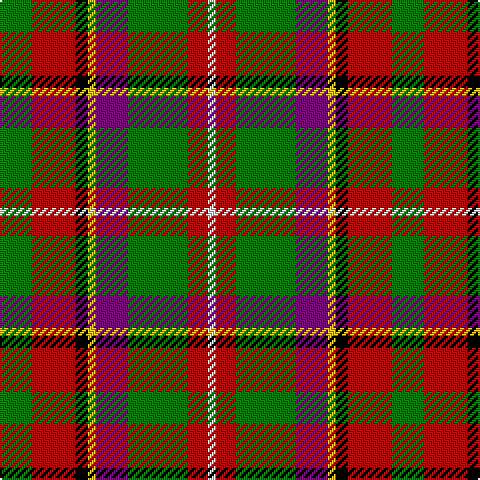

This page is one **sett** — a single exact thread-count. It belongs to the [tartan](/tartans/g8r11k3ly2p8g15r5w2/)
(the same proportion at any scale), whose colour order is pattern [GRKYBGRW](/stripes/grkybgrw/).

Sourced from weddslist.  It is a [8 stripe tartan](/stripes/stripes8/).

Original link http://www.weddslist.com/cgi-bin/tartans/pg.pl?source=sts

## Thread count
G/16 R22 K6 Y4 P16 G30 R10 LN/4

## Palette

Palette: <strong>Tartan Register</strong> <small style="color:#888">(2 of 6 colours)</small>
<table><thead><tr><th>Colour</th><th>Threads</th><th>Shade</th><th>Base</th><th>OKLCh</th></tr></thead><tbody><tr><td>G/</td><td style="text-align:right;font-variant-numeric:tabular-nums">16</td><td><code style="background-color:#008000;">#008000</code> <small style="color:#888">#008000</small></td><td>G <code style="background-color:#006100;">#006100</code></td><td><small style="color:#888">oklch(52.0% 0.177 142.5)</small></td></tr><tr><td>R</td><td style="text-align:right;font-variant-numeric:tabular-nums">22</td><td><code style="background-color:#C00000;">#C00000</code> <small style="color:#888">#C00000</small></td><td>R <code style="background-color:#CC0000;">#CC0000</code></td><td><small style="color:#888">oklch(50.7% 0.208 29.2)</small></td></tr><tr><td>K</td><td style="text-align:right;font-variant-numeric:tabular-nums">6</td><td><code style="background-color:#000000;">#000000</code> <small style="color:#888">#000000</small></td><td>K <code style="background-color:#000000;">#000000</code></td><td><small style="color:#888">oklch(0.0% 0.000 0.0)</small></td></tr><tr><td>Y</td><td style="text-align:right;font-variant-numeric:tabular-nums">4</td><td><code style="background-color:#F0C000;">#F0C000</code> <small style="color:#888">#F0C000</small></td><td>Y <code style="background-color:#F2BF00;">#F2BF00</code></td><td><small style="color:#888">oklch(82.7% 0.169 90.5)</small></td></tr><tr><td>P</td><td style="text-align:right;font-variant-numeric:tabular-nums">16</td><td><code style="background-color:#800080;">#800080</code> <small style="color:#888">#800080</small></td><td>B <code style="background-color:#2A418A;">#2A418A</code></td><td><small style="color:#888">oklch(42.1% 0.193 328.4)</small></td></tr><tr><td>G</td><td style="text-align:right;font-variant-numeric:tabular-nums">30</td><td><code style="background-color:#008000;">#008000</code> <small style="color:#888">#008000</small></td><td>G <code style="background-color:#006100;">#006100</code></td><td><small style="color:#888">oklch(52.0% 0.177 142.5)</small></td></tr><tr><td>R</td><td style="text-align:right;font-variant-numeric:tabular-nums">10</td><td><code style="background-color:#C00000;">#C00000</code> <small style="color:#888">#C00000</small></td><td>R <code style="background-color:#CC0000;">#CC0000</code></td><td><small style="color:#888">oklch(50.7% 0.208 29.2)</small></td></tr><tr><td>LN/</td><td style="text-align:right;font-variant-numeric:tabular-nums">4</td><td><code style="background-color:#E0E0E0;">#E0E0E0</code> <small style="color:#888">#E0E0E0</small></td><td>W <code style="background-color:#F7F7F7;">#F7F7F7</code></td><td><small style="color:#888">oklch(90.7% 0.000 89.9)</small></td></tr></tbody></table>

# Sample pattern

## Nearest tartans

The nearest existing variants by ΔTartan distance, with this tartan at the top so the swatches line up against it.

ΔTartan

Tartan

Sett

—

<a href="/ttd/edit/#slug=g8r11k3ly2p8g15r5w2~x2">Wilson's, No 109</a> <a class="nn-out" href="/setts/s8/g8r11k3ly2p8g15r5w2~x2/" title="open its dictionary page">↗</a>

0.96

<a href="/ttd/edit/#slug=dp2o9g8o4ly1o4db10w2~x4">De Maynard (Personal)</a> <a class="nn-out" href="/setts/s8/dp2o9g8o4ly1o4db10w2~x4/" title="open its dictionary page">↗</a>

0.98

<a href="/ttd/edit/#slug=dg9w2dg9k2lo14lo4w2r2~x4">MacShane (Clan)</a> <a class="nn-out" href="/setts/s8/dg9w2dg9k2lo14lo4w2r2~x4/" title="open its dictionary page">↗</a>

1.10

<a href="/ttd/edit/#slug=r1g4w1g4ly1r8t1~x6">George Watson's College</a> <a class="nn-out" href="/setts/s7/r1g4w1g4ly1r8t1~x6/" title="open its dictionary page">↗</a>

1.16

<a href="/ttd/edit/#slug=w4k2r15k2r5y7dg7k2ly4~x2">Thirkill</a> <a class="nn-out" href="/setts/s9/w4k2r15k2r5y7dg7k2ly4~x2/" title="open its dictionary page">↗</a>

1.18

<a href="/ttd/edit/#slug=t4dy27lr8k4lr8k4lr8r11ly3~x2">Brittany Hunting French Fancy Tartan Tartan Number: 5977. Earliest known date: 2003 For Richard and Anne-Marie Duclos of Le Coudray-Montceaux, France. Based on the Breton National at 3902. The term Randonnée (Walking) is used in the sense of the Scottish category, Hunting. See products available Copyright © Blair Urquhart, Comrie, 2015</a> <a class="nn-out" href="/setts/s9/t4dy27lr8k4lr8k4lr8r11ly3~x2/" title="open its dictionary page">↗</a>

1.20

<a href="/ttd/edit/#slug=r2t1r8k4db1g10w1g2~x4">Sawyer</a> <a class="nn-out" href="/setts/s8/r2t1r8k4db1g10w1g2~x4/" title="open its dictionary page">↗</a>

1.29

<a href="/ttd/edit/#slug=g36lb4g8k29r24w7~x2">Entre Rios Province (Provisional</a> <a class="nn-out" href="/setts/s6/g36lb4g8k29r24w7~x2/" title="open its dictionary page">↗</a>

1.30

<a href="/ttd/edit/#slug=w3r22k18g10dy6ly3~x2">Tyrolean (Fashion?)</a> <a class="nn-out" href="/setts/s6/w3r22k18g10dy6ly3~x2/" title="open its dictionary page">↗</a>

1.31

<a href="/ttd/edit/#slug=dg6lr2dg10k3r1k3lo10lr2lo6~x4">Eire</a> <a class="nn-out" href="/setts/s9/dg6lr2dg10k3r1k3lo10lr2lo6~x4/" title="open its dictionary page">↗</a>

1.32

<a href="/ttd/edit/#slug=r16g16r8k8ly3k3db3k3ly3r14w3~x2">Mars (Personal)</a> <a class="nn-out" href="/setts/s11/r16g16r8k8ly3k3db3k3ly3r14w3~x2/" title="open its dictionary page">↗</a>

## Neighbour map

Every grey dot is one of 14299 variants placed by the first two principal components of the ΔTartan feature space (44% of its variance). Red is this tartan; blue dots are its nearest — click one to open its page.

<svg viewBox="0 0 640 380" role="img" style="max-width:100%;height:auto;border:1px solid #e0e0e0;border-radius:4px;display:block" xmlns="http://www.w3.org/2000/svg"><image href="/nn/cloud.v1.png" width="640" height="380"/><a href="/setts/s8/dp2o9g8o4ly1o4db10w2~x4/"><circle cx="141.3" cy="162.2" r="4" fill="#3465a4"><title>De Maynard (Personal)</title></circle></a><a href="/setts/s8/dg9w2dg9k2lo14lo4w2r2~x4/"><circle cx="128.0" cy="170.8" r="4" fill="#3465a4"><title>MacShane (Clan)</title></circle></a><a href="/setts/s7/r1g4w1g4ly1r8t1~x6/"><circle cx="177.8" cy="171.8" r="4" fill="#3465a4"><title>George Watson's College</title></circle></a><a href="/setts/s9/w4k2r15k2r5y7dg7k2ly4~x2/"><circle cx="121.0" cy="157.4" r="4" fill="#3465a4"><title>Thirkill</title></circle></a><a href="/setts/s9/t4dy27lr8k4lr8k4lr8r11ly3~x2/"><circle cx="119.5" cy="150.5" r="4" fill="#3465a4"><title>Brittany Hunting French Fancy Tartan Tartan Number: 5977. Earliest known date: 2003 For Richard and Anne-Marie Duclos of Le Coudray-Montceaux, France. Based on the Breton National at 3902. The term Randonnée (Walking) is used in the sense of the Scottish category, Hunting. See products available Copyright © Blair Urquhart, Comrie, 2015</title></circle></a><a href="/setts/s8/r2t1r8k4db1g10w1g2~x4/"><circle cx="160.8" cy="146.2" r="4" fill="#3465a4"><title>Sawyer</title></circle></a><a href="/setts/s6/g36lb4g8k29r24w7~x2/"><circle cx="144.7" cy="193.6" r="4" fill="#3465a4"><title>Entre Rios Province (Provisional</title></circle></a><a href="/setts/s6/w3r22k18g10dy6ly3~x2/"><circle cx="109.7" cy="183.4" r="4" fill="#3465a4"><title>Tyrolean (Fashion?)</title></circle></a><a href="/setts/s9/dg6lr2dg10k3r1k3lo10lr2lo6~x4/"><circle cx="135.6" cy="175.6" r="4" fill="#3465a4"><title>Eire</title></circle></a><a href="/setts/s11/r16g16r8k8ly3k3db3k3ly3r14w3~x2/"><circle cx="151.8" cy="174.0" r="4" fill="#3465a4"><title>Mars (Personal)</title></circle></a><circle cx="132.8" cy="178.4" r="5" fill="#c00000"/></svg>

ID: /setts/s8/g8r11k3ly2p8g15r5w2~x2/
