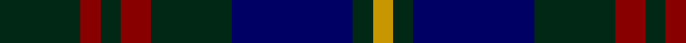
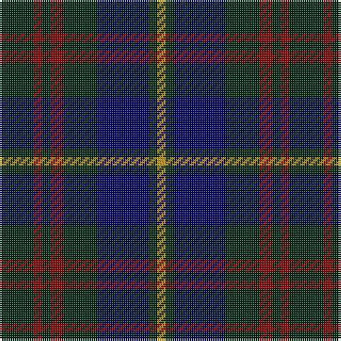

In pattern [GRGRGBGY](/patterns/grgrgbgy/).

This was sourced from register-of-tartans.  It is a [8 stripes tartan](/stripes/stripes8/).

Original link https://www.tartanregister.gov.uk/tartanDetails.aspx?ref=1389

## Register references

External register numbers recorded for this tartan.

- Scottish Register of Tartans: [1389](https://www.tartanregister.gov.uk/tartanDetails.aspx?ref=1389)
- Scottish Tartans Authority (ITI): 5017

## Thread count
DG/16 DR4 DG4 DR6 DG16 DB24 DG4 DY/4

## Palette
Each colour and its ΔE from the base-6 reference it is a variant of.

| Colour | Shade | Base | ΔE (OKLab) |
|---|---|---|---|
| DB | <code style="background-color:#000064;">#000064</code> `#000064` | B <code style="background-color:#2A418A;">#2A418A</code> | 0.18 |
| DG | <code style="background-color:#002814;">#002814</code> `#002814` | G <code style="background-color:#006100;">#006100</code> | 0.20 |
| DR | <code style="background-color:#880000;">#880000</code> `#880000` | R <code style="background-color:#CC0000;">#CC0000</code> | 0.15 |
| DY | <code style="background-color:#C89600;">#C89600</code> `#C89600` | Y <code style="background-color:#F2BF00;">#F2BF00</code> | 0.13 |

# Sample pattern

## Nearest tartans

The nearest existing variants by ΔTartan distance.

1. [Glen Nevis #1 (Fashion)](/setts/s8/g8r2g2r3g8b12g2y2~b1c0070-g003820-r880000-ye8c000~x2/) — ΔT 0.55
1. [The Harbour Town, Hilton Head](/setts/s6/k3g11k3b11k18r3~b600030-g004010-k000030-r906030~x2/) — ΔT 0.97
1. [Guthrie Family Tartan Tartan Number: 1085. Earliest known date: pre 2003 From the Barony of Guthrie in Angus, the name is also said to derive from Guthrum, a Scandinavian prince. Sir David Guthrie was King's Treasurer in the fifteenth century and built Guthrie Castle near Friockheim, Angus, in 1468. See products available Copyright © Blair Urquhart, Comrie, 2015](/setts/s9/k1g8k9r1k1r1k9b8r1~b2c2c80-g006818-k101010-rc80000~x6/) — ΔT 0.99
1. [Murray](/setts/s6/b3k16g16k16ba3b3~b3c82af-ba2c4084-g005020-k101010~x2/) — ΔT 1.00
1. [Nichol (Personal)](/setts/s10/k1b5k4b1g1b1g4b5g1r1~b202060-g285800-k101010-rc80000~x6/) — ΔT 1.02
1. [Wilson's No 108](/setts/s8/k7g7k1g7k7b1ba7k1~b3c82af-ba5a008c-g005020-k101010~x4/) — ΔT 1.03
1. [Cameron Hunting](/setts/s7/r3g10r3g14b16g3y2~b000052-g11450d-raa0000-yaaaa00~x2/) — ΔT 1.06
1. [Cameron Hunting](/setts/s7/r3g10r3g14b16g3y2~b000052-g11450d-raa0000-yaaaa00/) — ΔT 1.06
1. [Forbes Ancient Clan Tartan Tartan Number: 212. Earliest known date: Logan 1831 Lord Lyon includes the word 'Ancient' in register entry. The Clan Forbes is said to originate from one Ochonochar, who slew a bear to gain possession of the Braes of Forbes in Aberdeenshire. The charter for the land was granted later in 1271. See products available Copyright © Blair Urquhart, Comrie, 2015](/setts/s7/b1k6b6k6g6k1w1~b2c2c80-g006818-k101010-we0e0e0~x2/) — ΔT 1.08
1. [Bean Hunting Clan Tartan Tartan Number: 106. Earliest known date: 1987 The weaving and wearing of this tartan is 'Restricted'. This is not a legal definition and is applied by the Scottish Tartans Society irrespective of Design Patent or Copyright, in the spirit of a gentlemans agreement. Interested parties should contact the person listed under 'Source:' in this document. See products available Copyright © Blair Urquhart, Comrie, 2015](/setts/s7/b6g41ba20r15g41r15ba6~b1c0070-ba202060-g003820-rc8002c/) — ΔT 1.09

## Neighbour map

Every grey dot is one of 15726 variants placed by the first two principal components of the ΔTartan feature space (44% of its variance). Red is this tartan; blue dots are its nearest — click one to open its page.

<svg viewBox="0 0 640 380" role="img" style="max-width:100%;height:auto;border:1px solid #e0e0e0;border-radius:4px;display:block" xmlns="http://www.w3.org/2000/svg"><image href="/nn/cloud.v1.png" width="640" height="380"/><a href="/setts/s8/g8r2g2r3g8b12g2y2~b1c0070-g003820-r880000-ye8c000~x2/"><circle cx="261.3" cy="242.6" r="4" fill="#3465a4"><title>Glen Nevis #1 (Fashion)</title></circle></a><a href="/setts/s6/k3g11k3b11k18r3~b600030-g004010-k000030-r906030~x2/"><circle cx="265.5" cy="269.0" r="4" fill="#3465a4"><title>The Harbour Town, Hilton Head</title></circle></a><a href="/setts/s9/k1g8k9r1k1r1k9b8r1~b2c2c80-g006818-k101010-rc80000~x6/"><circle cx="276.4" cy="213.1" r="4" fill="#3465a4"><title>Guthrie Family Tartan Tartan Number: 1085. Earliest known date: pre 2003 From the Barony of Guthrie in Angus, the name is also said to derive from Guthrum, a Scandinavian prince. Sir David Guthrie was King's Treasurer in the fifteenth century and built Guthrie Castle near Friockheim, Angus, in 1468. See products available Copyright © Blair Urquhart, Comrie, 2015</title></circle></a><a href="/setts/s6/b3k16g16k16ba3b3~b3c82af-ba2c4084-g005020-k101010~x2/"><circle cx="298.3" cy="276.9" r="4" fill="#3465a4"><title>Murray</title></circle></a><a href="/setts/s10/k1b5k4b1g1b1g4b5g1r1~b202060-g285800-k101010-rc80000~x6/"><circle cx="270.1" cy="255.3" r="4" fill="#3465a4"><title>Nichol (Personal)</title></circle></a><a href="/setts/s8/k7g7k1g7k7b1ba7k1~b3c82af-ba5a008c-g005020-k101010~x4/"><circle cx="232.1" cy="258.4" r="4" fill="#3465a4"><title>Wilson's No 108</title></circle></a><a href="/setts/s7/r3g10r3g14b16g3y2~b000052-g11450d-raa0000-yaaaa00~x2/"><circle cx="282.7" cy="238.7" r="4" fill="#3465a4"><title>Cameron Hunting</title></circle></a><a href="/setts/s7/r3g10r3g14b16g3y2~b000052-g11450d-raa0000-yaaaa00/"><circle cx="282.7" cy="238.7" r="4" fill="#3465a4"><title>Cameron Hunting</title></circle></a><a href="/setts/s7/b1k6b6k6g6k1w1~b2c2c80-g006818-k101010-we0e0e0~x2/"><circle cx="219.3" cy="254.5" r="4" fill="#3465a4"><title>Forbes Ancient Clan Tartan Tartan Number: 212. Earliest known date: Logan 1831 Lord Lyon includes the word 'Ancient' in register entry. The Clan Forbes is said to originate from one Ochonochar, who slew a bear to gain possession of the Braes of Forbes in Aberdeenshire. The charter for the land was granted later in 1271. See products available Copyright © Blair Urquhart, Comrie, 2015</title></circle></a><a href="/setts/s7/b6g41ba20r15g41r15ba6~b1c0070-ba202060-g003820-rc8002c/"><circle cx="304.7" cy="255.0" r="4" fill="#3465a4"><title>Bean Hunting Clan Tartan Tartan Number: 106. Earliest known date: 1987 The weaving and wearing of this tartan is 'Restricted'. This is not a legal definition and is applied by the Scottish Tartans Society irrespective of Design Patent or Copyright, in the spirit of a gentlemans agreement. Interested parties should contact the person listed under 'Source:' in this document. See products available Copyright © Blair Urquhart, Comrie, 2015</title></circle></a><circle cx="273.3" cy="250.2" r="5" fill="#c00000"/></svg>

ID: /setts/s8/g8r2g2r3g8b12g2y2~b000064-g002814-r880000-yc89600~x2/
