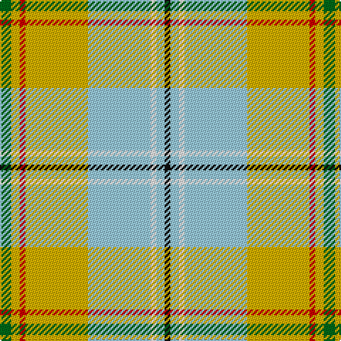

In pattern [GYRYWWWK](/patterns/gyrywwwk/).

This was sourced from tartans-authority.  It is a [8 stripes tartan](/stripes/stripes8/).

Original link http://www.tartansauthority.com/tartan-ferret/display/11147/

## Thread count
G/8 Y6 R4 Y44 LB44 W4 LB6 K/4

## Palette
Each colour and its ΔE from the base-6 reference it is a variant of.

| Colour | Shade | Base | ΔE (OKLab) |
|---|---|---|---|
| G | <code style="background-color:#006818;">#006818</code> `#006818` | G <code style="background-color:#006400;">#006400</code> | 0.02 |
| K | <code style="background-color:#101010;">#101010</code> `#101010` | K <code style="background-color:#000000;">#000000</code> | 0.17 |
| LB | <code style="background-color:#98C8E8;">#98C8E8</code> `#98C8E8` | W <code style="background-color:#F4F4F0;">#F4F4F0</code> | 0.17 |
| R | <code style="background-color:#C80000;">#C80000</code> `#C80000` | R <code style="background-color:#C80000;">#C80000</code> | 0.00 |
| W | <code style="background-color:#FCFCFC;">#FCFCFC</code> `#FCFCFC` | W <code style="background-color:#F4F4F0;">#F4F4F0</code> | 0.03 |
| Y | <code style="background-color:#D8B000;">#D8B000</code> `#D8B000` | Y <code style="background-color:#E8C000;">#E8C000</code> | 0.05 |

# Sample pattern

## Nearest tartans

The nearest existing variants by ΔTartan distance.

1. [Aguilar Pardo, Luis Alejandro (Personal)](/setts/s8/g8y6r4y44w44wa4w6k4-g146400-k000000-rc82828-w98c8e8-waffffff-yf8e38c/) — ΔT 0.83
1. [Los Angeles (District)](/setts/s8/b8b48y10g4b6ba10y66ba4-b6098b8-ba2c2c80-g289c18-ye8c000/) — ΔT 0.90
1. [Taylor, dress](/setts/s9/g18k4r8g28w6wa6w46g10y6-g008000-k000000-rd03030-we0e0e0-wac0a0e0-yf0c000/) — ΔT 1.49
1. [State Seal of Delaware (Fashion)](/setts/s10/w76b36w8y6g20ya6g8w6ya34r8-b003c64-g006818-rc80000-wc0c0c0-yfccc00-yaa08858/) — ΔT 1.49
1. [Reekie, Charlene (Personal)](/setts/s6/w86k10r6g10y54b10-b780078-g006818-k101010-rc80000-we0e0e0-yfccc00/) — ΔT 1.51
1. [Taylor Dress Family Tartan Tartan Number: 823. Earliest known date: 1992 A dress tartan for dancers See products available Copyright © Blair Urquhart, Comrie, 2015](/setts/s9/g18k4r8g28w6wa6w46g10y6-g006818-k101010-rd05054-we0e0e0-wac49cd8-ye8c000/) — ΔT 1.54
1. [Chambers, Christopher J (Personal)](/setts/s7/b32r2g32w2ba2w16ra6-b5f749c-ba5d321f-g649848-rca2625-ra86264d-wf9f5ef/) — ΔT 1.60
1. [Mission (District)](/setts/s8/y8w56k4g44k8r8ga8k4-g00a424-ga50a47c-k101010-re87878-w98c8e8-yec8048/) — ΔT 1.62
1. [MacKellar Dress (Reproduction colours)](/setts/s11/r70w8r6y14r6w8r14b30ya8w72ya10-b2a2303-rbe7832-we0e0e0-ye8c000-ya949494/) — ΔT 1.62
1. [Nova Scotia, dress](/setts/s9/g6w58g6b6g6b12g26y6r4-b304080-g008000-rc00000-we0e0e0-yf0c000/) — ΔT 1.64

## Neighbour map

Every grey dot is one of 15726 variants placed by the first two principal components of the ΔTartan feature space (44% of its variance). Red is this tartan; blue dots are its nearest — click one to open its page.

<svg viewBox="0 0 640 380" role="img" style="max-width:100%;height:auto;border:1px solid #e0e0e0;border-radius:4px;display:block" xmlns="http://www.w3.org/2000/svg"><image href="/nn/cloud.v1.png" width="640" height="380"/><a href="/setts/s8/g8y6r4y44w44wa4w6k4-g146400-k000000-rc82828-w98c8e8-waffffff-yf8e38c/"><circle cx="190.5" cy="121.8" r="4" fill="#3465a4"><title>Aguilar Pardo, Luis Alejandro (Personal)</title></circle></a><a href="/setts/s8/b8b48y10g4b6ba10y66ba4-b6098b8-ba2c2c80-g289c18-ye8c000/"><circle cx="252.2" cy="118.2" r="4" fill="#3465a4"><title>Los Angeles (District)</title></circle></a><a href="/setts/s9/g18k4r8g28w6wa6w46g10y6-g008000-k000000-rd03030-we0e0e0-wac0a0e0-yf0c000/"><circle cx="160.2" cy="131.5" r="4" fill="#3465a4"><title>Taylor, dress</title></circle></a><a href="/setts/s10/w76b36w8y6g20ya6g8w6ya34r8-b003c64-g006818-rc80000-wc0c0c0-yfccc00-yaa08858/"><circle cx="172.7" cy="121.0" r="4" fill="#3465a4"><title>State Seal of Delaware (Fashion)</title></circle></a><a href="/setts/s6/w86k10r6g10y54b10-b780078-g006818-k101010-rc80000-we0e0e0-yfccc00/"><circle cx="213.1" cy="121.3" r="4" fill="#3465a4"><title>Reekie, Charlene (Personal)</title></circle></a><a href="/setts/s9/g18k4r8g28w6wa6w46g10y6-g006818-k101010-rd05054-we0e0e0-wac49cd8-ye8c000/"><circle cx="161.0" cy="131.8" r="4" fill="#3465a4"><title>Taylor Dress Family Tartan Tartan Number: 823. Earliest known date: 1992 A dress tartan for dancers See products available Copyright © Blair Urquhart, Comrie, 2015</title></circle></a><a href="/setts/s7/b32r2g32w2ba2w16ra6-b5f749c-ba5d321f-g649848-rca2625-ra86264d-wf9f5ef/"><circle cx="166.7" cy="135.7" r="4" fill="#3465a4"><title>Chambers, Christopher J (Personal)</title></circle></a><a href="/setts/s8/y8w56k4g44k8r8ga8k4-g00a424-ga50a47c-k101010-re87878-w98c8e8-yec8048/"><circle cx="159.0" cy="122.0" r="4" fill="#3465a4"><title>Mission (District)</title></circle></a><a href="/setts/s11/r70w8r6y14r6w8r14b30ya8w72ya10-b2a2303-rbe7832-we0e0e0-ye8c000-ya949494/"><circle cx="184.2" cy="122.5" r="4" fill="#3465a4"><title>MacKellar Dress (Reproduction colours)</title></circle></a><a href="/setts/s9/g6w58g6b6g6b12g26y6r4-b304080-g008000-rc00000-we0e0e0-yf0c000/"><circle cx="207.2" cy="121.1" r="4" fill="#3465a4"><title>Nova Scotia, dress</title></circle></a><circle cx="209.9" cy="130.8" r="5" fill="#c00000"/></svg>

ID: /setts/s8/g8y6r4y44w44wa4w6k4-g006818-k101010-rc80000-w98c8e8-wafcfcfc-yd8b000/
