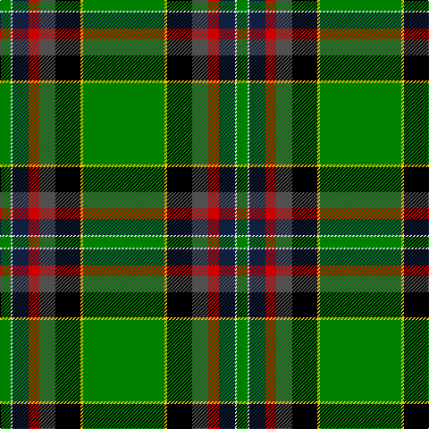

This page is one **sett** — a single exact thread-count. It belongs to the [tartan](/tartans/g91ly3k28n18r12dt18w2g12/)
(the same proportion at any scale), whose colour order is pattern [GWBRBKYG](/stripes/gwbrbkyg/).

Sourced from weddslist.  It is a [8 stripe tartan](/stripes/stripes8/).

Original link http://www.weddslist.com/cgi-bin/tartans/pg.pl?source=sts

## Thread count
G/91 Y3 K28 N18 R12 DB18 LN2 G/12

## Palette

Palette: <strong>Tartan Register</strong> <small style="color:#888">(3 of 7 colours)</small>
<table><thead><tr><th>Colour</th><th>Threads</th><th>Shade</th><th>Base</th><th>OKLCh</th></tr></thead><tbody><tr><td>G/</td><td style="text-align:right;font-variant-numeric:tabular-nums">91</td><td><code style="background-color:#008000;">#008000</code> <small style="color:#888">#008000</small></td><td>G <code style="background-color:#006100;">#006100</code></td><td><small style="color:#888">oklch(52.0% 0.177 142.5)</small></td></tr><tr><td>Y</td><td style="text-align:right;font-variant-numeric:tabular-nums">3</td><td><code style="background-color:#F0C000;">#F0C000</code> <small style="color:#888">#F0C000</small></td><td>Y <code style="background-color:#F2BF00;">#F2BF00</code></td><td><small style="color:#888">oklch(82.7% 0.169 90.5)</small></td></tr><tr><td>K</td><td style="text-align:right;font-variant-numeric:tabular-nums">28</td><td><code style="background-color:#000000;">#000000</code> <small style="color:#888">#000000</small></td><td>K <code style="background-color:#000000;">#000000</code></td><td><small style="color:#888">oklch(0.0% 0.000 0.0)</small></td></tr><tr><td>N</td><td style="text-align:right;font-variant-numeric:tabular-nums">18</td><td><code style="background-color:#505050;">#505050</code> <small style="color:#888">#505050</small></td><td>B <code style="background-color:#2A418A;">#2A418A</code></td><td><small style="color:#888">oklch(43.1% 0.000 89.9)</small></td></tr><tr><td>R</td><td style="text-align:right;font-variant-numeric:tabular-nums">12</td><td><code style="background-color:#D00000;">#D00000</code> <small style="color:#888">#D00000</small></td><td>R <code style="background-color:#CC0000;">#CC0000</code></td><td><small style="color:#888">oklch(53.9% 0.221 29.2)</small></td></tr><tr><td>DB</td><td style="text-align:right;font-variant-numeric:tabular-nums">18</td><td><code style="background-color:#102040;">#102040</code> <small style="color:#888">#102040</small></td><td>B <code style="background-color:#2A418A;">#2A418A</code></td><td><small style="color:#888">oklch(24.9% 0.065 262.6)</small></td></tr><tr><td>LN</td><td style="text-align:right;font-variant-numeric:tabular-nums">2</td><td><code style="background-color:#E0E0E0;">#E0E0E0</code> <small style="color:#888">#E0E0E0</small></td><td>W <code style="background-color:#F7F7F7;">#F7F7F7</code></td><td><small style="color:#888">oklch(90.7% 0.000 89.9)</small></td></tr><tr><td>G/</td><td style="text-align:right;font-variant-numeric:tabular-nums">12</td><td><code style="background-color:#008000;">#008000</code> <small style="color:#888">#008000</small></td><td>G <code style="background-color:#006100;">#006100</code></td><td><small style="color:#888">oklch(52.0% 0.177 142.5)</small></td></tr></tbody></table>

# Sample pattern

## Nearest tartans

The nearest existing variants by ΔTartan distance, with this tartan at the top so the swatches line up against it.

ΔTartan

Tartan

Sett

—

<a href="/ttd/edit/#slug=g91ly3k28n18r12dt18w2g12">Mull Millenium Tartan</a> <a class="nn-out" href="/setts/s8/g91ly3k28n18r12dt18w2g12/" title="open its dictionary page">↗</a>

1.43

<a href="/ttd/edit/#slug=g90r1k10w6k4g6r10db62ly8">Stirling, University of</a> <a class="nn-out" href="/setts/s9/g90r1k10w6k4g6r10db62ly8/" title="open its dictionary page">↗</a>

1.48

<a href="/ttd/edit/#slug=g92ly3k28n18r12db18w2g12">Mull Millennium</a> <a class="nn-out" href="/setts/s8/g92ly3k28n18r12db18w2g12/" title="open its dictionary page">↗</a>

1.56

<a href="/ttd/edit/#slug=k20g40db4k20g20r8k20g20ly1lo1ly1lo1w4">Mississippi</a> <a class="nn-out" href="/setts/s13/k20g40db4k20g20r8k20g20ly1lo1ly1lo1w4/" title="open its dictionary page">↗</a>

1.56

<a href="/ttd/edit/#slug=k20g40db4k20g20r8k20g20ly1lo1ly1lo1w4~x2">Mississippi (Fashion)</a> <a class="nn-out" href="/setts/s13/k20g40db4k20g20r8k20g20ly1lo1ly1lo1w4~x2/" title="open its dictionary page">↗</a>

1.64

<a href="/ttd/edit/#slug=g2w5dg1k7w1dg2k6dg6g9r1g30lo2g3w2~x2">Reilly fae the Mearns (Personal)</a> <a class="nn-out" href="/setts/s14/g2w5dg1k7w1dg2k6dg6g9r1g30lo2g3w2~x2/" title="open its dictionary page">↗</a>

1.67

<a href="/ttd/edit/#slug=b2lb1b2k16g20k14r2w2ly2~x2">Brooke</a> <a class="nn-out" href="/setts/s9/b2lb1b2k16g20k14r2w2ly2~x2/" title="open its dictionary page">↗</a>

1.67

<a href="/ttd/edit/#slug=w3r4db13g37b3k3ly2~x2">Washington</a> <a class="nn-out" href="/setts/s7/w3r4db13g37b3k3ly2~x2/" title="open its dictionary page">↗</a>

1.71

<a href="/ttd/edit/#slug=p4g24dg6lg4dg4lg4dg44lo1w4">Macmillan Cancer Support</a> <a class="nn-out" href="/setts/s9/p4g24dg6lg4dg4lg4dg44lo1w4/" title="open its dictionary page">↗</a>

1.74

<a href="/ttd/edit/#slug=w2k4db16lo12g36k1k6lo2w2~x2">National Millennium (Commemorative)</a> <a class="nn-out" href="/setts/s9/w2k4db16lo12g36k1k6lo2w2~x2/" title="open its dictionary page">↗</a>

1.76

<a href="/ttd/edit/#slug=g28r4k3y2k1dg2r3db20ly2~x2">Stirling, University</a> <a class="nn-out" href="/setts/s9/g28r4k3y2k1dg2r3db20ly2~x2/" title="open its dictionary page">↗</a>

## Neighbour map

Every grey dot is one of 14299 variants placed by the first two principal components of the ΔTartan feature space (44% of its variance). Red is this tartan; blue dots are its nearest — click one to open its page.

<svg viewBox="0 0 640 380" role="img" style="max-width:100%;height:auto;border:1px solid #e0e0e0;border-radius:4px;display:block" xmlns="http://www.w3.org/2000/svg"><image href="/nn/cloud.v1.png" width="640" height="380"/><a href="/setts/s9/g90r1k10w6k4g6r10db62ly8/"><circle cx="284.1" cy="72.3" r="4" fill="#3465a4"><title>Stirling, University of</title></circle></a><a href="/setts/s8/g92ly3k28n18r12db18w2g12/"><circle cx="321.4" cy="94.2" r="4" fill="#3465a4"><title>Mull Millennium</title></circle></a><a href="/setts/s13/k20g40db4k20g20r8k20g20ly1lo1ly1lo1w4/"><circle cx="262.6" cy="86.2" r="4" fill="#3465a4"><title>Mississippi</title></circle></a><a href="/setts/s13/k20g40db4k20g20r8k20g20ly1lo1ly1lo1w4~x2/"><circle cx="262.6" cy="86.2" r="4" fill="#3465a4"><title>Mississippi (Fashion)</title></circle></a><a href="/setts/s14/g2w5dg1k7w1dg2k6dg6g9r1g30lo2g3w2~x2/"><circle cx="289.3" cy="75.6" r="4" fill="#3465a4"><title>Reilly fae the Mearns (Personal)</title></circle></a><a href="/setts/s9/b2lb1b2k16g20k14r2w2ly2~x2/"><circle cx="207.4" cy="100.0" r="4" fill="#3465a4"><title>Brooke</title></circle></a><a href="/setts/s7/w3r4db13g37b3k3ly2~x2/"><circle cx="270.2" cy="108.2" r="4" fill="#3465a4"><title>Washington</title></circle></a><a href="/setts/s9/p4g24dg6lg4dg4lg4dg44lo1w4/"><circle cx="331.9" cy="91.2" r="4" fill="#3465a4"><title>Macmillan Cancer Support</title></circle></a><a href="/setts/s9/w2k4db16lo12g36k1k6lo2w2~x2/"><circle cx="219.3" cy="86.0" r="4" fill="#3465a4"><title>National Millennium (Commemorative)</title></circle></a><a href="/setts/s9/g28r4k3y2k1dg2r3db20ly2~x2/"><circle cx="216.0" cy="83.7" r="4" fill="#3465a4"><title>Stirling, University</title></circle></a><circle cx="279.5" cy="76.3" r="5" fill="#c00000"/></svg>

ID: /setts/s8/g91ly3k28n18r12dt18w2g12/
