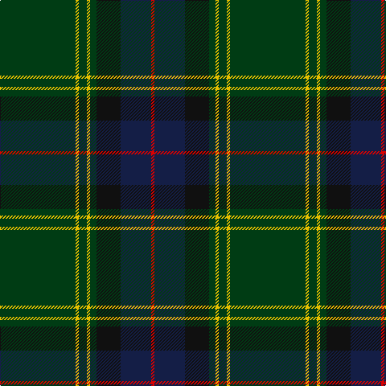

In pattern [GYGYGKBR](/patterns/gygygkbr/).

This was sourced from register-of-tartans.  It is a [8 stripes tartan](/stripes/stripes8/).

Original link https://www.tartanregister.gov.uk/tartanDetails.aspx?ref=4394

## Thread count
DG/94 Y4 DG10 Y4 DG8 K30 DB38 R/4

## Palette
Each colour and its ΔE from the base-6 reference it is a variant of.

| Colour | Shade | Base | ΔE (OKLab) |
|---|---|---|---|
| DB | <code style="background-color:#141E46;">#141E46</code> `#141E46` | B <code style="background-color:#2A418A;">#2A418A</code> | 0.16 |
| DG | <code style="background-color:#003C14;">#003C14</code> `#003C14` | G <code style="background-color:#006100;">#006100</code> | 0.13 |
| K | <code style="background-color:#101010;">#101010</code> `#101010` | K <code style="background-color:#000000;">#000000</code> | 0.17 |
| R | <code style="background-color:#DC0000;">#DC0000</code> `#DC0000` | R <code style="background-color:#CC0000;">#CC0000</code> | 0.03 |
| Y | <code style="background-color:#E8C000;">#E8C000</code> `#E8C000` | Y <code style="background-color:#F2BF00;">#F2BF00</code> | 0.02 |

# Sample pattern

## Nearest tartans

The nearest existing variants by ΔTartan distance.

1. [Green Swamp Youth Campers](/setts/s6/k16r4k26y4g96b12-b2c2c80-g003820-k101010-rc80000-ye8c000/) — ΔT 0.92
1. [Raymond of Doune](/setts/s8/r8g20y2w2b8w2b50r4-b14283c-g003820-r880000-wc0c0c0-yd09800/) — ΔT 1.03
1. [Lordship of Greencastle (Personal)](/setts/s9/g24r4ga24k6gb4k80g12gb4r4-g003820-ga006818-gb289c18-k101010-rc80000/) — ΔT 1.06
1. [Green Swamp Youth Campers](/setts/s6/k16r4k26y4g96b12-b2474e8-g004028-k101010-rc82828-ye0a126/) — ΔT 1.09
1. [Zorra Caledonian Society (Corporate](/setts/s10/g6w4g78k6b6k6g6k40ga20r4-b5c8ca8-g003820-ga00643c-k101010-rc80000-wfcfcfc/) — ΔT 1.29
1. [Scottish Chieftain (Universal)](/setts/s8/k40r2g6k16g4k4g40w4-g003820-k101010-rc80000-we0e0e0/) — ΔT 1.30
1. [US Army Regimental Tartan Tartan Number: 6307. Earliest known date: 2004 The Army was the only arm of the U.S. Forces not to have its own tartan. The colours were chosen to represent the uniforms - black for the beret, khaki for the summer uniform, light green for the original sniper and now part of the summer uniform, dark blue for the original dress uniform, olive for the combat uniform and gold for the cavalry. See products available Copyright © Blair Urquhart, Comrie, 2015](/setts/s6/b24k34g8ga102y6gb8-b003c64-g8c7038-ga003820-gb006818-k101010-ye8c000/) — ΔT 1.30
1. [Java Saint Andrew Society Hunting](/setts/s7/b100g52k18g8w4r4g20-b003c64-g006818-k101010-r880000-wc0c0c0/) — ΔT 1.36
1. [MacWilliam Hunting](/setts/s6/g4ga88k20r2b32r2-b2c2c80-g604000-ga285800-k101010-rc80000/) — ΔT 1.39
1. [Proctor (Name)](/setts/s14/g78k4g4k4g4k6b26k4w8k4b26k6g48y6-b2c485c-g2c582c-k101010-wd8d4cc-yc0943c/) — ΔT 1.49

## Neighbour map

Every grey dot is one of 15726 variants placed by the first two principal components of the ΔTartan feature space (44% of its variance). Red is this tartan; blue dots are its nearest — click one to open its page.

<svg viewBox="0 0 640 380" role="img" style="max-width:100%;height:auto;border:1px solid #e0e0e0;border-radius:4px;display:block" xmlns="http://www.w3.org/2000/svg"><image href="/nn/cloud.v1.png" width="640" height="380"/><a href="/setts/s6/k16r4k26y4g96b12-b2c2c80-g003820-k101010-rc80000-ye8c000/"><circle cx="434.0" cy="183.8" r="4" fill="#3465a4"><title>Green Swamp Youth Campers</title></circle></a><a href="/setts/s8/r8g20y2w2b8w2b50r4-b14283c-g003820-r880000-wc0c0c0-yd09800/"><circle cx="411.9" cy="155.0" r="4" fill="#3465a4"><title>Raymond of Doune</title></circle></a><a href="/setts/s9/g24r4ga24k6gb4k80g12gb4r4-g003820-ga006818-gb289c18-k101010-rc80000/"><circle cx="334.1" cy="150.0" r="4" fill="#3465a4"><title>Lordship of Greencastle (Personal)</title></circle></a><a href="/setts/s6/k16r4k26y4g96b12-b2474e8-g004028-k101010-rc82828-ye0a126/"><circle cx="404.2" cy="169.0" r="4" fill="#3465a4"><title>Green Swamp Youth Campers</title></circle></a><a href="/setts/s10/g6w4g78k6b6k6g6k40ga20r4-b5c8ca8-g003820-ga00643c-k101010-rc80000-wfcfcfc/"><circle cx="311.3" cy="134.4" r="4" fill="#3465a4"><title>Zorra Caledonian Society (Corporate</title></circle></a><a href="/setts/s8/k40r2g6k16g4k4g40w4-g003820-k101010-rc80000-we0e0e0/"><circle cx="389.1" cy="198.1" r="4" fill="#3465a4"><title>Scottish Chieftain (Universal)</title></circle></a><a href="/setts/s6/b24k34g8ga102y6gb8-b003c64-g8c7038-ga003820-gb006818-k101010-ye8c000/"><circle cx="346.7" cy="182.6" r="4" fill="#3465a4"><title>US Army Regimental Tartan Tartan Number: 6307. Earliest known date: 2004 The Army was the only arm of the U.S. Forces not to have its own tartan. The colours were chosen to represent the uniforms - black for the beret, khaki for the summer uniform, light green for the original sniper and now part of the summer uniform, dark blue for the original dress uniform, olive for the combat uniform and gold for the cavalry. See products available Copyright © Blair Urquhart, Comrie, 2015</title></circle></a><a href="/setts/s7/b100g52k18g8w4r4g20-b003c64-g006818-k101010-r880000-wc0c0c0/"><circle cx="349.2" cy="172.9" r="4" fill="#3465a4"><title>Java Saint Andrew Society Hunting</title></circle></a><a href="/setts/s6/g4ga88k20r2b32r2-b2c2c80-g604000-ga285800-k101010-rc80000/"><circle cx="423.7" cy="148.2" r="4" fill="#3465a4"><title>MacWilliam Hunting</title></circle></a><a href="/setts/s14/g78k4g4k4g4k6b26k4w8k4b26k6g48y6-b2c485c-g2c582c-k101010-wd8d4cc-yc0943c/"><circle cx="381.4" cy="140.8" r="4" fill="#3465a4"><title>Proctor (Name)</title></circle></a><circle cx="387.2" cy="164.2" r="5" fill="#c00000"/></svg>

ID: /setts/s8/g94y4g10y4g8k30b38r4-b141e46-g003c14-k101010-rdc0000-ye8c000/
