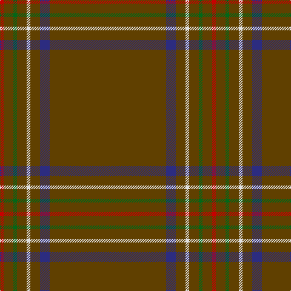

In pattern [GBGWGGGR](/patterns/gbgwgggr/).

This was sourced from house-of-tartan.  It is a [8 stripes tartan](/stripes/stripes8/).

Original link http://www.house-of-tartan.scotland.net/house/TartanViewjs.asp?colr=Def&tnam=1657

## Thread count
R/6 T16 G6 T16 LN6 T16 DB16 T/192

## Palette
Each colour and its ΔE from the base-6 reference it is a variant of.

| Colour | Shade | Base | ΔE (OKLab) |
|---|---|---|---|
| DB | <code style="background-color:#2C2C80;">#2C2C80</code> `#2C2C80` | B <code style="background-color:#2A418A;">#2A418A</code> | 0.06 |
| G | <code style="background-color:#006818;">#006818</code> `#006818` | G <code style="background-color:#006100;">#006100</code> | 0.02 |
| LN | <code style="background-color:#E0E0E0;">#E0E0E0</code> `#E0E0E0` | W <code style="background-color:#F7F7F7;">#F7F7F7</code> | 0.07 |
| R | <code style="background-color:#C80000;">#C80000</code> `#C80000` | R <code style="background-color:#CC0000;">#CC0000</code> | 0.01 |
| T | <code style="background-color:#604000;">#604000</code> `#604000` | G <code style="background-color:#006100;">#006100</code> | 0.14 |

# Sample pattern

## Nearest tartans

The nearest existing variants by ΔTartan distance.

1. [Burnett, of Leys hunting](/setts/s8/r96b8r8w3r8g3r8ra3~b304080-g008000-r806050-rac00000-we0e0e0~x2/) — ΔT 1.62
1. [Windy Meadows (Fashion)](/setts/s6/g45w2r4y1ra2b2~b5c5c5c-g604000-ra00000-raa480a8-w98c8e8-ye8c000~x4/) — ΔT 1.87
1. [MacFie](/setts/s7/y1r12g162r1g2r12ya1~g11450d-raa0000-yaaaa00-yaaaaaaa~x2/) — ΔT 1.92
1. [Eternity, Dedicated 2 Weddings](/setts/s5/b88r3y2k2ya1~b433e3b-k101010-r8c7853-yeec591-yab0b0b0~x2/) — ΔT 1.95
1. [Unidentified #12](/setts/s11/b2k1g36k1r2k1r2k1g36k1y2~b3c82af-g005020-k101010-rdc0000-ye8c000~x2/) — ΔT 2.37
1. [Kozmyk (Corporate)](/setts/s7/y6g14b10g58ga3g8w2~b2c2c80-g604000-ga006818-we0e0e0-ye8c000/) — ΔT 2.42
1. [Connacht](/setts/s10/r64g6r2g3r2g6r64b2r2b6~b401000-g008000-r806050~x2/) — ΔT 2.42
1. [Pisniak (Personal)](/setts/s7/b40g3ba4b28y2ya2b7~b1c1c1c-ba440044-g003820-ybc8c00-yab8b8b8~x2/) — ΔT 2.43
1. [Reece, Mathew](/setts/s7/w2r44b8r2b2r3ra1~b3f4059-ra58065-rab13836-we5e0d2~x2/) — ΔT 2.46
1. [Leiato of American Samoa (Personal)](/setts/s7/g45k5g28k5r5w2b6~b441800-g604000-k101010-rb03000-we0e0e0~x2/) — ΔT 2.56

## Neighbour map

Every grey dot is one of 15726 variants placed by the first two principal components of the ΔTartan feature space (44% of its variance). Red is this tartan; blue dots are its nearest — click one to open its page.

<svg viewBox="0 0 640 380" role="img" style="max-width:100%;height:auto;border:1px solid #e0e0e0;border-radius:4px;display:block" xmlns="http://www.w3.org/2000/svg"><image href="/nn/cloud.v1.png" width="640" height="380"/><a href="/setts/s8/r96b8r8w3r8g3r8ra3~b304080-g008000-r806050-rac00000-we0e0e0~x2/"><circle cx="626.0" cy="149.8" r="4" fill="#3465a4"><title>Burnett, of Leys hunting</title></circle></a><a href="/setts/s6/g45w2r4y1ra2b2~b5c5c5c-g604000-ra00000-raa480a8-w98c8e8-ye8c000~x4/"><circle cx="618.3" cy="117.3" r="4" fill="#3465a4"><title>Windy Meadows (Fashion)</title></circle></a><a href="/setts/s7/y1r12g162r1g2r12ya1~g11450d-raa0000-yaaaa00-yaaaaaaa~x2/"><circle cx="626.0" cy="146.3" r="4" fill="#3465a4"><title>MacFie</title></circle></a><a href="/setts/s5/b88r3y2k2ya1~b433e3b-k101010-r8c7853-yeec591-yab0b0b0~x2/"><circle cx="626.0" cy="153.9" r="4" fill="#3465a4"><title>Eternity, Dedicated 2 Weddings</title></circle></a><a href="/setts/s11/b2k1g36k1r2k1r2k1g36k1y2~b3c82af-g005020-k101010-rdc0000-ye8c000~x2/"><circle cx="624.7" cy="122.0" r="4" fill="#3465a4"><title>Unidentified #12</title></circle></a><a href="/setts/s7/y6g14b10g58ga3g8w2~b2c2c80-g604000-ga006818-we0e0e0-ye8c000/"><circle cx="548.8" cy="149.0" r="4" fill="#3465a4"><title>Kozmyk (Corporate)</title></circle></a><a href="/setts/s10/r64g6r2g3r2g6r64b2r2b6~b401000-g008000-r806050~x2/"><circle cx="626.0" cy="182.9" r="4" fill="#3465a4"><title>Connacht</title></circle></a><a href="/setts/s7/b40g3ba4b28y2ya2b7~b1c1c1c-ba440044-g003820-ybc8c00-yab8b8b8~x2/"><circle cx="626.0" cy="201.5" r="4" fill="#3465a4"><title>Pisniak (Personal)</title></circle></a><a href="/setts/s7/w2r44b8r2b2r3ra1~b3f4059-ra58065-rab13836-we5e0d2~x2/"><circle cx="626.0" cy="135.1" r="4" fill="#3465a4"><title>Reece, Mathew</title></circle></a><a href="/setts/s7/g45k5g28k5r5w2b6~b441800-g604000-k101010-rb03000-we0e0e0~x2/"><circle cx="547.4" cy="183.7" r="4" fill="#3465a4"><title>Leiato of American Samoa (Personal)</title></circle></a><circle cx="626.0" cy="143.9" r="5" fill="#c00000"/></svg>

ID: /setts/s8/g96b8g8w3g8ga3g8r3~b2c2c80-g604000-ga006818-rc80000-we0e0e0~x2/
