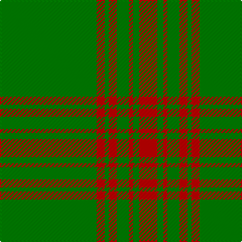

In pattern [GRGRGRGR](/patterns/grgrgrgr/).

This was sourced from weddslist.  It is a [8 stripes tartan](/stripes/stripes8/).

Original link http://www.weddslist.com/cgi-bin/tartans/pg.pl?source=sts

## Thread count
G/96 R8 G4 R8 G12 R4 G6 R/18

## Palette
Each colour and its ΔE from the base-6 reference it is a variant of.

| Colour | Shade | Base | ΔE (OKLab) |
|---|---|---|---|
| G | <code style="background-color:#008000;">#008000</code> `#008000` | G <code style="background-color:#006400;">#006400</code> | 0.09 |
| R | <code style="background-color:#C00000;">#C00000</code> `#C00000` | R <code style="background-color:#C80000;">#C80000</code> | 0.02 |

# Sample pattern

## Nearest tartans

The nearest existing variants by ΔTartan distance.

1. [Menzies](/setts/s8/g96r8g4r8g12r4g6r18-g006818-rc80000/) — ΔT 0.73
1. [Menzies Hunting](/setts/s8/g48r4g2r4g6r2g3r9-g004c00-rc80000/) — ΔT 1.32
1. [Loch Laggan District Tartan Tartan Number: 796. Earliest known date: pre 1820 Loch Laggan lies on the historic route between Lochaber and the Great Glen and the Central Highlands of Badenoch at the head of Glen Spean. See products available Copyright © Blair Urquhart, Comrie, 2015](/setts/s6/r19g6r7g101k7g7-g006818-k101010-rc80000/) — ΔT 1.41
1. [Loch Laggan (District)](/setts/s6/r16g8r4g80k4g4-g289c18-k101010-rc80000/) — ΔT 1.46
1. [Loch Laggan](/setts/s6/r19g6r7g101k7g7-g008000-k000000-rc00000/) — ΔT 1.50
1. [Aukland & District Pipe Band (Corp)](/setts/s8/g164r20g6r20g23r14g4r36-g006818-rc8002c/) — ΔT 1.65
1. [Highland Hospice (Fashion)](/setts/s10/g102b6g10y6g10b10g10b10g10y6-b28003c-g006818-ybc8c00/) — ΔT 1.68
1. [Menzies Hunting](/setts/s8/g96r8g4r8g12r4g6r18-g11450d-raa0000/) — ΔT 1.90
1. [Menzies Hunting](/setts/s8/g48r4g2r4g6r2g3r9-g11450d-raa0000/) — ΔT 1.90
1. [Unidentified Plaid 11](/setts/s10/g64r4g4r4g4r24g44w2g2w6-g008000-r806050-we0e0e0/) — ΔT 1.94

## Neighbour map

Every grey dot is one of 15726 variants placed by the first two principal components of the ΔTartan feature space (44% of its variance). Red is this tartan; blue dots are its nearest — click one to open its page.

<svg viewBox="0 0 640 380" role="img" style="max-width:100%;height:auto;border:1px solid #e0e0e0;border-radius:4px;display:block" xmlns="http://www.w3.org/2000/svg"><image href="/nn/cloud.v1.png" width="640" height="380"/><a href="/setts/s8/g96r8g4r8g12r4g6r18-g006818-rc80000/"><circle cx="584.2" cy="185.0" r="4" fill="#3465a4"><title>Menzies</title></circle></a><a href="/setts/s8/g48r4g2r4g6r2g3r9-g004c00-rc80000/"><circle cx="581.3" cy="184.3" r="4" fill="#3465a4"><title>Menzies Hunting</title></circle></a><a href="/setts/s6/r19g6r7g101k7g7-g006818-k101010-rc80000/"><circle cx="560.3" cy="200.7" r="4" fill="#3465a4"><title>Loch Laggan District Tartan Tartan Number: 796. Earliest known date: pre 1820 Loch Laggan lies on the historic route between Lochaber and the Great Glen and the Central Highlands of Badenoch at the head of Glen Spean. See products available Copyright © Blair Urquhart, Comrie, 2015</title></circle></a><a href="/setts/s6/r16g8r4g80k4g4-g289c18-k101010-rc80000/"><circle cx="555.4" cy="181.8" r="4" fill="#3465a4"><title>Loch Laggan (District)</title></circle></a><a href="/setts/s6/r19g6r7g101k7g7-g008000-k000000-rc00000/"><circle cx="528.4" cy="188.0" r="4" fill="#3465a4"><title>Loch Laggan</title></circle></a><a href="/setts/s8/g164r20g6r20g23r14g4r36-g006818-rc8002c/"><circle cx="542.0" cy="161.8" r="4" fill="#3465a4"><title>Aukland &amp; District Pipe Band (Corp)</title></circle></a><a href="/setts/s10/g102b6g10y6g10b10g10b10g10y6-b28003c-g006818-ybc8c00/"><circle cx="557.8" cy="174.8" r="4" fill="#3465a4"><title>Highland Hospice (Fashion)</title></circle></a><a href="/setts/s8/g96r8g4r8g12r4g6r18-g11450d-raa0000/"><circle cx="611.3" cy="197.8" r="4" fill="#3465a4"><title>Menzies Hunting</title></circle></a><a href="/setts/s8/g48r4g2r4g6r2g3r9-g11450d-raa0000/"><circle cx="611.3" cy="197.8" r="4" fill="#3465a4"><title>Menzies Hunting</title></circle></a><a href="/setts/s10/g64r4g4r4g4r24g44w2g2w6-g008000-r806050-we0e0e0/"><circle cx="565.8" cy="174.6" r="4" fill="#3465a4"><title>Unidentified Plaid 11</title></circle></a><circle cx="575.5" cy="181.8" r="5" fill="#c00000"/></svg>

ID: /setts/s8/g96r8g4r8g12r4g6r18-g008000-rc00000/
