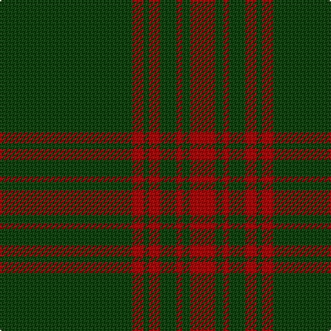

In pattern [GRGRGRGR](/patterns/grgrgrgr/).

This was sourced from weddslist.  It is a [8 stripes tartan](/stripes/stripes8/).

Original link http://www.weddslist.com/cgi-bin/tartans/pg.pl?source=tinsel

## Thread count
DG/96 DR8 DG4 DR8 DG12 DR4 DG6 DR/18

## Palette
Each colour and its ΔE from the base-6 reference it is a variant of.

| Colour | Shade | Base | ΔE (OKLab) |
|---|---|---|---|
| DG | <code style="background-color:#11450D;">#11450D</code> `#11450D` | G <code style="background-color:#006400;">#006400</code> | 0.10 |
| DR | <code style="background-color:#AA0000;">#AA0000</code> `#AA0000` | R <code style="background-color:#C80000;">#C80000</code> | 0.06 |

# Sample pattern

## Nearest tartans

The nearest existing variants by ΔTartan distance.

1. [Menzies Hunting](/setts/s8/g48r4g2r4g6r2g3r9-g11450d-raa0000/) — ΔT 0.00
1. [Menzies Hunting](/setts/s8/g48r4g2r4g6r2g3r9-g004c00-rc80000/) — ΔT 1.05
1. [Menzies](/setts/s8/g96r8g4r8g12r4g6r18-g006818-rc80000/) — ΔT 1.23
1. [Menzies Hunting Clan Tartan Tartan Number: 894. Earliest known date: 1893 This sett is woven in various colours with the same basic design. The certified version is red and black. The hunting Menzies was recorded by D.W. Stewart in his book, 'Old and Rare Scottish Tartans' (1893), which contained a selection of forty five setts, woven in silk, of special interest or antiquity. See products available Copyright © Blair Urquhart, Comrie, 2015](/setts/s8/g96r8g4r8g12r4g6r18-g003820-rc80000/) — ΔT 1.37
1. [Loch Laggan District Tartan Tartan Number: 796. Earliest known date: pre 1820 Loch Laggan lies on the historic route between Lochaber and the Great Glen and the Central Highlands of Badenoch at the head of Glen Spean. See products available Copyright © Blair Urquhart, Comrie, 2015](/setts/s6/r19g6r7g101k7g7-g006818-k101010-rc80000/) — ΔT 1.76
1. [Aukland & District Pipe Band (Corp)](/setts/s8/g164r20g6r20g23r14g4r36-g006818-rc8002c/) — ΔT 1.84
1. [Menzies, hunting](/setts/s8/g96r8g4r8g12r4g6r18-g008000-rc00000/) — ΔT 1.90
1. [Fife, Duke Of](/setts/s6/g128k24g16k32r4k8-g005814-k101010-rc80000/) — ΔT 1.97
1. [Highland Hospice (Fashion)](/setts/s10/g102b6g10y6g10b10g10b10g10y6-b28003c-g006818-ybc8c00/) — ΔT 2.02
1. [Madoc (Welsh Name)](/setts/s11/k3g3k2g4r2g6k6g4k4g36k2-g005410-k00002c-rc80000/) — ΔT 2.09

## Neighbour map

Every grey dot is one of 15726 variants placed by the first two principal components of the ΔTartan feature space (44% of its variance). Red is this tartan; blue dots are its nearest — click one to open its page.

<svg viewBox="0 0 640 380" role="img" style="max-width:100%;height:auto;border:1px solid #e0e0e0;border-radius:4px;display:block" xmlns="http://www.w3.org/2000/svg"><image href="/nn/cloud.v1.png" width="640" height="380"/><a href="/setts/s8/g48r4g2r4g6r2g3r9-g11450d-raa0000/"><circle cx="611.3" cy="197.8" r="4" fill="#3465a4"><title>Menzies Hunting</title></circle></a><a href="/setts/s8/g48r4g2r4g6r2g3r9-g004c00-rc80000/"><circle cx="581.3" cy="184.3" r="4" fill="#3465a4"><title>Menzies Hunting</title></circle></a><a href="/setts/s8/g96r8g4r8g12r4g6r18-g006818-rc80000/"><circle cx="584.2" cy="185.0" r="4" fill="#3465a4"><title>Menzies</title></circle></a><a href="/setts/s8/g96r8g4r8g12r4g6r18-g003820-rc80000/"><circle cx="578.3" cy="182.3" r="4" fill="#3465a4"><title>Menzies Hunting Clan Tartan Tartan Number: 894. Earliest known date: 1893 This sett is woven in various colours with the same basic design. The certified version is red and black. The hunting Menzies was recorded by D.W. Stewart in his book, 'Old and Rare Scottish Tartans' (1893), which contained a selection of forty five setts, woven in silk, of special interest or antiquity. See products available Copyright © Blair Urquhart, Comrie, 2015</title></circle></a><a href="/setts/s6/r19g6r7g101k7g7-g006818-k101010-rc80000/"><circle cx="560.3" cy="200.7" r="4" fill="#3465a4"><title>Loch Laggan District Tartan Tartan Number: 796. Earliest known date: pre 1820 Loch Laggan lies on the historic route between Lochaber and the Great Glen and the Central Highlands of Badenoch at the head of Glen Spean. See products available Copyright © Blair Urquhart, Comrie, 2015</title></circle></a><a href="/setts/s8/g164r20g6r20g23r14g4r36-g006818-rc8002c/"><circle cx="542.0" cy="161.8" r="4" fill="#3465a4"><title>Aukland &amp; District Pipe Band (Corp)</title></circle></a><a href="/setts/s8/g96r8g4r8g12r4g6r18-g008000-rc00000/"><circle cx="575.5" cy="181.8" r="4" fill="#3465a4"><title>Menzies, hunting</title></circle></a><a href="/setts/s6/g128k24g16k32r4k8-g005814-k101010-rc80000/"><circle cx="528.1" cy="202.2" r="4" fill="#3465a4"><title>Fife, Duke Of</title></circle></a><a href="/setts/s10/g102b6g10y6g10b10g10b10g10y6-b28003c-g006818-ybc8c00/"><circle cx="557.8" cy="174.8" r="4" fill="#3465a4"><title>Highland Hospice (Fashion)</title></circle></a><a href="/setts/s11/k3g3k2g4r2g6k6g4k4g36k2-g005410-k00002c-rc80000/"><circle cx="517.3" cy="176.5" r="4" fill="#3465a4"><title>Madoc (Welsh Name)</title></circle></a><circle cx="611.3" cy="197.8" r="5" fill="#c00000"/></svg>

ID: /setts/s8/g96r8g4r8g12r4g6r18-g11450d-raa0000/
