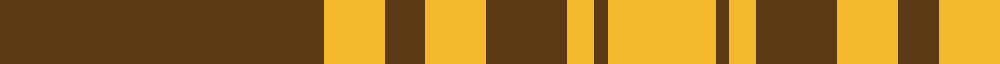

In pattern [GYGYGYGY](/patterns/gygygygy/).

This was sourced from register-of-tartans.  It is a [8 stripes tartan](/stripes/stripes8/).

Original link https://www.tartanregister.gov.uk/tartanDetails.aspx?ref=10761

## Thread count
T/96 Y18 T12 Y18 T24 Y8 T4 Y/32

## Palette
Each colour and its ΔE from the base-6 reference it is a variant of.

| Colour | Shade | Base | ΔE (OKLab) |
|---|---|---|---|
| T | <code style="background-color:#5B3A15;">#5B3A15</code> `#5B3A15` | G <code style="background-color:#006400;">#006400</code> | 0.16 |
| Y | <code style="background-color:#F5B92F;">#F5B92F</code> `#F5B92F` | Y <code style="background-color:#E8C000;">#E8C000</code> | 0.03 |

# Sample pattern

## Nearest tartans

The nearest existing variants by ΔTartan distance.

1. [Loughheed (Personal)](/setts/s8/b12y12b16b8y72b4y8b8-b4c0000-ydc943c/) — ΔT 1.08
1. [Monoch Airline](/setts/s6/y8k12y2k2y32k4-k101010-yd09800/) — ΔT 1.19
1. [Yellow Pencil (Corporate)](/setts/s8/g96y18g12y18g24y8g4y32-g604000-ydc943c/) — ΔT 1.26
1. [Menzies Brown & White Trade Tartan Tartan Number: 1752. Earliest known date: 1984 Nothing See products available Copyright © Blair Urquhart, Comrie, 2015](/setts/s8/g62w10g4w10g8w6g4w14-g604000-we0e0e0/) — ΔT 1.32
1. [Schranz-Gritte](/setts/s10/y6k4y8k10y48k10y8k4y6k4-k101010-yd87c00/) — ΔT 1.49
1. [Menzies Brown & White](/setts/s8/g62w10g4w10g8w6g4w14-g503c14-we0e0e0/) — ΔT 1.56
1. [Maxwell; Maxwell Ancient](/setts/s7/r6g32r8k12r56g2r6-g008000-k000000-rc00000/) — ΔT 1.66
1. [Livingstone](/setts/s10/g24r8k2r4k2r8g32r40g4r16-g008000-k000000-rc00000/) — ΔT 1.67
1. [Donachie](/setts/s10/r48g4r4g80r50g4r4g4r4g40-g008440-rc80000/) — ΔT 1.68
1. [Livingstone](/setts/s10/g28r8g4r4g4r8g38r60g4r18-g008000-rc00000/) — ΔT 1.70

## Neighbour map

Every grey dot is one of 15726 variants placed by the first two principal components of the ΔTartan feature space (44% of its variance). Red is this tartan; blue dots are its nearest — click one to open its page.

<svg viewBox="0 0 640 380" role="img" style="max-width:100%;height:auto;border:1px solid #e0e0e0;border-radius:4px;display:block" xmlns="http://www.w3.org/2000/svg"><image href="/nn/cloud.v1.png" width="640" height="380"/><a href="/setts/s8/b12y12b16b8y72b4y8b8-b4c0000-ydc943c/"><circle cx="448.7" cy="165.8" r="4" fill="#3465a4"><title>Loughheed (Personal)</title></circle></a><a href="/setts/s6/y8k12y2k2y32k4-k101010-yd09800/"><circle cx="448.7" cy="194.1" r="4" fill="#3465a4"><title>Monoch Airline</title></circle></a><a href="/setts/s8/g96y18g12y18g24y8g4y32-g604000-ydc943c/"><circle cx="477.5" cy="188.4" r="4" fill="#3465a4"><title>Yellow Pencil (Corporate)</title></circle></a><a href="/setts/s8/g62w10g4w10g8w6g4w14-g604000-we0e0e0/"><circle cx="430.0" cy="172.4" r="4" fill="#3465a4"><title>Menzies Brown &amp; White Trade Tartan Tartan Number: 1752. Earliest known date: 1984 Nothing See products available Copyright © Blair Urquhart, Comrie, 2015</title></circle></a><a href="/setts/s10/y6k4y8k10y48k10y8k4y6k4-k101010-yd87c00/"><circle cx="448.9" cy="175.0" r="4" fill="#3465a4"><title>Schranz-Gritte</title></circle></a><a href="/setts/s8/g62w10g4w10g8w6g4w14-g503c14-we0e0e0/"><circle cx="425.6" cy="173.2" r="4" fill="#3465a4"><title>Menzies Brown &amp; White</title></circle></a><a href="/setts/s7/r6g32r8k12r56g2r6-g008000-k000000-rc00000/"><circle cx="413.7" cy="155.3" r="4" fill="#3465a4"><title>Maxwell; Maxwell Ancient</title></circle></a><a href="/setts/s10/g24r8k2r4k2r8g32r40g4r16-g008000-k000000-rc00000/"><circle cx="372.7" cy="170.1" r="4" fill="#3465a4"><title>Livingstone</title></circle></a><a href="/setts/s10/r48g4r4g80r50g4r4g4r4g40-g008440-rc80000/"><circle cx="424.2" cy="182.3" r="4" fill="#3465a4"><title>Donachie</title></circle></a><a href="/setts/s10/g28r8g4r4g4r8g38r60g4r18-g008000-rc00000/"><circle cx="415.7" cy="194.3" r="4" fill="#3465a4"><title>Livingstone</title></circle></a><circle cx="439.4" cy="172.2" r="5" fill="#c00000"/></svg>

ID: /setts/s8/g96y18g12y18g24y8g4y32-g5b3a15-yf5b92f/
