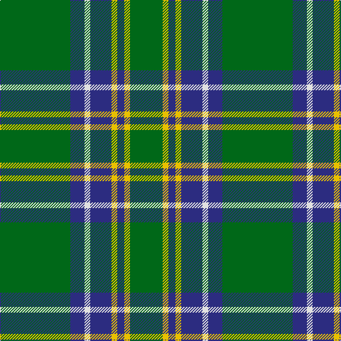

In pattern [GBWBYBYG](/patterns/gbwbybyg/).

This was sourced from house-of-tartan.  It is a [8 stripes tartan](/stripes/stripes8/).

Original link http://www.house-of-tartan.scotland.net/house/TartanViewjs.asp?colr=Def&tnam=745

## Thread count
G/99 DB20 LN8 DB30 Y8 DB10 Y8 G/46

## Palette
Each colour and its ΔE from the base-6 reference it is a variant of.

| Colour | Shade | Base | ΔE (OKLab) |
|---|---|---|---|
| DB | <code style="background-color:#2C2C80;">#2C2C80</code> `#2C2C80` | B <code style="background-color:#2A418A;">#2A418A</code> | 0.06 |
| G | <code style="background-color:#006818;">#006818</code> `#006818` | G <code style="background-color:#006100;">#006100</code> | 0.02 |
| LN | <code style="background-color:#E0E0E0;">#E0E0E0</code> `#E0E0E0` | W <code style="background-color:#F7F7F7;">#F7F7F7</code> | 0.07 |
| Y | <code style="background-color:#E8C000;">#E8C000</code> `#E8C000` | Y <code style="background-color:#F2BF00;">#F2BF00</code> | 0.02 |

# Sample pattern

## Nearest tartans

The nearest existing variants by ΔTartan distance.

1. [Duke of York Hunting](/setts/s8/g99b20w8b30y8b10y8g46~b2c2c80-g006818-wfcfcfc-ye8c000/) — ΔT 0.17
1. [Duke of York, hunting](/setts/s8/g99b20w8b30y8b10y8g46~b304080-g008000-we0e0e0-yf0c000/) — ΔT 0.82
1. [Marshall Field](/setts/s8/g10b1w1b1y1b6g8r1~b2c2c80-g006818-rc80000-wfcfcfc-ye8c000~x8/) — ΔT 0.95
1. [McGirr (Letterkenny) David, (Pers.)](/setts/s8/g4r1g15b5r1w5g4r1~b68889c-g006818-rc8002c-we0e0e0~x4/) — ΔT 0.96
1. [MacCandlish Hunting Green](/setts/s11/w3k1g12k1g1k2g1k6g12k1y1~g006818-k101010-wa8ace8-yd09800~x4/) — ΔT 0.97
1. [Shaw](/setts/s6/g24k2b3k2b8r2~b304080-g008000-k000000-rc00000~x2/) — ΔT 1.04
1. [Scottish Scouts (1957) (Corporate)](/setts/s7/r3g22b16g14r2g6y2~b1c0070-g006818-r880000-yd09800~x2/) — ΔT 1.05
1. [MacKintosh Hunting Clan Tartan Tartan Number: 544. Earliest known date: 1951 This sett appears in D.C. Stewarts book, The Setts of the Scottish Tartans, with slightly different proportions. The Lyon Court Book No. 1 records the sett in relation to the narrowest stripe. ie Y 1, Vt (Vert meaning green) 10 1/2, Bu 5, etc. The rendering illustrated here multiplies the Lyon count by two. Commercially manufactured cloth may vary from these proportions. D.C. Stewart calls the sett "a modern arrangement". See products available Copyright © Blair Urquhart, Comrie, 2015](/setts/s7/b1r3g11r2b5g11y1~b2c2c80-g006818-rc80000-ye8c000~x2/) — ΔT 1.11
1. [Island Weavers (Corporate)](/setts/s10/g33b2g33r2b12r12g4r2g4w3~b1c0070-g006818-rc80000-we0e0e0~x2/) — ΔT 1.13
1. [Irving of Bonshaw](/setts/s5/g27b14k2b2y2~b304080-g008000-k000030-yf0c000~x4/) — ΔT 1.16

## Neighbour map

Every grey dot is one of 15726 variants placed by the first two principal components of the ΔTartan feature space (44% of its variance). Red is this tartan; blue dots are its nearest — click one to open its page.

<svg viewBox="0 0 640 380" role="img" style="max-width:100%;height:auto;border:1px solid #e0e0e0;border-radius:4px;display:block" xmlns="http://www.w3.org/2000/svg"><image href="/nn/cloud.v1.png" width="640" height="380"/><a href="/setts/s8/g99b20w8b30y8b10y8g46~b2c2c80-g006818-wfcfcfc-ye8c000/"><circle cx="354.3" cy="188.7" r="4" fill="#3465a4"><title>Duke of York Hunting</title></circle></a><a href="/setts/s8/g99b20w8b30y8b10y8g46~b304080-g008000-we0e0e0-yf0c000/"><circle cx="360.2" cy="190.5" r="4" fill="#3465a4"><title>Duke of York, hunting</title></circle></a><a href="/setts/s8/g10b1w1b1y1b6g8r1~b2c2c80-g006818-rc80000-wfcfcfc-ye8c000~x8/"><circle cx="323.8" cy="185.4" r="4" fill="#3465a4"><title>Marshall Field</title></circle></a><a href="/setts/s8/g4r1g15b5r1w5g4r1~b68889c-g006818-rc8002c-we0e0e0~x4/"><circle cx="351.4" cy="181.3" r="4" fill="#3465a4"><title>McGirr (Letterkenny) David, (Pers.)</title></circle></a><a href="/setts/s11/w3k1g12k1g1k2g1k6g12k1y1~g006818-k101010-wa8ace8-yd09800~x4/"><circle cx="360.5" cy="175.2" r="4" fill="#3465a4"><title>MacCandlish Hunting Green</title></circle></a><a href="/setts/s6/g24k2b3k2b8r2~b304080-g008000-k000000-rc00000~x2/"><circle cx="329.0" cy="190.6" r="4" fill="#3465a4"><title>Shaw</title></circle></a><a href="/setts/s7/r3g22b16g14r2g6y2~b1c0070-g006818-r880000-yd09800~x2/"><circle cx="363.4" cy="225.6" r="4" fill="#3465a4"><title>Scottish Scouts (1957) (Corporate)</title></circle></a><a href="/setts/s7/b1r3g11r2b5g11y1~b2c2c80-g006818-rc80000-ye8c000~x2/"><circle cx="367.5" cy="218.3" r="4" fill="#3465a4"><title>MacKintosh Hunting Clan Tartan Tartan Number: 544. Earliest known date: 1951 This sett appears in D.C. Stewarts book, The Setts of the Scottish Tartans, with slightly different proportions. The Lyon Court Book No. 1 records the sett in relation to the narrowest stripe. ie Y 1, Vt (Vert meaning green) 10 1/2, Bu 5, etc. The rendering illustrated here multiplies the Lyon count by two. Commercially manufactured cloth may vary from these proportions. D.C. Stewart calls the sett &quot;a modern arrangement&quot;. See products available Copyright © Blair Urquhart, Comrie, 2015</title></circle></a><a href="/setts/s10/g33b2g33r2b12r12g4r2g4w3~b1c0070-g006818-rc80000-we0e0e0~x2/"><circle cx="412.6" cy="168.3" r="4" fill="#3465a4"><title>Island Weavers (Corporate)</title></circle></a><a href="/setts/s5/g27b14k2b2y2~b304080-g008000-k000030-yf0c000~x4/"><circle cx="350.7" cy="208.0" r="4" fill="#3465a4"><title>Irving of Bonshaw</title></circle></a><circle cx="359.3" cy="190.7" r="5" fill="#c00000"/></svg>

ID: /setts/s8/g99b20w8b30y8b10y8g46~b2c2c80-g006818-we0e0e0-ye8c000/
