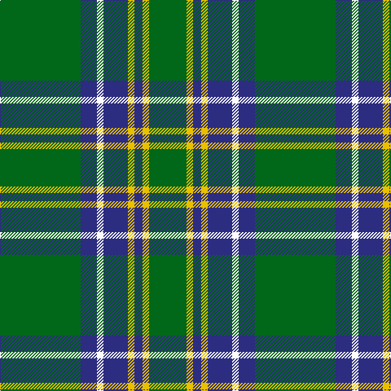

This page is one **sett** — a single exact thread-count. It belongs to the [tartan](/tartans/g99db20w8db30ly8db10ly8g46/)
(the same proportion at any scale), whose colour order is pattern [GBWBYBYG](/stripes/gbwbybyg/).

Sourced from register-of-tartans.  It is a [8 stripe tartan](/stripes/stripes8/).

Original link https://www.tartanregister.gov.uk/tartanDetails.aspx?ref=1012

## Also known as

This cloth is also recorded under:

- Duke of York Hunting
- Duke of York Hunting Royal
- Duke of York, hunting

4 attestations — the source records this cloth was collapsed from (oldest owns this page)

<ul>
<li>01/01/2002 — Duke of York Hunting (register-of-tartans, <a href="https://www.tartanregister.gov.uk/tartanDetails.aspx?ref=1012">record</a>)</li>
<li>pre 2002 — Duke of York Htg (Royal) (tartans-authority, <a href="http://www.tartansauthority.com/tartan-ferret/display/745/">record</a>)</li>
<li>undated — Duke of York, hunting (weddslist, <a href="http://www.weddslist.com/cgi-bin/tartans/pg.pl?source=sts">record</a>)</li>
<li>undated — Duke of York Hunting Royal Family Tartan Tartan Number: 745. Earliest known date: pre 2003 Kinloch Anderson Gift. See products available Copyright © Blair Urquhart, Comrie, 2015 (house-of-tartan, <a href="http://www.house-of-tartan.scotland.net/house/TartanViewjs.asp?colr=Def&tnam=745">record</a>)</li>
</ul>

## Register references

External register numbers recorded for this tartan.

- Scottish Register of Tartans: [1012](https://www.tartanregister.gov.uk/tartanDetails.aspx?ref=1012)
- Scottish Tartans Authority (ITI): 745
- Scottish Tartans World Register: 745

## Thread count
G/99 DB20 W8 DB30 Y8 DB10 Y8 G/46

## Palette

Palette: <strong>Tartan Register</strong>
<table><thead><tr><th>Colour</th><th>Threads</th><th>Shade</th><th>Base</th><th>OKLCh</th></tr></thead><tbody><tr><td>G/</td><td style="text-align:right;font-variant-numeric:tabular-nums">99</td><td><code style="background-color:#006818;">#006818</code> <small style="color:#888">#006818</small></td><td>G <code style="background-color:#006100;">#006100</code></td><td><small style="color:#888">oklch(45.0% 0.142 145.0)</small></td></tr><tr><td>DB</td><td style="text-align:right;font-variant-numeric:tabular-nums">20</td><td><code style="background-color:#2C2C80;">#2C2C80</code> <small style="color:#888">#2C2C80</small></td><td>B <code style="background-color:#2A418A;">#2A418A</code></td><td><small style="color:#888">oklch(35.0% 0.138 276.6)</small></td></tr><tr><td>W</td><td style="text-align:right;font-variant-numeric:tabular-nums">8</td><td><code style="background-color:#FCFCFC;">#FCFCFC</code> <small style="color:#888">#FCFCFC</small></td><td>W <code style="background-color:#F7F7F7;">#F7F7F7</code></td><td><small style="color:#888">oklch(99.1% 0.000 89.9)</small></td></tr><tr><td>DB</td><td style="text-align:right;font-variant-numeric:tabular-nums">30</td><td><code style="background-color:#2C2C80;">#2C2C80</code> <small style="color:#888">#2C2C80</small></td><td>B <code style="background-color:#2A418A;">#2A418A</code></td><td><small style="color:#888">oklch(35.0% 0.138 276.6)</small></td></tr><tr><td>Y</td><td style="text-align:right;font-variant-numeric:tabular-nums">8</td><td><code style="background-color:#E8C000;">#E8C000</code> <small style="color:#888">#E8C000</small></td><td>Y <code style="background-color:#F2BF00;">#F2BF00</code></td><td><small style="color:#888">oklch(81.9% 0.168 93.7)</small></td></tr><tr><td>DB</td><td style="text-align:right;font-variant-numeric:tabular-nums">10</td><td><code style="background-color:#2C2C80;">#2C2C80</code> <small style="color:#888">#2C2C80</small></td><td>B <code style="background-color:#2A418A;">#2A418A</code></td><td><small style="color:#888">oklch(35.0% 0.138 276.6)</small></td></tr><tr><td>Y</td><td style="text-align:right;font-variant-numeric:tabular-nums">8</td><td><code style="background-color:#E8C000;">#E8C000</code> <small style="color:#888">#E8C000</small></td><td>Y <code style="background-color:#F2BF00;">#F2BF00</code></td><td><small style="color:#888">oklch(81.9% 0.168 93.7)</small></td></tr><tr><td>G/</td><td style="text-align:right;font-variant-numeric:tabular-nums">46</td><td><code style="background-color:#006818;">#006818</code> <small style="color:#888">#006818</small></td><td>G <code style="background-color:#006100;">#006100</code></td><td><small style="color:#888">oklch(45.0% 0.142 145.0)</small></td></tr></tbody></table>

# Sample pattern

## Nearest tartans

The nearest existing variants by ΔTartan distance, with this tartan at the top so the swatches line up against it.

ΔTartan

Tartan

Sett

—

<a href="/ttd/edit/#slug=g99db20w8db30ly8db10ly8g46">Duke of York Hunting</a> <a class="nn-out" href="/setts/s8/g99db20w8db30ly8db10ly8g46/" title="open its dictionary page">↗</a>

0.94

<a href="/ttd/edit/#slug=g4r1g15t5r1w5g4r1~x4">McGirr (Letterkenny) David, (Pers.)</a> <a class="nn-out" href="/setts/s8/g4r1g15t5r1w5g4r1~x4/" title="open its dictionary page">↗</a>

0.97

<a href="/ttd/edit/#slug=g10db1w1db1ly1db6g8r1~x8">Marshall Field</a> <a class="nn-out" href="/setts/s8/g10db1w1db1ly1db6g8r1~x8/" title="open its dictionary page">↗</a>

0.99

<a href="/ttd/edit/#slug=lb3k1g12k1g1k2g1k6g12k1lo1~x4">MacCandlish Hunting Green</a> <a class="nn-out" href="/setts/s11/lb3k1g12k1g1k2g1k6g12k1lo1~x4/" title="open its dictionary page">↗</a>

1.13

<a href="/ttd/edit/#slug=r3g22db16g14r2g6lo2~x2">Scottish Scouts (1957) (Corporate)</a> <a class="nn-out" href="/setts/s7/r3g22db16g14r2g6lo2~x2/" title="open its dictionary page">↗</a>

1.15

<a href="/ttd/edit/#slug=k5g2k5g2db8g25w4~x2">Keppoch</a> <a class="nn-out" href="/setts/s7/k5g2k5g2db8g25w4~x2/" title="open its dictionary page">↗</a>

1.16

<a href="/ttd/edit/#slug=g33db2g33r2db12r12g4r2g4w3~x2">Island Weavers (Corporate)</a> <a class="nn-out" href="/setts/s10/g33db2g33r2db12r12g4r2g4w3~x2/" title="open its dictionary page">↗</a>

1.20

<a href="/ttd/edit/#slug=g27db14k2db2ly2~x4">Irving of Bonshaw</a> <a class="nn-out" href="/setts/s5/g27db14k2db2ly2~x4/" title="open its dictionary page">↗</a>

1.22

<a href="/ttd/edit/#slug=k3db10dg25ly2dg2ly3dg2ly2dg25db10w3~x2">William &amp; Mary GALA (Corporate)</a> <a class="nn-out" href="/setts/s11/k3db10dg25ly2dg2ly3dg2ly2dg25db10w3~x2/" title="open its dictionary page">↗</a>

1.22

<a href="/ttd/edit/#slug=r4g4k2g31k10ly3g5k11g6k3~x2">MacArthur-Fox Green</a> <a class="nn-out" href="/setts/s10/r4g4k2g31k10ly3g5k11g6k3~x2/" title="open its dictionary page">↗</a>

1.23

<a href="/ttd/edit/#slug=k4g32k4g4k8w3k8t4~x2">Hartmann (Personal)</a> <a class="nn-out" href="/setts/s8/k4g32k4g4k8w3k8t4~x2/" title="open its dictionary page">↗</a>

## Neighbour map

Every grey dot is one of 14359 variants placed by the first two principal components of the ΔTartan feature space (44% of its variance). Red is this tartan; blue dots are its nearest — click one to open its page.

<svg viewBox="0 0 640 380" role="img" style="max-width:100%;height:auto;border:1px solid #e0e0e0;border-radius:4px;display:block" xmlns="http://www.w3.org/2000/svg"><image href="/nn/cloud.v1.png" width="640" height="380"/><a href="/setts/s8/g4r1g15t5r1w5g4r1~x4/"><circle cx="352.6" cy="181.0" r="4" fill="#3465a4"><title>McGirr (Letterkenny) David, (Pers.)</title></circle></a><a href="/setts/s8/g10db1w1db1ly1db6g8r1~x8/"><circle cx="325.8" cy="186.9" r="4" fill="#3465a4"><title>Marshall Field</title></circle></a><a href="/setts/s11/lb3k1g12k1g1k2g1k6g12k1lo1~x4/"><circle cx="362.6" cy="176.1" r="4" fill="#3465a4"><title>MacCandlish Hunting Green</title></circle></a><a href="/setts/s7/r3g22db16g14r2g6lo2~x2/"><circle cx="365.3" cy="227.4" r="4" fill="#3465a4"><title>Scottish Scouts (1957) (Corporate)</title></circle></a><a href="/setts/s7/k5g2k5g2db8g25w4~x2/"><circle cx="296.9" cy="187.6" r="4" fill="#3465a4"><title>Keppoch</title></circle></a><a href="/setts/s10/g33db2g33r2db12r12g4r2g4w3~x2/"><circle cx="413.7" cy="168.0" r="4" fill="#3465a4"><title>Island Weavers (Corporate)</title></circle></a><a href="/setts/s5/g27db14k2db2ly2~x4/"><circle cx="353.0" cy="209.7" r="4" fill="#3465a4"><title>Irving of Bonshaw</title></circle></a><a href="/setts/s11/k3db10dg25ly2dg2ly3dg2ly2dg25db10w3~x2/"><circle cx="323.1" cy="153.7" r="4" fill="#3465a4"><title>William &amp; Mary GALA (Corporate)</title></circle></a><a href="/setts/s10/r4g4k2g31k10ly3g5k11g6k3~x2/"><circle cx="349.3" cy="176.6" r="4" fill="#3465a4"><title>MacArthur-Fox Green</title></circle></a><a href="/setts/s8/k4g32k4g4k8w3k8t4~x2/"><circle cx="304.9" cy="191.4" r="4" fill="#3465a4"><title>Hartmann (Personal)</title></circle></a><circle cx="356.4" cy="188.9" r="5" fill="#c00000"/></svg>

ID: /setts/s8/g99db20w8db30ly8db10ly8g46/
