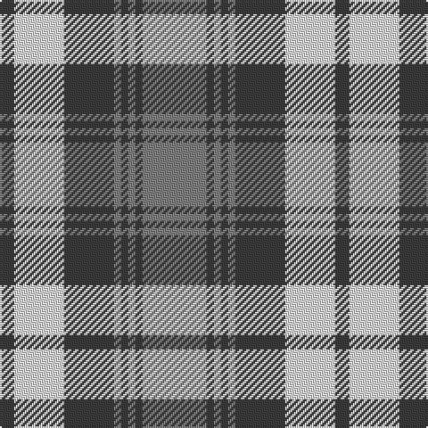

In pattern [BWBGBGBG](/patterns/bwbgbgbg/).

This was sourced from register-of-tartans.  It is a [8 stripes tartan](/stripes/stripes8/).

Original link https://www.tartanregister.gov.uk/tartanDetails.aspx?ref=1544

## Thread count
N/8 LN28 N28 Na4 N4 Na4 N4 Na/36

## Palette
Each colour and its ΔE from the base-6 reference it is a variant of.

| Colour | Shade | Base | ΔE (OKLab) |
|---|---|---|---|
| LN | <code style="background-color:#E0E0E0;">#E0E0E0</code> `#E0E0E0` | W <code style="background-color:#F7F7F7;">#F7F7F7</code> | 0.07 |
| N | <code style="background-color:#3C3C3C;">#3C3C3C</code> `#3C3C3C` | B <code style="background-color:#2A418A;">#2A418A</code> | 0.13 |
| Na | <code style="background-color:#808080;">#808080</code> `#808080` | G <code style="background-color:#006100;">#006100</code> | 0.23 |

# Sample pattern

## Nearest tartans

The nearest existing variants by ΔTartan distance.

1. [Chindecella Gorse (Personal)](/setts/s8/y7b4y2b4y23ba19b19ba4~b1c1c50-ba5c5c5c-ybc8c00~x2/) — ΔT 1.16
1. [Canadian Winter Games 1987](/setts/s9/w8b2w1b2w1b2r3b3w1~b283c50-r8c0000-wc8c8c8~x4/) — ΔT 1.19
1. [Kildonan Brown (Fashion)](/setts/s9/g22b3g3b3g3b9w28b3w6~b441800-g604000-wc0c0c0~x2/) — ΔT 1.20
1. [Lindsay Dress, Green (Dance)](/setts/s9/g33b4g4b4g4b12w33b3w6~b405060-g1c6830-we0e0e0~x2/) — ΔT 1.22
1. [Baillie Dress](/setts/s8/y24g3y3g3y3g20w22g4~g604000-we0e0e0-ya08858~x2/) — ΔT 1.25
1. [Grey Watch Dress (Fashion)](/setts/s8/b12ba2b2ba2b2ba10w12ba3~b5c5c5c-ba1c1c1c-we0e0e0~x2/) — ΔT 1.25
1. [Lindsay Dress](/setts/s9/g33b4g4b4g4b12w33b3w6~b2c4084-g005020-we0e0e0~x2/) — ΔT 1.25
1. [Gleneagles USA (Dalgleish)](/setts/s6/g4w31g7r14g11r3~g006818-r880000-wc0c0c0~x2/) — ΔT 1.26
1. [Turnberry Manx Snaefell Family Tartan Tartan Number: 1749. Earliest known date: 1981 A coincidence. See products available Copyright © Blair Urquhart, Comrie, 2015](/setts/s8/y22b2y2b2y2b15w17b3~b441800-we0e0e0-ya08858~x2/) — ΔT 1.29
1. [Snaefell (District)](/setts/s8/g22ga2g2ga2g2ga14w16ga3~g685838-ga604000-we8e4d0~x2/) — ΔT 1.29

## Neighbour map

Every grey dot is one of 15726 variants placed by the first two principal components of the ΔTartan feature space (44% of its variance). Red is this tartan; blue dots are its nearest — click one to open its page.

<svg viewBox="0 0 640 380" role="img" style="max-width:100%;height:auto;border:1px solid #e0e0e0;border-radius:4px;display:block" xmlns="http://www.w3.org/2000/svg"><image href="/nn/cloud.v1.png" width="640" height="380"/><a href="/setts/s8/y7b4y2b4y23ba19b19ba4~b1c1c50-ba5c5c5c-ybc8c00~x2/"><circle cx="230.1" cy="210.3" r="4" fill="#3465a4"><title>Chindecella Gorse (Personal)</title></circle></a><a href="/setts/s9/w8b2w1b2w1b2r3b3w1~b283c50-r8c0000-wc8c8c8~x4/"><circle cx="238.0" cy="203.0" r="4" fill="#3465a4"><title>Canadian Winter Games 1987</title></circle></a><a href="/setts/s9/g22b3g3b3g3b9w28b3w6~b441800-g604000-wc0c0c0~x2/"><circle cx="234.0" cy="182.7" r="4" fill="#3465a4"><title>Kildonan Brown (Fashion)</title></circle></a><a href="/setts/s9/g33b4g4b4g4b12w33b3w6~b405060-g1c6830-we0e0e0~x2/"><circle cx="220.9" cy="177.8" r="4" fill="#3465a4"><title>Lindsay Dress, Green (Dance)</title></circle></a><a href="/setts/s8/y24g3y3g3y3g20w22g4~g604000-we0e0e0-ya08858~x2/"><circle cx="210.2" cy="202.7" r="4" fill="#3465a4"><title>Baillie Dress</title></circle></a><a href="/setts/s8/b12ba2b2ba2b2ba10w12ba3~b5c5c5c-ba1c1c1c-we0e0e0~x2/"><circle cx="169.9" cy="220.2" r="4" fill="#3465a4"><title>Grey Watch Dress (Fashion)</title></circle></a><a href="/setts/s9/g33b4g4b4g4b12w33b3w6~b2c4084-g005020-we0e0e0~x2/"><circle cx="209.9" cy="175.3" r="4" fill="#3465a4"><title>Lindsay Dress</title></circle></a><a href="/setts/s6/g4w31g7r14g11r3~g006818-r880000-wc0c0c0~x2/"><circle cx="238.4" cy="213.2" r="4" fill="#3465a4"><title>Gleneagles USA (Dalgleish)</title></circle></a><a href="/setts/s8/y22b2y2b2y2b15w17b3~b441800-we0e0e0-ya08858~x2/"><circle cx="220.9" cy="179.0" r="4" fill="#3465a4"><title>Turnberry Manx Snaefell Family Tartan Tartan Number: 1749. Earliest known date: 1981 A coincidence. See products available Copyright © Blair Urquhart, Comrie, 2015</title></circle></a><a href="/setts/s8/g22ga2g2ga2g2ga14w16ga3~g685838-ga604000-we8e4d0~x2/"><circle cx="246.1" cy="190.8" r="4" fill="#3465a4"><title>Snaefell (District)</title></circle></a><circle cx="213.7" cy="202.7" r="5" fill="#c00000"/></svg>

ID: /setts/s8/g9b1g1b1g1b7w7b2~b3c3c3c-g808080-we0e0e0~x4/
