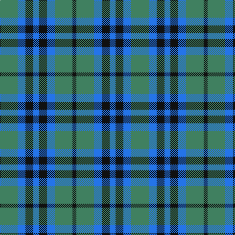

This page is one **sett** — a single exact thread-count. It belongs to the [tartan](/tartans/g9b4k4b3k4b4g9k2/)
(the same proportion at any scale), whose colour order is pattern [GBKBKBGK](/stripes/gbkbkbgk/).

Sourced from register-of-tartans.  It is a [8 stripe tartan](/stripes/stripes8/).

Original link https://www.tartanregister.gov.uk/tartanDetails.aspx?ref=1936

## Register references

External register numbers recorded for this tartan.

- Scottish Register of Tartans: [1936](https://www.tartanregister.gov.uk/tartanDetails.aspx?ref=1936)
- Scottish Tartans Authority (ITI): 253
- Scottish Tartans World Register: 253

## Thread count
G/36 B16 K16 B12 K16 B16 G36 K/8

## Palette
Each colour and the base-6 reference it is a variant of.

| Colour | Shade | Base |
|---|---|---|
| B | <code style="background-color:#2474E8;">#2474E8</code> `oklch(57.8% 0.192 258.7)` <small>#2474E8</small> | B <code style="background-color:#2A418A;">#2A418A</code> |
| DB | <code style="background-color:#003C64;">#003C64</code> `oklch(34.5% 0.089 246.0)` <small>#003C64</small> | B <code style="background-color:#2A418A;">#2A418A</code> |
| DN | <code style="background-color:#14283C;">#14283C</code> `oklch(27.1% 0.046 249.9)` <small>#14283C</small> | B <code style="background-color:#2A418A;">#2A418A</code> |
| G | <code style="background-color:#408060;">#408060</code> `oklch(54.8% 0.084 160.1)` <small>#408060</small> | G <code style="background-color:#006100;">#006100</code> |
| Ga | <code style="background-color:#005448;">#005448</code> `oklch(39.9% 0.073 178.8)` <small>#005448</small> | G <code style="background-color:#006100;">#006100</code> |
| K | <code style="background-color:#101010;">#101010</code> `oklch(17.3% 0.000 89.9)` <small>#101010</small> | K <code style="background-color:#000000;">#000000</code> |

# Sample pattern

## Nearest tartans

The nearest existing variants by ΔTartan distance, with this tartan at the top so the swatches line up against it.

ΔTartan

Tartan

Sett

—

<a href="/ttd/edit/#slug=g9b4k4b3k4b4g9k2~x4">Keith Clan</a> <a class="nn-out" href="/setts/s8/g9b4k4b3k4b4g9k2~x4/" title="open its dictionary page">↗</a>

1.09

<a href="/ttd/edit/#slug=b3k4b4g9k2~x4">Falconer</a> <a class="nn-out" href="/setts/s5/b3k4b4g9k2~x4/" title="open its dictionary page">↗</a>

1.13

<a href="/ttd/edit/#slug=dg3ly1db3ly1db3ly1dg3ly1db3ly1~x4">Unidentified Printing #2</a> <a class="nn-out" href="/setts/s10/dg3ly1db3ly1db3ly1dg3ly1db3ly1~x4/" title="open its dictionary page">↗</a>

1.30

<a href="/ttd/edit/#slug=b6k6b18k18g22k5~x2">Campbell, The 42nd</a> <a class="nn-out" href="/setts/s6/b6k6b18k18g22k5~x2/" title="open its dictionary page">↗</a>

1.31

<a href="/ttd/edit/#slug=g12k14t11k3t3k3t11k14g12t3~x2">Wilson's No.166</a> <a class="nn-out" href="/setts/s10/g12k14t11k3t3k3t11k14g12t3~x2/" title="open its dictionary page">↗</a>

1.52

<a href="/ttd/edit/#slug=g7k6b7k1b2~x2">Campbell of Glenlyon</a> <a class="nn-out" href="/setts/s5/g7k6b7k1b2~x2/" title="open its dictionary page">↗</a>

1.52

<a href="/ttd/edit/#slug=g7k6b7k1b2~x4">Campbell of Glenlyon Check (Clan)</a> <a class="nn-out" href="/setts/s5/g7k6b7k1b2~x4/" title="open its dictionary page">↗</a>

1.57

<a href="/ttd/edit/#slug=g11t2db11t6g3t6db11t2g11db3~x2">Norwich No.029</a> <a class="nn-out" href="/setts/s10/g11t2db11t6g3t6db11t2g11db3~x2/" title="open its dictionary page">↗</a>

1.58

<a href="/setts/s8/k12n3k12n18w5~x2/">Grampian Television</a>

1.58

<a href="/ttd/edit/#slug=g7r4g14db10g5db10w2db10g5db5~x2">Edmonstone of Duntreath</a> <a class="nn-out" href="/setts/s10/g7r4g14db10g5db10w2db10g5db5~x2/" title="open its dictionary page">↗</a>

1.63

<a href="/ttd/edit/#slug=g9b9k24b35dr5b35k24b9g9dr5~x2">Notre Dame Marching Guard</a> <a class="nn-out" href="/setts/s10/g9b9k24b35dr5b35k24b9g9dr5~x2/" title="open its dictionary page">↗</a>

## Neighbour map

Every grey dot is one of 14299 variants placed by the first two principal components of the ΔTartan feature space (44% of its variance). Red is this tartan; blue dots are its nearest — click one to open its page.

<svg viewBox="0 0 640 380" role="img" style="max-width:100%;height:auto;border:1px solid #e0e0e0;border-radius:4px;display:block" xmlns="http://www.w3.org/2000/svg"><image href="/nn/cloud.v1.png" width="640" height="380"/><a href="/setts/s5/b3k4b4g9k2~x4/"><circle cx="180.6" cy="295.5" r="4" fill="#3465a4"><title>Falconer</title></circle></a><a href="/setts/s10/dg3ly1db3ly1db3ly1dg3ly1db3ly1~x4/"><circle cx="149.8" cy="279.5" r="4" fill="#3465a4"><title>Unidentified Printing #2</title></circle></a><a href="/setts/s6/b6k6b18k18g22k5~x2/"><circle cx="180.9" cy="297.3" r="4" fill="#3465a4"><title>Campbell, The 42nd</title></circle></a><a href="/setts/s10/g12k14t11k3t3k3t11k14g12t3~x2/"><circle cx="164.1" cy="267.2" r="4" fill="#3465a4"><title>Wilson's No.166</title></circle></a><a href="/setts/s5/g7k6b7k1b2~x2/"><circle cx="204.4" cy="289.0" r="4" fill="#3465a4"><title>Campbell of Glenlyon</title></circle></a><a href="/setts/s5/g7k6b7k1b2~x4/"><circle cx="204.4" cy="289.0" r="4" fill="#3465a4"><title>Campbell of Glenlyon Check (Clan)</title></circle></a><a href="/setts/s10/g11t2db11t6g3t6db11t2g11db3~x2/"><circle cx="207.3" cy="276.5" r="4" fill="#3465a4"><title>Norwich No.029</title></circle></a><a href="/setts/s8/k12n3k12n18w5~x2/"><circle cx="258.1" cy="270.0" r="4" fill="#3465a4"><title>Grampian Television</title></circle></a><a href="/setts/s10/g7r4g14db10g5db10w2db10g5db5~x2/"><circle cx="206.1" cy="246.4" r="4" fill="#3465a4"><title>Edmonstone of Duntreath</title></circle></a><a href="/setts/s10/g9b9k24b35dr5b35k24b9g9dr5~x2/"><circle cx="238.6" cy="222.4" r="4" fill="#3465a4"><title>Notre Dame Marching Guard</title></circle></a><circle cx="190.7" cy="282.5" r="5" fill="#c00000"/></svg>

ID: /setts/s8/g9b4k4b3k4b4g9k2~x4/
