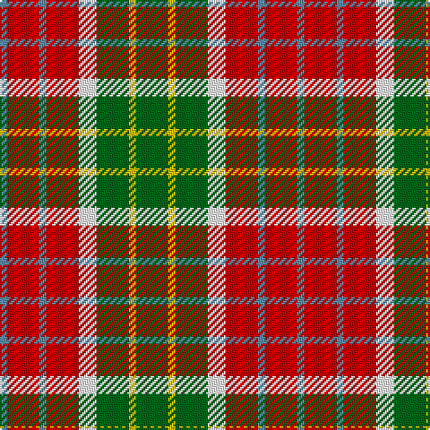

In pattern [BRBRWGYG](/patterns/brbrwgyg/).

This was sourced from register-of-tartans.  It is a [8 stripes tartan](/stripes/stripes8/).

Original link https://www.tartanregister.gov.uk/tartanDetails.aspx?ref=285

## Thread count
B/4 R18 B4 R18 W10 G18 Y4 G/18

## Palette
Each colour and its ΔE from the base-6 reference it is a variant of.

| Colour | Shade | Base | ΔE (OKLab) |
|---|---|---|---|
| B | <code style="background-color:#5C8CA8;">#5C8CA8</code> `#5C8CA8` | B <code style="background-color:#2A418A;">#2A418A</code> | 0.23 |
| G | <code style="background-color:#006818;">#006818</code> `#006818` | G <code style="background-color:#006100;">#006100</code> | 0.02 |
| R | <code style="background-color:#C80000;">#C80000</code> `#C80000` | R <code style="background-color:#CC0000;">#CC0000</code> | 0.01 |
| W | <code style="background-color:#FFFFFF;">#FFFFFF</code> `#FFFFFF` | W <code style="background-color:#F7F7F7;">#F7F7F7</code> | 0.02 |
| Y | <code style="background-color:#E8C000;">#E8C000</code> `#E8C000` | Y <code style="background-color:#F2BF00;">#F2BF00</code> | 0.02 |

# Sample pattern

## Nearest tartans

The nearest existing variants by ΔTartan distance.

1. [Blackie (Artefact)](/setts/s8/g9y2g9w5r9b2r9b2~b5c8ca8-g006818-rc80000-we0e0e0-ye8c000~x2/) — ΔT 0.32
1. [Cawte of Middlebanknock (Personal)](/setts/s9/g13y16w4y4r4y4k20y8r8~g408060-k101010-rc80000-wfcfcfc-ye8c000~x2/) — ΔT 1.04
1. [Jardine of Castlemilk](/setts/s9/r8g33y33k33r8b8y33b8r8~b2c4084-g482800-k101010-rdc0000-ye8c000/) — ΔT 1.11
1. [Aboyne II (Fashion)](/setts/s6/r2y1r5k4g5w1~g006818-k101010-rc80000-wfcfcfc-yfccc00~x4/) — ΔT 1.17
1. [Jardine, of Castlemilk](/setts/s9/r8ra33y33k33r8b8y33b8r8~b304080-k000000-rc00000-ra806050-yf0c000/) — ΔT 1.26
1. [Londonderry](/setts/s7/r6k2g12y8r5k2g3~g008000-k000000-rd00000-yd08010~x4/) — ΔT 1.34
1. [Victoria, City of (British Columbia)](/setts/s6/r5g2ra2k2y7r2~g289c18-k101010-ra00000-rae87878-yd09800~x4/) — ΔT 1.35
1. [Inspiration](/setts/s5/r5b12y11ba21ya5~b202060-ba5c5c5c-rc80000-yfccc00-yae8c000~x2/) — ΔT 1.36
1. [Jardine, of Castlemilk](/setts/s9/r8ra33y33k33r8b8y33b8r8~b304080-k000000-rc00000-ra703000-yf0c000/) — ΔT 1.39
1. [Toorak Chapler](/setts/s9/b3r1y1b1r3b3y3ya6ba1~b3d3134-ba72393f-ra58065-yafb8bb-yaf5d38b~x6/) — ΔT 1.40

## Neighbour map

Every grey dot is one of 15726 variants placed by the first two principal components of the ΔTartan feature space (44% of its variance). Red is this tartan; blue dots are its nearest — click one to open its page.

<svg viewBox="0 0 640 380" role="img" style="max-width:100%;height:auto;border:1px solid #e0e0e0;border-radius:4px;display:block" xmlns="http://www.w3.org/2000/svg"><image href="/nn/cloud.v1.png" width="640" height="380"/><a href="/setts/s8/g9y2g9w5r9b2r9b2~b5c8ca8-g006818-rc80000-we0e0e0-ye8c000~x2/"><circle cx="122.9" cy="223.8" r="4" fill="#3465a4"><title>Blackie (Artefact)</title></circle></a><a href="/setts/s9/g13y16w4y4r4y4k20y8r8~g408060-k101010-rc80000-wfcfcfc-ye8c000~x2/"><circle cx="85.4" cy="192.2" r="4" fill="#3465a4"><title>Cawte of Middlebanknock (Personal)</title></circle></a><a href="/setts/s9/r8g33y33k33r8b8y33b8r8~b2c4084-g482800-k101010-rdc0000-ye8c000/"><circle cx="76.6" cy="198.3" r="4" fill="#3465a4"><title>Jardine of Castlemilk</title></circle></a><a href="/setts/s6/r2y1r5k4g5w1~g006818-k101010-rc80000-wfcfcfc-yfccc00~x4/"><circle cx="112.0" cy="224.2" r="4" fill="#3465a4"><title>Aboyne II (Fashion)</title></circle></a><a href="/setts/s9/r8ra33y33k33r8b8y33b8r8~b304080-k000000-rc00000-ra806050-yf0c000/"><circle cx="69.7" cy="195.4" r="4" fill="#3465a4"><title>Jardine, of Castlemilk</title></circle></a><a href="/setts/s7/r6k2g12y8r5k2g3~g008000-k000000-rd00000-yd08010~x4/"><circle cx="147.4" cy="226.4" r="4" fill="#3465a4"><title>Londonderry</title></circle></a><a href="/setts/s6/r5g2ra2k2y7r2~g289c18-k101010-ra00000-rae87878-yd09800~x4/"><circle cx="107.8" cy="236.0" r="4" fill="#3465a4"><title>Victoria, City of (British Columbia)</title></circle></a><a href="/setts/s5/r5b12y11ba21ya5~b202060-ba5c5c5c-rc80000-yfccc00-yae8c000~x2/"><circle cx="93.2" cy="241.4" r="4" fill="#3465a4"><title>Inspiration</title></circle></a><a href="/setts/s9/r8ra33y33k33r8b8y33b8r8~b304080-k000000-rc00000-ra703000-yf0c000/"><circle cx="71.2" cy="195.6" r="4" fill="#3465a4"><title>Jardine, of Castlemilk</title></circle></a><a href="/setts/s9/b3r1y1b1r3b3y3ya6ba1~b3d3134-ba72393f-ra58065-yafb8bb-yaf5d38b~x6/"><circle cx="77.6" cy="189.6" r="4" fill="#3465a4"><title>Toorak Chapler</title></circle></a><circle cx="113.4" cy="219.7" r="5" fill="#c00000"/></svg>

ID: /setts/s8/g9y2g9w5r9b2r9b2~b5c8ca8-g006818-rc80000-wffffff-ye8c000~x2/
