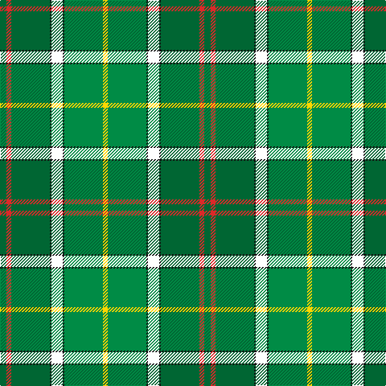

This page is one **sett** — a single exact thread-count. It belongs to the [tartan](/tartans/gi4r3gi24k1w7k1g24ly3/)
(the same proportion at any scale), whose colour order is pattern [GRGKWKGY](/stripes/grgkwkgy/).

Sourced from register-of-tartans.  It is a [8 stripe tartan](/stripes/stripes8/).

Original link https://www.tartanregister.gov.uk/tartanDetails.aspx?ref=10486

## Also known as

This cloth is also recorded under:

- Layton, Mervin

2 attestations — the source records this cloth was collapsed from (oldest owns this page)

<ul>
<li>01/01/2010 — Layton, Mervin (register-of-tartans, <a href="https://www.tartanregister.gov.uk/tartanDetails.aspx?ref=10486">record</a>)</li>
<li>1st January 2010 — Layton (Name) (tartans-authority, <a href="http://www.tartansauthority.com/tartan-ferret/display/10486/">record</a>)</li>
</ul>

## Register references

External register numbers recorded for this tartan.

- Scottish Register of Tartans: [10486](https://www.tartanregister.gov.uk/tartanDetails?ref=10486)
- Scottish Tartans Authority (ITI): 10486

## Thread count
G/8 R6 G48 K2 W14 K2 Ga48 Y/6

## Palette

Palette: <strong>Tartan Register</strong> <small style="color:#888">(3 of 6 colours)</small>
<table><thead><tr><th>Colour</th><th>Threads</th><th>Shade</th><th>Base</th><th>OKLCh</th></tr></thead><tbody><tr><td>G/</td><td style="text-align:right;font-variant-numeric:tabular-nums">8</td><td><code style="background-color:#006633;">#006633</code> <small style="color:#888">#006633</small></td><td>G <code style="background-color:#006100;">#006100</code></td><td><small style="color:#888">oklch(44.7% 0.116 152.7)</small></td></tr><tr><td>R</td><td style="text-align:right;font-variant-numeric:tabular-nums">6</td><td><code style="background-color:#DB2929;">#DB2929</code> <small style="color:#888">#DB2929</small></td><td>R <code style="background-color:#CC0000;">#CC0000</code></td><td><small style="color:#888">oklch(57.7% 0.212 27.1)</small></td></tr><tr><td>G</td><td style="text-align:right;font-variant-numeric:tabular-nums">48</td><td><code style="background-color:#006633;">#006633</code> <small style="color:#888">#006633</small></td><td>G <code style="background-color:#006100;">#006100</code></td><td><small style="color:#888">oklch(44.7% 0.116 152.7)</small></td></tr><tr><td>K</td><td style="text-align:right;font-variant-numeric:tabular-nums">2</td><td><code style="background-color:#101010;">#101010</code> <small style="color:#888">#101010</small></td><td>K <code style="background-color:#000000;">#000000</code></td><td><small style="color:#888">oklch(17.3% 0.000 89.9)</small></td></tr><tr><td>W</td><td style="text-align:right;font-variant-numeric:tabular-nums">14</td><td><code style="background-color:#FFFFFF;">#FFFFFF</code> <small style="color:#888">#FFFFFF</small></td><td>W <code style="background-color:#F7F7F7;">#F7F7F7</code></td><td><small style="color:#888">oklch(100.0% 0.000 89.9)</small></td></tr><tr><td>K</td><td style="text-align:right;font-variant-numeric:tabular-nums">2</td><td><code style="background-color:#101010;">#101010</code> <small style="color:#888">#101010</small></td><td>K <code style="background-color:#000000;">#000000</code></td><td><small style="color:#888">oklch(17.3% 0.000 89.9)</small></td></tr><tr><td>Ga</td><td style="text-align:right;font-variant-numeric:tabular-nums">48</td><td><code style="background-color:#008B45;">#008B45</code> <small style="color:#888">#008B45</small></td><td>G <code style="background-color:#006100;">#006100</code></td><td><small style="color:#888">oklch(55.8% 0.147 151.8)</small></td></tr><tr><td>Y/</td><td style="text-align:right;font-variant-numeric:tabular-nums">6</td><td><code style="background-color:#FFD700;">#FFD700</code> <small style="color:#888">#FFD700</small></td><td>Y <code style="background-color:#F2BF00;">#F2BF00</code></td><td><small style="color:#888">oklch(88.7% 0.182 95.3)</small></td></tr></tbody></table>

# Sample pattern

## Nearest tartans

The nearest existing variants by ΔTartan distance, with this tartan at the top so the swatches line up against it.

ΔTartan

Tartan

Sett

—

<a href="/ttd/edit/#slug=gi4r3gi24k1w7k1g24ly3~x2">Layton, Mervin</a> <a class="nn-out" href="/setts/s8/gi4r3gi24k1w7k1g24ly3~x2/" title="open its dictionary page">↗</a>

1.13

<a href="/ttd/edit/#slug=g22r3w1g2r3t16k3ly2~x4">Stirling University (Corporate)</a> <a class="nn-out" href="/setts/s8/g22r3w1g2r3t16k3ly2~x4/" title="open its dictionary page">↗</a>

1.18

<a href="/setts/s8/g22r3k1g2r3t16ki3ly2~x4/">Stirling, University of Corporate Univ Tartan Tartan Number: 2297. Earliest known date: 1994 This is the accepted University design. See products available Copyright © Blair Urquhart, Comrie, 2015</a>

1.20

<a href="/ttd/edit/#slug=g4n2gi24dy10ly12r1ly12gi2~x2">Jolley (Personal)</a> <a class="nn-out" href="/setts/s8/g4n2gi24dy10ly12r1ly12gi2~x2/" title="open its dictionary page">↗</a>

1.22

<a href="/ttd/edit/#slug=g40k8g4k8g4m14gi64t9gi3">West Lothian/Linlithgowshire</a> <a class="nn-out" href="/setts/s9/g40k8g4k8g4m14gi64t9gi3/" title="open its dictionary page">↗</a>

1.26

<a href="/ttd/edit/#slug=db16w3db1ly4g24r1g3r4g3r1t8~x2">Currie</a> <a class="nn-out" href="/setts/s11/db16w3db1ly4g24r1g3r4g3r1t8~x2/" title="open its dictionary page">↗</a>

1.31

<a href="/ttd/edit/#slug=dy4gi26lb1gi2lb2dy4lg26dy4g3ly3~x2">Carter (Savannah) (Personal)</a> <a class="nn-out" href="/setts/s10/dy4gi26lb1gi2lb2dy4lg26dy4g3ly3~x2/" title="open its dictionary page">↗</a>

1.38

<a href="/ttd/edit/#slug=g42ly2gi16db7dr16r5~x2">Waterford</a> <a class="nn-out" href="/setts/s6/g42ly2gi16db7dr16r5~x2/" title="open its dictionary page">↗</a>

1.38

<a href="/ttd/edit/#slug=w9dg2g2w3g18k2dg33lo2~x2">New World Irish (Fashion)</a> <a class="nn-out" href="/setts/s8/w9dg2g2w3g18k2dg33lo2~x2/" title="open its dictionary page">↗</a>

1.39

<a href="/ttd/edit/#slug=dg70ly6o28g56o5g11o5g11lo12">Dalwhinnie Trade Tartan Tartan Number: 1018. Earliest known date: 1982 Reconstructed and woven by Don Rankin from illustration. Sample in STS collection. See products available Copyright © Blair Urquhart, Comrie, 2015</a> <a class="nn-out" href="/setts/s9/dg70ly6o28g56o5g11o5g11lo12/" title="open its dictionary page">↗</a>

1.48

<a href="/ttd/edit/#slug=lo3g1lo1g14o2g2o2g4o11dg25ly2dg3w2~x2">Buglass</a> <a class="nn-out" href="/setts/s13/lo3g1lo1g14o2g2o2g4o11dg25ly2dg3w2~x2/" title="open its dictionary page">↗</a>

## Neighbour map

Every grey dot is one of 14359 variants placed by the first two principal components of the ΔTartan feature space (44% of its variance). Red is this tartan; blue dots are its nearest — click one to open its page.

<svg viewBox="0 0 640 380" role="img" style="max-width:100%;height:auto;border:1px solid #e0e0e0;border-radius:4px;display:block" xmlns="http://www.w3.org/2000/svg"><image href="/nn/cloud.v1.png" width="640" height="380"/><a href="/setts/s8/g22r3w1g2r3t16k3ly2~x4/"><circle cx="249.9" cy="124.3" r="4" fill="#3465a4"><title>Stirling University (Corporate)</title></circle></a><a href="/setts/s8/g22r3k1g2r3t16ki3ly2~x4/"><circle cx="249.9" cy="125.1" r="4" fill="#3465a4"><title>Stirling, University of Corporate Univ Tartan Tartan Number: 2297. Earliest known date: 1994 This is the accepted University design. See products available Copyright © Blair Urquhart, Comrie, 2015</title></circle></a><a href="/setts/s8/g4n2gi24dy10ly12r1ly12gi2~x2/"><circle cx="206.9" cy="138.8" r="4" fill="#3465a4"><title>Jolley (Personal)</title></circle></a><a href="/setts/s9/g40k8g4k8g4m14gi64t9gi3/"><circle cx="230.9" cy="134.8" r="4" fill="#3465a4"><title>West Lothian/Linlithgowshire</title></circle></a><a href="/setts/s11/db16w3db1ly4g24r1g3r4g3r1t8~x2/"><circle cx="217.0" cy="104.3" r="4" fill="#3465a4"><title>Currie</title></circle></a><a href="/setts/s10/dy4gi26lb1gi2lb2dy4lg26dy4g3ly3~x2/"><circle cx="228.0" cy="113.0" r="4" fill="#3465a4"><title>Carter (Savannah) (Personal)</title></circle></a><a href="/setts/s6/g42ly2gi16db7dr16r5~x2/"><circle cx="240.0" cy="160.9" r="4" fill="#3465a4"><title>Waterford</title></circle></a><a href="/setts/s8/w9dg2g2w3g18k2dg33lo2~x2/"><circle cx="269.8" cy="150.2" r="4" fill="#3465a4"><title>New World Irish (Fashion)</title></circle></a><a href="/setts/s9/dg70ly6o28g56o5g11o5g11lo12/"><circle cx="203.0" cy="162.0" r="4" fill="#3465a4"><title>Dalwhinnie Trade Tartan Tartan Number: 1018. Earliest known date: 1982 Reconstructed and woven by Don Rankin from illustration. Sample in STS collection. See products available Copyright © Blair Urquhart, Comrie, 2015</title></circle></a><a href="/setts/s13/lo3g1lo1g14o2g2o2g4o11dg25ly2dg3w2~x2/"><circle cx="195.9" cy="87.6" r="4" fill="#3465a4"><title>Buglass</title></circle></a><circle cx="218.5" cy="121.0" r="5" fill="#c00000"/></svg>

ID: /setts/s8/gi4r3gi24k1w7k1g24ly3~x2/
