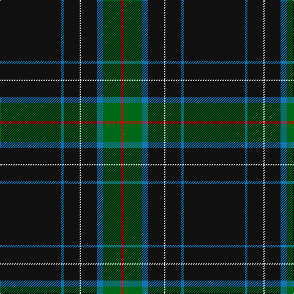

In pattern [KBKWKBGR](/patterns/kbkwkbgr/).

This was sourced from tartans-authority.  It is a [8 stripes tartan](/stripes/stripes8/).

Original link http://www.tartansauthority.com/tartan-ferret/display/7355/

## Thread count
K/100 B4 K26 LN2 K26 B10 G30 R/4

## Palette
Each colour and its ΔE from the base-6 reference it is a variant of.

| Colour | Shade | Base | ΔE (OKLab) |
|---|---|---|---|
| B | <code style="background-color:#1474B4;">#1474B4</code> `#1474B4` | B <code style="background-color:#2C4084;">#2C4084</code> | 0.15 |
| G | <code style="background-color:#006818;">#006818</code> `#006818` | G <code style="background-color:#006400;">#006400</code> | 0.02 |
| K | <code style="background-color:#101010;">#101010</code> `#101010` | K <code style="background-color:#000000;">#000000</code> | 0.17 |
| LN | <code style="background-color:#E0E0E0;">#E0E0E0</code> `#E0E0E0` | W <code style="background-color:#F4F4F0;">#F4F4F0</code> | 0.06 |
| R | <code style="background-color:#C80000;">#C80000</code> `#C80000` | R <code style="background-color:#C80000;">#C80000</code> | 0.00 |

# Sample pattern

## Nearest tartans

The nearest existing variants by ΔTartan distance.

1. [Center](/setts/s8/k100b4k26w2k26b10g30r4-b2c4084-g005020-k101010-rdc0000-we0e0e0/) — ΔT 1.16
1. [MacGregor, Black (Personal)](/setts/s6/k144g46k14g16r2w6-g006818-k101010-rc80000-we0e0e0/) — ΔT 1.32
1. [Pride of Scotland Contemporary](/setts/s11/k18b4r4b4k36b4k4w2b38k66ba4-b5c5c5c-ba6c0070-k101010-r888888-wc49cd8/) — ΔT 1.40
1. [McCann of Castlecraig (Personal)](/setts/s7/k128g24b12k30r2g10y2-b5c5c5c-g545c24-k00002c-rb47800-ya0a0a0/) — ΔT 1.43
1. [Springbank](/setts/s11/k28b4k4b10k50y2b18w6k6wa2k28-b5c5c5c-k101010-wc49cd8-wafcfcfc-ya08858/) — ΔT 1.47
1. [Touch](/setts/s6/g10y2k10ga92k10r6-g808080-ga003000-k000000-rc00000-yf0c000/) — ΔT 1.49
1. [degli Uberti, Baron of Cartsburn (P)](/setts/s8/b16r2k12r2y16r2k90y2-b202060-k101010-rc80000-ybc8c00/) — ΔT 1.49
1. [Martinez (2014)](/setts/s12/b12k40r6k40y2b4y2k50y2r4y2ba12-b003c64-ba2c2c80-k101010-r880000-ye8c000/) — ΔT 1.52
1. [O'Boyle](/setts/s12/k90r18k24ra2k2g24k2ra2k24r18k90g18-g289c18-k101010-r9c68a4-rac80000/) — ΔT 1.53
1. [degli Uberti, Baron of Cartsburn (Personal)](/setts/s8/b16r2k12r2y16r2k90y2-b000080-k101010-rbe3d3d-ybc933d/) — ΔT 1.54

## Neighbour map

Every grey dot is one of 15726 variants placed by the first two principal components of the ΔTartan feature space (44% of its variance). Red is this tartan; blue dots are its nearest — click one to open its page.

<svg viewBox="0 0 640 380" role="img" style="max-width:100%;height:auto;border:1px solid #e0e0e0;border-radius:4px;display:block" xmlns="http://www.w3.org/2000/svg"><image href="/nn/cloud.v1.png" width="640" height="380"/><a href="/setts/s8/k100b4k26w2k26b10g30r4-b2c4084-g005020-k101010-rdc0000-we0e0e0/"><circle cx="546.0" cy="144.1" r="4" fill="#3465a4"><title>Center</title></circle></a><a href="/setts/s6/k144g46k14g16r2w6-g006818-k101010-rc80000-we0e0e0/"><circle cx="497.4" cy="145.8" r="4" fill="#3465a4"><title>MacGregor, Black (Personal)</title></circle></a><a href="/setts/s11/k18b4r4b4k36b4k4w2b38k66ba4-b5c5c5c-ba6c0070-k101010-r888888-wc49cd8/"><circle cx="452.0" cy="128.6" r="4" fill="#3465a4"><title>Pride of Scotland Contemporary</title></circle></a><a href="/setts/s7/k128g24b12k30r2g10y2-b5c5c5c-g545c24-k00002c-rb47800-ya0a0a0/"><circle cx="531.6" cy="127.7" r="4" fill="#3465a4"><title>McCann of Castlecraig (Personal)</title></circle></a><a href="/setts/s11/k28b4k4b10k50y2b18w6k6wa2k28-b5c5c5c-k101010-wc49cd8-wafcfcfc-ya08858/"><circle cx="448.8" cy="143.4" r="4" fill="#3465a4"><title>Springbank</title></circle></a><a href="/setts/s6/g10y2k10ga92k10r6-g808080-ga003000-k000000-rc00000-yf0c000/"><circle cx="479.2" cy="125.3" r="4" fill="#3465a4"><title>Touch</title></circle></a><a href="/setts/s8/b16r2k12r2y16r2k90y2-b202060-k101010-rc80000-ybc8c00/"><circle cx="504.1" cy="117.9" r="4" fill="#3465a4"><title>degli Uberti, Baron of Cartsburn (P)</title></circle></a><a href="/setts/s12/b12k40r6k40y2b4y2k50y2r4y2ba12-b003c64-ba2c2c80-k101010-r880000-ye8c000/"><circle cx="469.7" cy="139.2" r="4" fill="#3465a4"><title>Martinez (2014)</title></circle></a><a href="/setts/s12/k90r18k24ra2k2g24k2ra2k24r18k90g18-g289c18-k101010-r9c68a4-rac80000/"><circle cx="477.5" cy="119.8" r="4" fill="#3465a4"><title>O'Boyle</title></circle></a><a href="/setts/s8/b16r2k12r2y16r2k90y2-b000080-k101010-rbe3d3d-ybc933d/"><circle cx="496.5" cy="115.9" r="4" fill="#3465a4"><title>degli Uberti, Baron of Cartsburn (Personal)</title></circle></a><circle cx="511.9" cy="129.0" r="5" fill="#c00000"/></svg>

ID: /setts/s8/k100b4k26w2k26b10g30r4-b1474b4-g006818-k101010-rc80000-we0e0e0/
