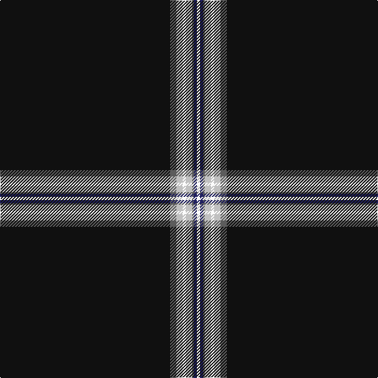

This page is one **sett** — a single exact thread-count. It belongs to the [tartan](/tartans/k108n4na4w2na4n1db2w2/)
(the same proportion at any scale), whose colour order is pattern [KBWWWBBW](/stripes/kbwwwbbw/).

Sourced from tartans-authority.  It is a [8 stripe tartan](/stripes/stripes8/).

Original link http://www.tartansauthority.com/tartan-ferret/display/11044/

## Thread count
K/216 N8 Na8 W4 Na8 N2 DB4 W/4

## Palette
Each colour and the base-6 reference it is a variant of.

| Colour | Shade | Base |
|---|---|---|
| DB | <code style="background-color:#202060;">#202060</code> `oklch(28.9% 0.111 276.9)` <small>#202060</small> | B <code style="background-color:#2A418A;">#2A418A</code> |
| K | <code style="background-color:#101010;">#101010</code> `oklch(17.3% 0.000 89.9)` <small>#101010</small> | K <code style="background-color:#000000;">#000000</code> |
| N | <code style="background-color:#5C5C5C;">#5C5C5C</code> `oklch(47.5% 0.000 89.9)` <small>#5C5C5C</small> | B <code style="background-color:#2A418A;">#2A418A</code> |
| Na | <code style="background-color:#C0C0C0;">#C0C0C0</code> `oklch(80.8% 0.000 89.9)` <small>#C0C0C0</small> | W <code style="background-color:#F7F7F7;">#F7F7F7</code> |
| W | <code style="background-color:#FCFCFC;">#FCFCFC</code> `oklch(99.1% 0.000 89.9)` <small>#FCFCFC</small> | W <code style="background-color:#F7F7F7;">#F7F7F7</code> |

# Sample pattern

## Nearest tartans

The nearest existing variants by ΔTartan distance, with this tartan at the top so the swatches line up against it.

ΔTartan

Tartan

Sett

—

<a href="/ttd/edit/#slug=k108n4lb4w2lb4n1db2w2~x2">Modern Craft (Masonic)</a> <a class="nn-out" href="/setts/s8/k108n4lb4w2lb4n1db2w2~x2/" title="open its dictionary page">↗</a>

0.42

<a href="/ttd/edit/#slug=k108k4lr4w2lr4k1db2w2~x2">Modern Craft (Masonic)</a> <a class="nn-out" href="/setts/s8/k108k4lr4w2lr4k1db2w2~x2/" title="open its dictionary page">↗</a>

1.12

<a href="/ttd/edit/#slug=k85r6k1w3k3w3k1r6k6lo1~x2">Ambassador</a> <a class="nn-out" href="/setts/s10/k85r6k1w3k3w3k1r6k6lo1~x2/" title="open its dictionary page">↗</a>

1.22

<a href="/ttd/edit/#slug=ly2k4ly1k4r5k50o1k2r1~x2">Magdalene (Commemorative)</a> <a class="nn-out" href="/setts/s9/ly2k4ly1k4r5k50o1k2r1~x2/" title="open its dictionary page">↗</a>

1.25

<a href="/ttd/edit/#slug=k83ly2db4r2k8g5r4w3~x2">Spirit of Lanarkshire (Corporate)</a> <a class="nn-out" href="/setts/s8/k83ly2db4r2k8g5r4w3~x2/" title="open its dictionary page">↗</a>

1.26

<a href="/ttd/edit/#slug=ly2k4ly1k4r5k50y1k2r1~x2">Magdalene</a> <a class="nn-out" href="/setts/s9/ly2k4ly1k4r5k50y1k2r1~x2/" title="open its dictionary page">↗</a>

1.39

<a href="/ttd/edit/#slug=k45b2r4ly1w1~x2">McHattie (Personal)</a> <a class="nn-out" href="/setts/s5/k45b2r4ly1w1~x2/" title="open its dictionary page">↗</a>

1.52

<a href="/ttd/edit/#slug=w2k2dp8k10dp8k64w2k8ly1k1~x2">Payne of Wallins Creek (Personal)</a> <a class="nn-out" href="/setts/s10/w2k2dp8k10dp8k64w2k8ly1k1~x2/" title="open its dictionary page">↗</a>

1.52

<a href="/ttd/edit/#slug=k45db2r4ly1w1~x2">McHattie (Personal)</a> <a class="nn-out" href="/setts/s5/k45db2r4ly1w1~x2/" title="open its dictionary page">↗</a>

1.53

<a href="/ttd/edit/#slug=k64r1k4r1k6r7w2r7k6t2~x2">Noordermeer (Personal)</a> <a class="nn-out" href="/setts/s10/k64r1k4r1k6r7w2r7k6t2~x2/" title="open its dictionary page">↗</a>

1.53

<a href="/ttd/edit/#slug=k50dt3lp2r3w1~x2">Fettes Personal Tartan Tartan Number: 7565. Earliest known date: 2008 Designed online for four kilts by Fiona Fettes. See products available Copyright © Blair Urquhart, Comrie, 2015</a> <a class="nn-out" href="/setts/s5/k50dt3lp2r3w1~x2/" title="open its dictionary page">↗</a>

## Neighbour map

Every grey dot is one of 14299 variants placed by the first two principal components of the ΔTartan feature space (44% of its variance). Red is this tartan; blue dots are its nearest — click one to open its page.

<svg viewBox="0 0 640 380" role="img" style="max-width:100%;height:auto;border:1px solid #e0e0e0;border-radius:4px;display:block" xmlns="http://www.w3.org/2000/svg"><image href="/nn/cloud.v1.png" width="640" height="380"/><a href="/setts/s8/k108k4lr4w2lr4k1db2w2~x2/"><circle cx="621.6" cy="87.9" r="4" fill="#3465a4"><title>Modern Craft (Masonic)</title></circle></a><a href="/setts/s10/k85r6k1w3k3w3k1r6k6lo1~x2/"><circle cx="606.3" cy="82.8" r="4" fill="#3465a4"><title>Ambassador</title></circle></a><a href="/setts/s9/ly2k4ly1k4r5k50o1k2r1~x2/"><circle cx="626.0" cy="105.3" r="4" fill="#3465a4"><title>Magdalene (Commemorative)</title></circle></a><a href="/setts/s8/k83ly2db4r2k8g5r4w3~x2/"><circle cx="564.5" cy="87.3" r="4" fill="#3465a4"><title>Spirit of Lanarkshire (Corporate)</title></circle></a><a href="/setts/s9/ly2k4ly1k4r5k50y1k2r1~x2/"><circle cx="626.0" cy="106.6" r="4" fill="#3465a4"><title>Magdalene</title></circle></a><a href="/setts/s5/k45b2r4ly1w1~x2/"><circle cx="612.6" cy="129.2" r="4" fill="#3465a4"><title>McHattie (Personal)</title></circle></a><a href="/setts/s10/w2k2dp8k10dp8k64w2k8ly1k1~x2/"><circle cx="581.8" cy="104.6" r="4" fill="#3465a4"><title>Payne of Wallins Creek (Personal)</title></circle></a><a href="/setts/s5/k45db2r4ly1w1~x2/"><circle cx="620.9" cy="133.3" r="4" fill="#3465a4"><title>McHattie (Personal)</title></circle></a><a href="/setts/s10/k64r1k4r1k6r7w2r7k6t2~x2/"><circle cx="586.8" cy="98.4" r="4" fill="#3465a4"><title>Noordermeer (Personal)</title></circle></a><a href="/setts/s5/k50dt3lp2r3w1~x2/"><circle cx="624.1" cy="131.7" r="4" fill="#3465a4"><title>Fettes Personal Tartan Tartan Number: 7565. Earliest known date: 2008 Designed online for four kilts by Fiona Fettes. See products available Copyright © Blair Urquhart, Comrie, 2015</title></circle></a><circle cx="609.3" cy="81.2" r="5" fill="#c00000"/></svg>

ID: /setts/s8/k108n4lb4w2lb4n1db2w2~x2/
