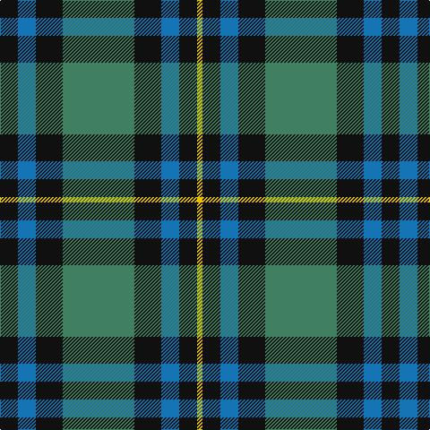

In pattern [KBKGKBKY](/patterns/kbkgkbky/).

This was sourced from register-of-tartans.  It is a [8 stripes tartan](/stripes/stripes8/).

Original link https://www.tartanregister.gov.uk/tartanDetails.aspx?ref=4183

## Register references

External register numbers recorded for this tartan.

- Scottish Register of Tartans: [4183](https://www.tartanregister.gov.uk/tartanDetails.aspx?ref=4183)
- Scottish Tartans Authority (ITI): 6182
- Scottish Tartans World Register: 2882

## Thread count
K/20 B20 K30 G80 K30 B20 K20 Y/6

## Palette
Each colour and its ΔE from the base-6 reference it is a variant of.

| Colour | Shade | Base | ΔE (OKLab) |
|---|---|---|---|
| B | <code style="background-color:#1474B4;">#1474B4</code> `#1474B4` | B <code style="background-color:#2A418A;">#2A418A</code> | 0.15 |
| G | <code style="background-color:#408060;">#408060</code> `#408060` | G <code style="background-color:#006100;">#006100</code> | 0.14 |
| K | <code style="background-color:#101010;">#101010</code> `#101010` | K <code style="background-color:#000000;">#000000</code> | 0.17 |
| Y | <code style="background-color:#E8C000;">#E8C000</code> `#E8C000` | Y <code style="background-color:#F2BF00;">#F2BF00</code> | 0.02 |

# Sample pattern

## Nearest tartans

The nearest existing variants by ΔTartan distance.

1. [Pinney's of Scotland](/setts/s10/k4g2b10y1b2g13k11g13b13y2~b304080-g008000-k000030-yf0c000~x2/) — ΔT 0.80
1. [Bijral](/setts/s11/b2k2b5k2b2k2b4k10g10r1k2~b2888c4-g285800-k101010-rc80000~x2/) — ΔT 0.87
1. [Guthrie (Name)](/setts/s9/k1g12k12r1k1r1k12b12r1~b1474b4-g408060-k101010-rc80000~x4/) — ΔT 0.95
1. [Aiton](/setts/s8/b6k1g3k1b3k1g10r3~b304080-g008000-k000000-rc00000~x2/) — ΔT 0.95
1. [Triad Highland Games Proposed](/setts/s7/r1b8k8r1k8g8r1~b2888c4-g006818-k101010-re87878~x4/) — ΔT 0.95
1. [Abercrombie](/setts/s9/g14w1g7k7b2k2b2k2b7~b2c2c80-g006818-k101010-we0e0e0~x4/) — ΔT 0.97
1. [Abercrombie Family Tartan Tartan Number: 241. Earliest known date: 1831 Tartan manufacturers and weavers often increase the width of the blue ground when producing this sett. J.Scarlett compares it with the Graham of Menteith and Wilson's No 158 and concludes that "the central panels... , both blue and green, should be doubled in size. See products available Copyright © Blair Urquhart, Comrie, 2015](/setts/s9/g14w1g7k7b2k2b2k2b7~b2c2c80-g006818-k101010-we0e0e0~x2/) — ΔT 0.97
1. [Newlands of Lauriston](/setts/s10/b9k9b9r2k20g13r2g4r2g4~b1474b4-g006818-k101010-rc80000~x2/) — ΔT 0.98
1. [Flower of Scotland](/setts/s6/b3g28b3k16b28r3~b304080-g008000-k000000-rc00000/) — ΔT 0.98
1. [Unidentified #28](/setts/s6/g2b4k6ba1g9k2~b0596fa-ba3c82af-g005020-k101010~x2/) — ΔT 1.02

## Neighbour map

Every grey dot is one of 15726 variants placed by the first two principal components of the ΔTartan feature space (44% of its variance). Red is this tartan; blue dots are its nearest — click one to open its page.

<svg viewBox="0 0 640 380" role="img" style="max-width:100%;height:auto;border:1px solid #e0e0e0;border-radius:4px;display:block" xmlns="http://www.w3.org/2000/svg"><image href="/nn/cloud.v1.png" width="640" height="380"/><a href="/setts/s10/k4g2b10y1b2g13k11g13b13y2~b304080-g008000-k000030-yf0c000~x2/"><circle cx="187.1" cy="195.5" r="4" fill="#3465a4"><title>Pinney's of Scotland</title></circle></a><a href="/setts/s11/b2k2b5k2b2k2b4k10g10r1k2~b2888c4-g285800-k101010-rc80000~x2/"><circle cx="206.2" cy="192.5" r="4" fill="#3465a4"><title>Bijral</title></circle></a><a href="/setts/s9/k1g12k12r1k1r1k12b12r1~b1474b4-g408060-k101010-rc80000~x4/"><circle cx="253.2" cy="185.5" r="4" fill="#3465a4"><title>Guthrie (Name)</title></circle></a><a href="/setts/s8/b6k1g3k1b3k1g10r3~b304080-g008000-k000000-rc00000~x2/"><circle cx="222.0" cy="200.4" r="4" fill="#3465a4"><title>Aiton</title></circle></a><a href="/setts/s7/r1b8k8r1k8g8r1~b2888c4-g006818-k101010-re87878~x4/"><circle cx="191.7" cy="225.2" r="4" fill="#3465a4"><title>Triad Highland Games Proposed</title></circle></a><a href="/setts/s9/g14w1g7k7b2k2b2k2b7~b2c2c80-g006818-k101010-we0e0e0~x4/"><circle cx="263.6" cy="199.2" r="4" fill="#3465a4"><title>Abercrombie</title></circle></a><a href="/setts/s9/g14w1g7k7b2k2b2k2b7~b2c2c80-g006818-k101010-we0e0e0~x2/"><circle cx="263.6" cy="199.2" r="4" fill="#3465a4"><title>Abercrombie Family Tartan Tartan Number: 241. Earliest known date: 1831 Tartan manufacturers and weavers often increase the width of the blue ground when producing this sett. J.Scarlett compares it with the Graham of Menteith and Wilson's No 158 and concludes that &quot;the central panels... , both blue and green, should be doubled in size. See products available Copyright © Blair Urquhart, Comrie, 2015</title></circle></a><a href="/setts/s10/b9k9b9r2k20g13r2g4r2g4~b1474b4-g006818-k101010-rc80000~x2/"><circle cx="184.3" cy="201.8" r="4" fill="#3465a4"><title>Newlands of Lauriston</title></circle></a><a href="/setts/s6/b3g28b3k16b28r3~b304080-g008000-k000000-rc00000/"><circle cx="203.5" cy="215.8" r="4" fill="#3465a4"><title>Flower of Scotland</title></circle></a><a href="/setts/s6/g2b4k6ba1g9k2~b0596fa-ba3c82af-g005020-k101010~x2/"><circle cx="225.8" cy="240.1" r="4" fill="#3465a4"><title>Unidentified #28</title></circle></a><circle cx="225.2" cy="202.5" r="5" fill="#c00000"/></svg>

ID: /setts/s8/k10b10k15g40k15b10k10y3~b1474b4-g408060-k101010-ye8c000~x2/
