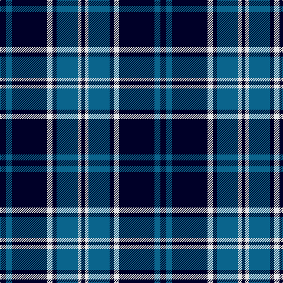

In pattern [KBKWKBWK](/patterns/kbkwkbwk/).

This was sourced from register-of-tartans.  It is a [8 stripes tartan](/stripes/stripes8/).

Original link https://www.tartanregister.gov.uk/tartanDetails.aspx?ref=3642

## Thread count
DB/10 B10 DB60 LN9 DB7 B36 LN6 DB/6

## Palette
Each colour and its ΔE from the base-6 reference it is a variant of.

| Colour | Shade | Base | ΔE (OKLab) |
|---|---|---|---|
| B | <code style="background-color:#0A648C;">#0A648C</code> `#0A648C` | B <code style="background-color:#2C4084;">#2C4084</code> | 0.10 |
| DB | <code style="background-color:#000028;">#000028</code> `#000028` | K <code style="background-color:#000000;">#000000</code> | 0.15 |
| LN | <code style="background-color:#E0E0E0;">#E0E0E0</code> `#E0E0E0` | W <code style="background-color:#F4F4F0;">#F4F4F0</code> | 0.06 |

# Sample pattern

ID: /setts/s8/k10b10k60w9k7b36w6k6-b0a648c-k000028-we0e0e0/
