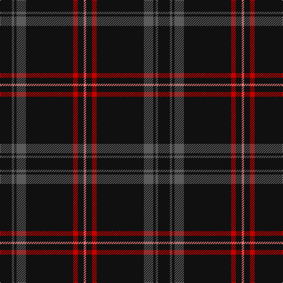

In pattern [KBKBKRKR](/patterns/kbkbkrkr/).

This was sourced from register-of-tartans.  It is a [8 stripes tartan](/stripes/stripes8/).

Original link https://www.tartanregister.gov.uk/tartanDetails.aspx?ref=2029

## Attestations

This cloth appears in 2 source records; the oldest owns this page.

- 01/03/2007 — Laird Abdullah (Personal) (register-of-tartans, [record](https://www.tartanregister.gov.uk/tartanDetails.aspx?ref=2029))
- March 2007 — Laird Abdullah (Personal) (tartans-authority, [record](http://www.tartansauthority.com/tartan-ferret/display/7176/))

## Thread count
K/20 N4 K4 N16 K80 R8 K10 LR/4

## Palette
Each colour and its ΔE from the base-6 reference it is a variant of.

| Colour | Shade | Base | ΔE (OKLab) |
|---|---|---|---|
| K | <code style="background-color:#101010;">#101010</code> `#101010` | K <code style="background-color:#000000;">#000000</code> | 0.17 |
| LR | <code style="background-color:#E87878;">#E87878</code> `#E87878` | R <code style="background-color:#CC0000;">#CC0000</code> | 0.19 |
| N | <code style="background-color:#5C5C5C;">#5C5C5C</code> `#5C5C5C` | B <code style="background-color:#2A418A;">#2A418A</code> | 0.15 |
| R | <code style="background-color:#C80000;">#C80000</code> `#C80000` | R <code style="background-color:#CC0000;">#CC0000</code> | 0.01 |

# Sample pattern

## Nearest tartans

The nearest existing variants by ΔTartan distance.

1. [Rikaco Vintage](/setts/s8/b74r9b4ra5b4r9b37ba9~b1c1c1c-ba000048-r9c68a4-raff0000~x2/) — ΔT 0.56
1. [Harley Davidson](/setts/s10/k49r8k4b6ra4b6k4r8k49ra2~b5c5c5c-k101010-rb84c00-ra888888/) — ΔT 0.76
1. [Clan Inebriated](/setts/s9/k21b2r1k1r1b2k6ba2r1~b780078-ba1c0070-k101010-r888888~x4/) — ΔT 0.86
1. [Ironside (Personal)](/setts/s10/k40b2k6ba2k2ba2k10b4w2b5~b780078-ba1474b4-k101010-we0e0e0~x2/) — ΔT 0.91
1. [Whitaker (2014)](/setts/s8/k60r3k15r3w2r5b3r2~b2c2c80-k101010-rc80000-wc0c0c0~x2/) — ΔT 1.06
1. [Highland Brewing Company](/setts/s8/k42b2r3k5r16k8y2k3~b2888c4-k101010-ra00000-ye8c000~x2/) — ΔT 1.10
1. [Harley Davidson (Corporate)](/setts/s6/r4b6k4ra8k49r2~b5c5c5c-k101010-r888888-rab84c00/) — ΔT 1.25
1. [Whitaker (2014)](/setts/s8/k60r3k15r3w2r5b3r2~b3850c8-k101010-rdc0000-wc0c0c0~x2/) — ΔT 1.28
1. [Springbank](/setts/s11/k14b2k2b5k25w1b9r3k3w1k14~b505050-k101010-r9c68a4-wffffff~x2/) — ΔT 1.32
1. [Auld Bernensis](/setts/s8/k62r3k3y3k3r3k9ra5~k101010-rc80000-ra888888-yd09800~x2/) — ΔT 1.33

## Neighbour map

Every grey dot is one of 15726 variants placed by the first two principal components of the ΔTartan feature space (44% of its variance). Red is this tartan; blue dots are its nearest — click one to open its page.

<svg viewBox="0 0 640 380" role="img" style="max-width:100%;height:auto;border:1px solid #e0e0e0;border-radius:4px;display:block" xmlns="http://www.w3.org/2000/svg"><image href="/nn/cloud.v1.png" width="640" height="380"/><a href="/setts/s8/b74r9b4ra5b4r9b37ba9~b1c1c1c-ba000048-r9c68a4-raff0000~x2/"><circle cx="538.2" cy="183.6" r="4" fill="#3465a4"><title>Rikaco Vintage</title></circle></a><a href="/setts/s10/k49r8k4b6ra4b6k4r8k49ra2~b5c5c5c-k101010-rb84c00-ra888888/"><circle cx="506.7" cy="156.2" r="4" fill="#3465a4"><title>Harley Davidson</title></circle></a><a href="/setts/s9/k21b2r1k1r1b2k6ba2r1~b780078-ba1c0070-k101010-r888888~x4/"><circle cx="528.8" cy="161.2" r="4" fill="#3465a4"><title>Clan Inebriated</title></circle></a><a href="/setts/s10/k40b2k6ba2k2ba2k10b4w2b5~b780078-ba1474b4-k101010-we0e0e0~x2/"><circle cx="523.5" cy="153.3" r="4" fill="#3465a4"><title>Ironside (Personal)</title></circle></a><a href="/setts/s8/k60r3k15r3w2r5b3r2~b2c2c80-k101010-rc80000-wc0c0c0~x2/"><circle cx="578.8" cy="143.5" r="4" fill="#3465a4"><title>Whitaker (2014)</title></circle></a><a href="/setts/s8/k42b2r3k5r16k8y2k3~b2888c4-k101010-ra00000-ye8c000~x2/"><circle cx="480.2" cy="164.2" r="4" fill="#3465a4"><title>Highland Brewing Company</title></circle></a><a href="/setts/s6/r4b6k4ra8k49r2~b5c5c5c-k101010-r888888-rab84c00/"><circle cx="488.0" cy="166.8" r="4" fill="#3465a4"><title>Harley Davidson (Corporate)</title></circle></a><a href="/setts/s8/k60r3k15r3w2r5b3r2~b3850c8-k101010-rdc0000-wc0c0c0~x2/"><circle cx="566.8" cy="138.4" r="4" fill="#3465a4"><title>Whitaker (2014)</title></circle></a><a href="/setts/s11/k14b2k2b5k25w1b9r3k3w1k14~b505050-k101010-r9c68a4-wffffff~x2/"><circle cx="474.2" cy="166.6" r="4" fill="#3465a4"><title>Springbank</title></circle></a><a href="/setts/s8/k62r3k3y3k3r3k9ra5~k101010-rc80000-ra888888-yd09800~x2/"><circle cx="597.8" cy="156.7" r="4" fill="#3465a4"><title>Auld Bernensis</title></circle></a><circle cx="537.1" cy="175.4" r="5" fill="#c00000"/></svg>

ID: /setts/s8/k10b2k2b8k40r4k5ra2~b5c5c5c-k101010-rc80000-rae87878~x2/
