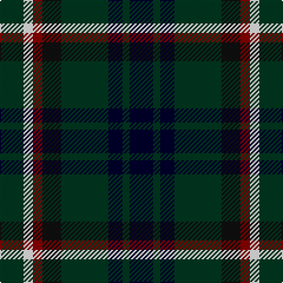

This page is one **sett** — a single exact thread-count. It belongs to the [tartan](/tartans/k10dg3k6dg20ki8r4w4dg10/)
(the same proportion at any scale), whose colour order is pattern [GWRKGKGK](/stripes/gwrkgkgk/).

Sourced from register-of-tartans.  It is a [8 stripe tartan](/stripes/stripes8/).

Original link https://www.tartanregister.gov.uk/tartanDetails.aspx?ref=286

## Also known as

This cloth is also recorded under:

- Blackrock

2 attestations — the source records this cloth was collapsed from (oldest owns this page)

<ul>
<li>01/01/2000 — BlackRock (Symmetrical) (register-of-tartans, <a href="https://www.tartanregister.gov.uk/tartanDetails.aspx?ref=286">record</a>)</li>
<li>pre 2000 — Blackrock (Corporate) (tartans-authority, <a href="http://www.tartansauthority.com/tartan-ferret/display/4008/">record</a>)</li>
</ul>

## Register references

External register numbers recorded for this tartan.

- Scottish Register of Tartans: [286](https://www.tartanregister.gov.uk/tartanDetails.aspx?ref=286)
- Scottish Tartans Authority (ITI): 4008
- Scottish Tartans World Register: 2717

## Thread count
DG/20 W8 DR8 K16 DG40 DB12 DG6 DB/20

## Palette

Palette: <strong>Tartan Register</strong> <small style="color:#888">(4 of 5 colours)</small>
<table><thead><tr><th>Colour</th><th>Threads</th><th>Shade</th><th>Base</th><th>OKLCh</th></tr></thead><tbody><tr><td>DG/</td><td style="text-align:right;font-variant-numeric:tabular-nums">20</td><td><code style="background-color:#003820;">#003820</code> <small style="color:#888">#003820</small></td><td>G <code style="background-color:#006100;">#006100</code></td><td><small style="color:#888">oklch(30.0% 0.070 158.3)</small></td></tr><tr><td>W</td><td style="text-align:right;font-variant-numeric:tabular-nums">8</td><td><code style="background-color:#FFFFFF;">#FFFFFF</code> <small style="color:#888">#FFFFFF</small></td><td>W <code style="background-color:#F7F7F7;">#F7F7F7</code></td><td><small style="color:#888">oklch(100.0% 0.000 89.9)</small></td></tr><tr><td>DR</td><td style="text-align:right;font-variant-numeric:tabular-nums">8</td><td><code style="background-color:#880000;">#880000</code> <small style="color:#888">#880000</small></td><td>R <code style="background-color:#CC0000;">#CC0000</code></td><td><small style="color:#888">oklch(39.4% 0.162 29.2)</small></td></tr><tr><td>K</td><td style="text-align:right;font-variant-numeric:tabular-nums">16</td><td><code style="background-color:#101010;">#101010</code> <small style="color:#888">#101010</small></td><td>K <code style="background-color:#000000;">#000000</code></td><td><small style="color:#888">oklch(17.3% 0.000 89.9)</small></td></tr><tr><td>DG</td><td style="text-align:right;font-variant-numeric:tabular-nums">40</td><td><code style="background-color:#003820;">#003820</code> <small style="color:#888">#003820</small></td><td>G <code style="background-color:#006100;">#006100</code></td><td><small style="color:#888">oklch(30.0% 0.070 158.3)</small></td></tr><tr><td>DB</td><td style="text-align:right;font-variant-numeric:tabular-nums">12</td><td><code style="background-color:#00002C;">#00002C</code> <small style="color:#888">#00002C</small></td><td>K <code style="background-color:#000000;">#000000</code></td><td><small style="color:#888">oklch(13.2% 0.092 264.1)</small></td></tr><tr><td>DG</td><td style="text-align:right;font-variant-numeric:tabular-nums">6</td><td><code style="background-color:#003820;">#003820</code> <small style="color:#888">#003820</small></td><td>G <code style="background-color:#006100;">#006100</code></td><td><small style="color:#888">oklch(30.0% 0.070 158.3)</small></td></tr><tr><td>DB/</td><td style="text-align:right;font-variant-numeric:tabular-nums">20</td><td><code style="background-color:#00002C;">#00002C</code> <small style="color:#888">#00002C</small></td><td>K <code style="background-color:#000000;">#000000</code></td><td><small style="color:#888">oklch(13.2% 0.092 264.1)</small></td></tr></tbody></table>

# Sample pattern

## Nearest tartans

The nearest existing variants by ΔTartan distance, with this tartan at the top so the swatches line up against it.

ΔTartan

Tartan

Sett

—

<a href="/ttd/edit/#slug=k10dg3k6dg20ki8r4w4dg10~x2">BlackRock (Symmetrical)</a> <a class="nn-out" href="/setts/s8/k10dg3k6dg20ki8r4w4dg10~x2/" title="open its dictionary page">↗</a>

0.75

<a href="/ttd/edit/#slug=r1k7g7k7db7k7r1w1~x4">Tennent (Personal)</a> <a class="nn-out" href="/setts/s8/r1k7g7k7db7k7r1w1~x4/" title="open its dictionary page">↗</a>

1.03

<a href="/ttd/edit/#slug=db1k6db6k6g6k1w1~x6">Forbes - 1947 (Lyon Court)</a> <a class="nn-out" href="/setts/s7/db1k6db6k6g6k1w1~x6/" title="open its dictionary page">↗</a>

1.06

<a href="/ttd/edit/#slug=db10o3db10r3k21g20k15r3~x2">Williamson/Smart (Personal)</a> <a class="nn-out" href="/setts/s8/db10o3db10r3k21g20k15r3~x2/" title="open its dictionary page">↗</a>

1.18

<a href="/ttd/edit/#slug=dg3db8dg3k4dg9ly2db2ly2r2~x2">Maitland</a> <a class="nn-out" href="/setts/s9/dg3db8dg3k4dg9ly2db2ly2r2~x2/" title="open its dictionary page">↗</a>

1.18

<a href="/ttd/edit/#slug=dg3db8dg3k4dg9ly2db2ly2r2">Maitland</a> <a class="nn-out" href="/setts/s9/dg3db8dg3k4dg9ly2db2ly2r2/" title="open its dictionary page">↗</a>

1.18

<a href="/ttd/edit/#slug=r2dg8ly1k8dg8db8r2">Brodie Hunting</a> <a class="nn-out" href="/setts/s7/r2dg8ly1k8dg8db8r2/" title="open its dictionary page">↗</a>

1.20

<a href="/ttd/edit/#slug=dg31ly4dg6k19db18t9~x2">Lanark</a> <a class="nn-out" href="/setts/s6/dg31ly4dg6k19db18t9~x2/" title="open its dictionary page">↗</a>

1.20

<a href="/ttd/edit/#slug=db20k10lo3k7r4k7lo3k8g20~x2">Scottish Tartan Society</a> <a class="nn-out" href="/setts/s9/db20k10lo3k7r4k7lo3k8g20~x2/" title="open its dictionary page">↗</a>

1.22

<a href="/ttd/edit/#slug=k14t2db6dg7r2k14db6t2db2t4~x2">Unidentified #2</a> <a class="nn-out" href="/setts/s10/k14t2db6dg7r2k14db6t2db2t4~x2/" title="open its dictionary page">↗</a>

1.30

<a href="/setts/s10/k19dg7k7t2dg20ki9dg6ki4dg10w3~x2/">O'Connell, William Benedict (Personal)</a>

## Neighbour map

Every grey dot is one of 14359 variants placed by the first two principal components of the ΔTartan feature space (44% of its variance). Red is this tartan; blue dots are its nearest — click one to open its page.

<svg viewBox="0 0 640 380" role="img" style="max-width:100%;height:auto;border:1px solid #e0e0e0;border-radius:4px;display:block" xmlns="http://www.w3.org/2000/svg"><image href="/nn/cloud.v1.png" width="640" height="380"/><a href="/setts/s8/r1k7g7k7db7k7r1w1~x4/"><circle cx="235.9" cy="232.4" r="4" fill="#3465a4"><title>Tennent (Personal)</title></circle></a><a href="/setts/s7/db1k6db6k6g6k1w1~x6/"><circle cx="216.3" cy="255.3" r="4" fill="#3465a4"><title>Forbes - 1947 (Lyon Court)</title></circle></a><a href="/setts/s8/db10o3db10r3k21g20k15r3~x2/"><circle cx="172.9" cy="225.4" r="4" fill="#3465a4"><title>Williamson/Smart (Personal)</title></circle></a><a href="/setts/s9/dg3db8dg3k4dg9ly2db2ly2r2~x2/"><circle cx="134.5" cy="230.1" r="4" fill="#3465a4"><title>Maitland</title></circle></a><a href="/setts/s9/dg3db8dg3k4dg9ly2db2ly2r2/"><circle cx="134.5" cy="230.1" r="4" fill="#3465a4"><title>Maitland</title></circle></a><a href="/setts/s7/r2dg8ly1k8dg8db8r2/"><circle cx="154.0" cy="225.5" r="4" fill="#3465a4"><title>Brodie Hunting</title></circle></a><a href="/setts/s6/dg31ly4dg6k19db18t9~x2/"><circle cx="154.0" cy="229.3" r="4" fill="#3465a4"><title>Lanark</title></circle></a><a href="/setts/s9/db20k10lo3k7r4k7lo3k8g20~x2/"><circle cx="149.2" cy="218.4" r="4" fill="#3465a4"><title>Scottish Tartan Society</title></circle></a><a href="/setts/s10/k14t2db6dg7r2k14db6t2db2t4~x2/"><circle cx="211.7" cy="215.4" r="4" fill="#3465a4"><title>Unidentified #2</title></circle></a><a href="/setts/s10/k19dg7k7t2dg20ki9dg6ki4dg10w3~x2/"><circle cx="246.2" cy="222.8" r="4" fill="#3465a4"><title>O'Connell, William Benedict (Personal)</title></circle></a><circle cx="202.9" cy="232.4" r="5" fill="#c00000"/></svg>

ID: /setts/s8/k10dg3k6dg20ki8r4w4dg10~x2/
