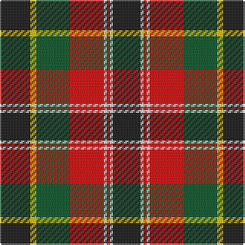

**Bands:** [KYGRWRWK](/stripes/kygrwrwk/) · **Stripes:** [K LY DG R W R W K](/stripes/stripes8/) K LY DG R W R W K

This was sourced from register-of-tartans.  It is a [8 band tartan](/bands/bands8/).

Original link https://www.tartanregister.gov.uk/tartanDetails.aspx?ref=4326

## Also known as

This cloth is also recorded under:

- Unnamed No 5

## Register references

External register numbers recorded for this tartan.

- Scottish Register of Tartans: [4326](https://www.tartanregister.gov.uk/tartanDetails.aspx?ref=4326)
- Scottish Tartans World Register: 1257

## Thread count
K/20 Y4 G22 R22 LN2 R2 LN2 K/18

## Palette
Each colour and its ΔE from the base-6 reference it is a variant of.

| Colour | Shade | Base | ΔE (OKLab) |
|---|---|---|---|
| G | <code style="background-color:#005020;">#005020</code> `#005020` | G <code style="background-color:#006100;">#006100</code> | 0.07 |
| K | <code style="background-color:#101010;">#101010</code> `#101010` | K <code style="background-color:#000000;">#000000</code> | 0.17 |
| LN | <code style="background-color:#E0E0E0;">#E0E0E0</code> `#E0E0E0` | W <code style="background-color:#F7F7F7;">#F7F7F7</code> | 0.07 |
| R | <code style="background-color:#DC0000;">#DC0000</code> `#DC0000` | R <code style="background-color:#CC0000;">#CC0000</code> | 0.03 |
| Y | <code style="background-color:#E8C000;">#E8C000</code> `#E8C000` | Y <code style="background-color:#F2BF00;">#F2BF00</code> | 0.02 |

# Sample pattern

## Nearest tartans

The nearest existing variants by ΔTartan distance.

1. [Caledonian Brewery Corporate Tartan Tartan Number: 2315. Earliest known date: pre 1997 Designed by Kinloch Anderson Ltd to commemorate the opening of the new Caledonian Brewery Malting Building. See products available Copyright © Blair Urquhart, Comrie, 2015](/setts/s7/lb4k13g6r16lb2r2g2~x2/) — ΔT 0.78
1. [MacLachlan W](/setts/s7/r24lr2ly3dg16k16lr2ly3~x2/) — ΔT 0.78
1. [MacLachlan W](/setts/s7/r24lr2ly3dg16k16lr2ly3/) — ΔT 0.78
1. [Unnamed No 5](/setts/s8/k10ly2g11r11w1r1w1k9~x2/) — ΔT 0.87
1. [Graham of Montrose Red](/setts/s9/lb1k1r10g10k5lb5r10k1lb1~x4/) — ΔT 0.89
1. [Dickie](/setts/s8/g8r2g12k6g3db6r24k4~x2/) — ΔT 0.92
1. [Garvock (2015)](/setts/s8/g28t3g3k10r2k10r20ly4~x2/) — ΔT 0.94
1. [Caledonian Brewery (Corporate)](/setts/s7/w4dg20dg10r25b2r2dg2~x2/) — ΔT 0.99
1. [Manson Family Tartan Tartan Number: 987. Earliest known date: 1983 The official recording of the sett shows the letter G for the dark green stripe. In heraldic terms this means 'Gules' - red. The designer, Hugh Kirkwood Rankine, clearly intended dark green and this is reproduced here. See products available Copyright © Blair Urquhart, Comrie, 2015](/setts/s8/g1r9g3k3g3r1k9w1~x2/) — ΔT 1.00
1. [Wcwm 1712](/setts/s12/r8w2r22k8dg6k6dg6k6dg8lg3dg3lg3~x2/) — ΔT 1.08

## Neighbour map

Every grey dot is one of 14299 variants placed by the first two principal components of the ΔTartan feature space (44% of its variance). Red is this tartan; blue dots are its nearest — click one to open its page.

<svg viewBox="0 0 640 380" role="img" style="max-width:100%;height:auto;border:1px solid #e0e0e0;border-radius:4px;display:block" xmlns="http://www.w3.org/2000/svg"><image href="/nn/cloud.v1.png" width="640" height="380"/><a href="/setts/s7/lb4k13g6r16lb2r2g2~x2/"><circle cx="172.2" cy="188.2" r="4" fill="#3465a4"><title>Caledonian Brewery Corporate Tartan Tartan Number: 2315. Earliest known date: pre 1997 Designed by Kinloch Anderson Ltd to commemorate the opening of the new Caledonian Brewery Malting Building. See products available Copyright © Blair Urquhart, Comrie, 2015</title></circle></a><a href="/setts/s7/r24lr2ly3dg16k16lr2ly3~x2/"><circle cx="155.8" cy="160.9" r="4" fill="#3465a4"><title>MacLachlan W</title></circle></a><a href="/setts/s7/r24lr2ly3dg16k16lr2ly3/"><circle cx="155.8" cy="160.9" r="4" fill="#3465a4"><title>MacLachlan W</title></circle></a><a href="/setts/s8/k10ly2g11r11w1r1w1k9~x2/"><circle cx="156.1" cy="165.6" r="4" fill="#3465a4"><title>Unnamed No 5</title></circle></a><a href="/setts/s9/lb1k1r10g10k5lb5r10k1lb1~x4/"><circle cx="198.9" cy="172.2" r="4" fill="#3465a4"><title>Graham of Montrose Red</title></circle></a><a href="/setts/s8/g8r2g12k6g3db6r24k4~x2/"><circle cx="200.7" cy="180.3" r="4" fill="#3465a4"><title>Dickie</title></circle></a><a href="/setts/s8/g28t3g3k10r2k10r20ly4~x2/"><circle cx="164.1" cy="148.9" r="4" fill="#3465a4"><title>Garvock (2015)</title></circle></a><a href="/setts/s7/w4dg20dg10r25b2r2dg2~x2/"><circle cx="203.0" cy="153.8" r="4" fill="#3465a4"><title>Caledonian Brewery (Corporate)</title></circle></a><a href="/setts/s8/g1r9g3k3g3r1k9w1~x2/"><circle cx="203.3" cy="192.3" r="4" fill="#3465a4"><title>Manson Family Tartan Tartan Number: 987. Earliest known date: 1983 The official recording of the sett shows the letter G for the dark green stripe. In heraldic terms this means 'Gules' - red. The designer, Hugh Kirkwood Rankine, clearly intended dark green and this is reproduced here. See products available Copyright © Blair Urquhart, Comrie, 2015</title></circle></a><a href="/setts/s12/r8w2r22k8dg6k6dg6k6dg8lg3dg3lg3~x2/"><circle cx="138.9" cy="158.8" r="4" fill="#3465a4"><title>Wcwm 1712</title></circle></a><circle cx="174.2" cy="169.9" r="5" fill="#c00000"/></svg>

ID: /setts/s8/k10ly2dg11r11w1r1w1k9~x2/
