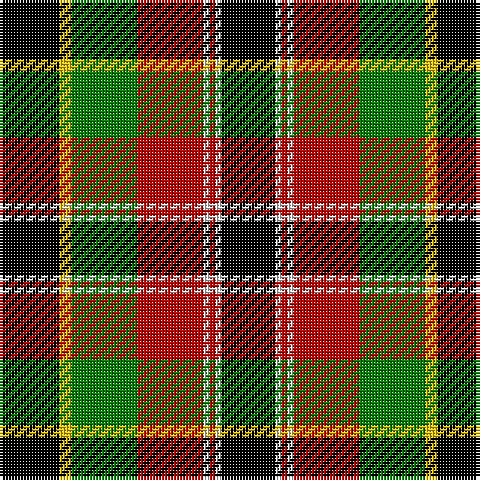

In pattern [KWRWRGYK](/stripes/kwrwrgyk/).

This was sourced from weddslist.  It is a [8 stripe tartan](/stripes/stripes8/).

Original link http://www.weddslist.com/cgi-bin/tartans/pg.pl?source=sts

## Also known as

This cloth is also recorded under:

- Unnamed No 5

## Attestations

This cloth appears in 2 source records; the oldest owns this page.

- undated — Unnamed No 5 (weddslist, [record](http://www.weddslist.com/cgi-bin/tartans/pg.pl?source=sts))
- undated — Unnamed No 5 Tartan Tartan Number: 1257. Earliest known date: 1870 This sett is taken from the records of Messrs Bolingbroke and Jones of Norwich, who were weavers around 1870. Some of the tartans have been adopted or modified in recent times as the copyright of the designs is now in the public domain. See products available Copyright © Blair Urquhart, Comrie, 2015 (house-of-tartan, [record](http://www.house-of-tartan.scotland.net/house/TartanViewjs.asp?colr=Def&tnam=1257))

## Thread count
K/20 Y4 G22 R22 LN2 R2 LN2 K/18

## Palette
Each colour and the base-6 reference it is a variant of.

| Colour | Shade | Base |
|---|---|---|
| G | <code style="background-color:#008000;">#008000</code> `oklch(52.0% 0.177 142.5)` <small>#008000</small> | G <code style="background-color:#006100;">#006100</code> |
| K | <code style="background-color:#000000;">#000000</code> `oklch(0.0% 0.000 0.0)` <small>#000000</small> | K <code style="background-color:#000000;">#000000</code> |
| LN | <code style="background-color:#E0E0E0;">#E0E0E0</code> `oklch(90.7% 0.000 89.9)` <small>#E0E0E0</small> | W <code style="background-color:#F7F7F7;">#F7F7F7</code> |
| R | <code style="background-color:#C00000;">#C00000</code> `oklch(50.7% 0.208 29.2)` <small>#C00000</small> | R <code style="background-color:#CC0000;">#CC0000</code> |
| Y | <code style="background-color:#F0C000;">#F0C000</code> `oklch(82.7% 0.169 90.5)` <small>#F0C000</small> | Y <code style="background-color:#F2BF00;">#F2BF00</code> |

# Sample pattern

## Nearest tartans

The nearest existing variants by ΔTartan distance.

1. [MacLamroc](/setts/s10/ly4k1r16k16w3r1k16g16k1ly4~x2/) — ΔT 0.80
1. [Garvock (2015)](/setts/s8/g28t3g3k10r2k10r20ly4~x2/) — ΔT 0.82
1. [Unidentified No 5](/setts/s8/k10ly2dg11r11w1r1w1k9~x2/) — ΔT 0.87
1. [MacLachlan W](/setts/s7/r24lr2ly3dg16k16lr2ly3~x2/) — ΔT 1.01
1. [MacLachlan W](/setts/s7/r24lr2ly3dg16k16lr2ly3/) — ΔT 1.01
1. [Cornish National (District)](/setts/s6/w5k26lo26t7k3r3~x2/) — ΔT 1.01
1. [Wcwm 1712](/setts/s12/r8w2r22k8dg6k6dg6k6dg8lg3dg3lg3~x2/) — ΔT 1.03
1. [Cornish National](/setts/s10/k3lb7lo26k26w5k26lo26lb7k3r3~x2/) — ΔT 1.07
1. [MacMillan Variant (Unidentified)](/setts/s6/k3ly18g6r17k31g3~x2/) — ΔT 1.14
1. [MacLachlan W](/setts/s7/r24lb2ly3dg16k16lb2ly3/) — ΔT 1.17

## Neighbour map

Every grey dot is one of 14299 variants placed by the first two principal components of the ΔTartan feature space (44% of its variance). Red is this tartan; blue dots are its nearest — click one to open its page.

<svg viewBox="0 0 640 380" role="img" style="max-width:100%;height:auto;border:1px solid #e0e0e0;border-radius:4px;display:block" xmlns="http://www.w3.org/2000/svg"><image href="/nn/cloud.v1.png" width="640" height="380"/><a href="/setts/s10/ly4k1r16k16w3r1k16g16k1ly4~x2/"><circle cx="173.0" cy="135.2" r="4" fill="#3465a4"><title>MacLamroc</title></circle></a><a href="/setts/s8/g28t3g3k10r2k10r20ly4~x2/"><circle cx="164.1" cy="148.9" r="4" fill="#3465a4"><title>Garvock (2015)</title></circle></a><a href="/setts/s8/k10ly2dg11r11w1r1w1k9~x2/"><circle cx="174.2" cy="169.9" r="4" fill="#3465a4"><title>Unidentified No 5</title></circle></a><a href="/setts/s7/r24lr2ly3dg16k16lr2ly3~x2/"><circle cx="155.8" cy="160.9" r="4" fill="#3465a4"><title>MacLachlan W</title></circle></a><a href="/setts/s7/r24lr2ly3dg16k16lr2ly3/"><circle cx="155.8" cy="160.9" r="4" fill="#3465a4"><title>MacLachlan W</title></circle></a><a href="/setts/s6/w5k26lo26t7k3r3~x2/"><circle cx="162.4" cy="174.2" r="4" fill="#3465a4"><title>Cornish National (District)</title></circle></a><a href="/setts/s12/r8w2r22k8dg6k6dg6k6dg8lg3dg3lg3~x2/"><circle cx="138.9" cy="158.8" r="4" fill="#3465a4"><title>Wcwm 1712</title></circle></a><a href="/setts/s10/k3lb7lo26k26w5k26lo26lb7k3r3~x2/"><circle cx="165.5" cy="160.7" r="4" fill="#3465a4"><title>Cornish National</title></circle></a><a href="/setts/s6/k3ly18g6r17k31g3~x2/"><circle cx="180.0" cy="190.4" r="4" fill="#3465a4"><title>MacMillan Variant (Unidentified)</title></circle></a><a href="/setts/s7/r24lb2ly3dg16k16lb2ly3/"><circle cx="140.1" cy="149.7" r="4" fill="#3465a4"><title>MacLachlan W</title></circle></a><circle cx="156.1" cy="165.6" r="5" fill="#c00000"/></svg>

ID: /setts/s8/k10ly2g11r11w1r1w1k9~x2/
